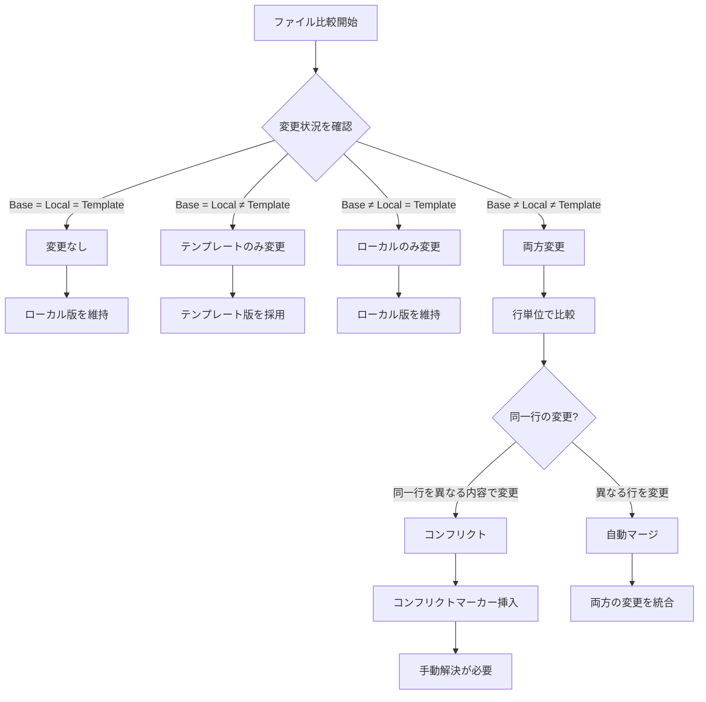
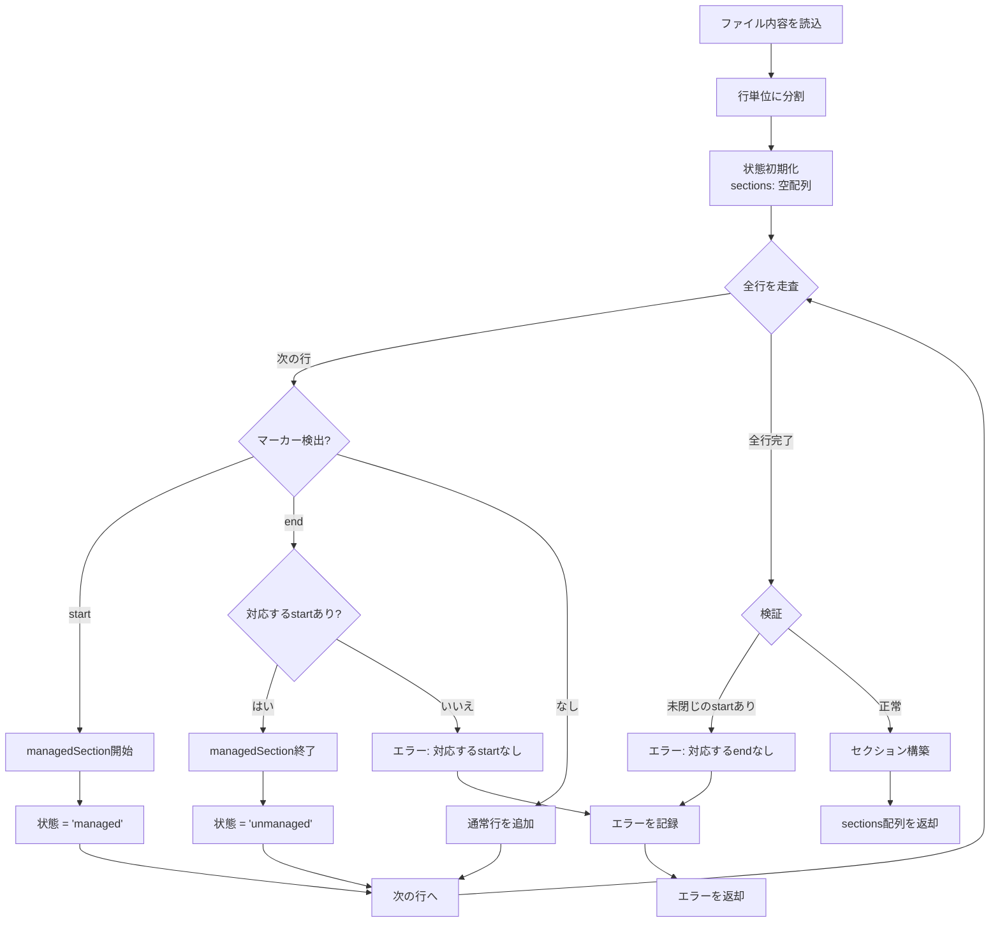
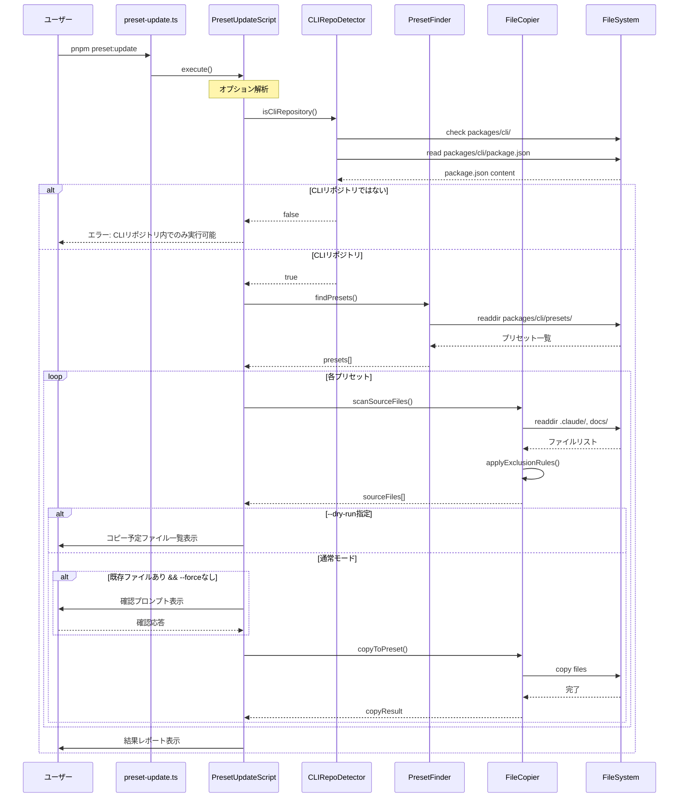

# 実装詳細

## データモデル設計

### メタデータファイル: .einja-sync.json

メタデータはプロジェクトルートに`.einja-sync.json`として保存されます。本機能はデータベースを使用せず、ファイルシステムベースのメタデータ管理を行います。

**スキーマ定義（Zod）**:

| フィールド | 型 | 説明 | 例 |
|-----------|-----|------|-----|
| version | string | メタデータフォーマットバージョン | "0.2.0" |
| lastSync | string (ISO 8601) | 最終同期日時 | "2026-01-03T10:00:00Z" |
| templateVersion | string (optional) | テンプレートバージョン | "1.2.0" |
| files | Record<string, FileMetadata> | ファイルごとのメタデータ | - |

**FileMetadata**:

| フィールド | 型 | 説明 | 例 |
|-----------|-----|------|-----|
| hash | string | SHA-256ハッシュ値（ベース版） | "abc123..." |
| syncedAt | string (ISO 8601) | 同期日時 | "2026-01-03T10:00:00Z" |
| conflicts | number (optional) | コンフリクト回数 | 0 |

**例**:
```json
{
  "version": "0.2.0",
  "lastSync": "2026-01-03T10:00:00Z",
  "templateVersion": "1.2.0",
  "files": {
    ".claude/agents/einja/spec-requirements.md": {
      "hash": "abc123def456...",
      "syncedAt": "2026-01-03T10:00:00Z",
      "conflicts": 0
    },
    ".claude/commands/einja/task-exec.md": {
      "hash": "789xyz012...",
      "syncedAt": "2026-01-03T10:00:00Z"
    }
  }
}
```

## CLI コマンド仕様

### コマンド: sync

**概要**: テンプレート更新を既存プロジェクトに同期

**基本構文**:
```bash
npx @einja/cli sync [options]
```

**オプション一覧**:

| オプション | 短縮形 | 型 | デフォルト | 説明 |
|-----------|-------|-----|-----------|------|
| --only | -o | string | - | 同期するカテゴリを指定（カンマ区切り） |
| --dry-run | -d | boolean | false | 実際の変更を行わず、差分のみ表示 |
| --force | -f | boolean | false | ローカル変更を無視してテンプレートで上書き |
| --yes | -y | boolean | false | 確認プロンプトをスキップ |
| --json | -j | boolean | false | JSON形式で結果を出力 |
| --backup | -b | boolean | true | 変更前にバックアップを作成 |

**カテゴリ指定**:
- `commands`: `.claude/commands/einja/`
- `agents`: `.claude/agents/einja/`
- `skills`: `.claude/skills/einja/`
- `docs`: `docs/einja/`

**使用例**:

```bash
# 基本的な同期
npx @einja/cli sync

# 差分確認のみ
npx @einja/cli sync --dry-run

# commandsとagentsのみ同期
npx @einja/cli sync --only commands,agents

# 強制上書き（確認あり）
npx @einja/cli sync --force

# 強制上書き（確認なし）
npx @einja/cli sync --force --yes

# JSON形式で結果出力（CI/CD用）
npx @einja/cli sync --json

# バックアップなしで同期
npx @einja/cli sync --backup=false
```

**出力形式**:

通常モード（ターミナル出力）:
```
🔄 テンプレート同期を開始...

📦 同期対象をスキャン中...
✓ 42ファイルを検出

⚙️  差分を計算中...
✓ 15ファイルに変更あり

📝 ファイルをマージ中...
  ✓ .claude/commands/einja/spec-create.md
  ✓ .claude/agents/einja/spec-requirements.md
  ⚠️ .claude/commands/einja/task-exec.md (コンフリクト)
  ✓ docs/einja/acceptance-criteria-and-qa-guide.md

⚠️  コンフリクトが検出されました:
  - .claude/commands/einja/task-exec.md (3箇所)

✅ 同期完了!
  - 成功: 14ファイル
  - コンフリクト: 1ファイル
  - スキップ: 27ファイル

💡 コンフリクト解消方法:
  1. 上記ファイルを開く
  2. <<<<<<< LOCAL と >>>>>>> TEMPLATE の間を手動編集
  3. 再度 sync を実行
```

JSON形式（--jsonオプション）:
```json
{
  "status": "partial_success",
  "summary": {
    "total": 42,
    "changed": 15,
    "succeeded": 14,
    "conflicts": 1,
    "skipped": 27
  },
  "files": [
    {
      "path": ".claude/commands/einja/spec-create.md",
      "status": "success",
      "action": "merged"
    },
    {
      "path": ".claude/commands/einja/task-exec.md",
      "status": "conflict",
      "action": "marked",
      "conflicts": [
        {
          "line": 45,
          "local": "旧テキスト",
          "template": "新テキスト"
        }
      ]
    }
  ],
  "metadata": {
    "version": "0.2.0",
    "syncedAt": "2026-01-03T10:30:00Z"
  }
}
```

## モジュール構成

```
packages/cli/
├── src/
│   ├── commands/
│   │   ├── sync.ts                    # Syncコマンドエントリーポイント
│   │   └── init.ts                    # 既存のInitコマンド
│   │
│   ├── lib/
│   │   ├── sync/
│   │   │   ├── metadata-manager.ts   # メタデータ管理
│   │   │   ├── file-filter.ts        # ファイルフィルタリング
│   │   │   ├── diff-engine.ts        # 3方向マージエンジン
│   │   │   ├── marker-processor.ts   # @einja:managed処理
│   │   │   ├── conflict-reporter.ts  # コンフリクト報告
│   │   │   └── backup-manager.ts     # バックアップ管理
│   │   │
│   │   ├── file-system.ts             # 既存のファイルシステムユーティリティ
│   │   ├── preset.ts                  # 既存のプリセット管理
│   │   └── merger.ts                  # 既存のマージ処理
│   │
│   ├── types/
│   │   ├── sync.ts                    # Sync関連の型定義
│   │   └── index.ts                   # 既存の型定義
│   │
│   ├── cli.ts                         # CLIエントリーポイント
│   └── index.ts                       # パッケージエクスポート
│
└── package.json
```

## 主要モジュールのインターフェース

### MetadataManager

**責務**: `.einja-sync.json`の読み込み、検証、更新

**主要メソッド**:

| メソッド名 | 引数 | 戻り値 | 説明 |
|-----------|-----|--------|------|
| load | - | Promise\<SyncMetadata\> | メタデータ読み込み（存在しない場合は初期化） |
| save | metadata: SyncMetadata | Promise\<void\> | メタデータ保存 |
| getBaseContent | filePath: string | string \| null | ファイルのベース版を取得（ハッシュから復元） |
| updateFileHash | filePath: string, content: string | void | ファイルハッシュを更新 |
| validate | metadata: unknown | SyncMetadata | スキーマ検証 |

### FileFilter

**責務**: 同期対象ファイルのフィルタリング

**主要メソッド**:

| メソッド名 | 引数 | 戻り値 | 説明 |
|-----------|-----|--------|------|
| scanSyncTargets | options: ScanOptions | Promise\<SyncTarget[]\> | 同期対象ファイルをスキャン |
| shouldExclude | filePath: string | boolean | 除外対象かを判定 |
| filterByCategory | files: SyncTarget[], categories: string[] | SyncTarget[] | カテゴリでフィルタリング |
| getCategoryFromPath | filePath: string | string \| null | パスからカテゴリを推測 |

**型定義**:

| 型名 | プロパティ | 型 | 説明 |
|------|-----------|-----|------|
| ScanOptions | categories | string[] \| undefined | フィルタするカテゴリ |
| ScanOptions | excludePatterns | string[] \| undefined | 追加の除外パターン |
| SyncTarget | path | string | 相対パス |
| SyncTarget | category | string | カテゴリ |
| SyncTarget | templatePath | string | テンプレートファイルパス |
| SyncTarget | exists | boolean | ローカルに存在するか |

### DiffEngine

**責務**: 3方向マージの実行

**主要メソッド**:

| メソッド名 | 引数 | 戻り値 | 説明 |
|-----------|-----|--------|------|
| merge3Way | base: string, local: string, template: string | MergeResult | 3方向マージ実行 |
| detectConflicts | mergedLines: string[] | Conflict[] | コンフリクト検出 |
| insertConflictMarkers | conflicts: Conflict[] | string | コンフリクトマーカー挿入 |

**型定義**:

| 型名 | プロパティ | 型 | 説明 |
|------|-----------|-----|------|
| MergeResult | success | boolean | マージ成功 |
| MergeResult | content | string | マージ結果 |
| MergeResult | conflicts | Conflict[] | コンフリクト一覧 |
| Conflict | line | number | 行番号 |
| Conflict | localContent | string | ローカル内容 |
| Conflict | templateContent | string | テンプレート内容 |

### MarkerProcessor

**責務**: @einja:managedマーカーの処理

**主要メソッド**:

| メソッド名 | 引数 | 戻り値 | 説明 |
|-----------|-----|--------|------|
| parseMarkers | content: string | MarkerSection[] | マーカーをパースしてセクション分離 |
| validateMarkers | content: string | MarkerValidationResult | マーカーペアの検証 |
| replaceManaged | sections: MarkerSection[], template: string | string | マーカー内をテンプレートで置換 |

**型定義**:

| 型名 | プロパティ | 型 | 説明 |
|------|-----------|-----|------|
| MarkerSection | type | 'managed' \| 'unmanaged' | セクション種別 |
| MarkerSection | startLine | number | 開始行番号 |
| MarkerSection | endLine | number | 終了行番号 |
| MarkerSection | content | string | セクション内容 |
| MarkerValidationResult | valid | boolean | 検証結果 |
| MarkerValidationResult | errors | MarkerError[] | エラー一覧 |
| MarkerError | line | number | エラー行番号 |
| MarkerError | message | string | エラーメッセージ |
| MarkerError | type | ErrorType | エラー種別 |

**ErrorType**: `'unpaired_start' | 'unpaired_end' | 'nested'`

## 3方向マージアルゴリズム

### アルゴリズムの概要

3方向マージは、以下の3つのバージョンを比較してマージを行います：

1. **ベース版（Base）**: 前回の同期時点のテンプレート版（`.einja-sync.json`のハッシュから復元）
2. **ローカル版（Local）**: 現在のプロジェクトのファイル
3. **テンプレート版（Template）**: 最新のテンプレートファイル

### マージルール



### 3つのバージョンとは？

| バージョン | 説明 |
|-----------|------|
| **Base版** | 前回sync/init時点のテンプレート（`.einja-sync.json`に記録） |
| **Local版** | 現在のプロジェクトにあるファイル |
| **Template版** | 最新CLIパッケージに含まれるファイル |

```
時間軸:
  前回sync          現在
    │                │
    ▼                ▼
  Base版 ─────────→ Local版（ローカルで編集された可能性あり）
    │
    └─────────────→ Template版（CLIパッケージで更新された可能性あり）
```

**なぜ3つ必要か？**
- `Base版 → Local版` の差分 = ローカルでの変更内容
- `Base版 → Template版` の差分 = CLIパッケージでの更新内容
- 両方の差分を合成することで、ローカル変更を保持しつつ新機能も取り込める

### 具体的なマージ処理

#### ケース1: ローカルのみ変更

Base版とTemplate版が同一、Local版のみ異なる場合：

```
Base版:     "仕様書を作成"
Local版:    "仕様書を作成（カスタム追記）"  ← ローカル編集
Template版: "仕様書を作成"

→ 結果: "仕様書を作成（カスタム追記）"  ← ローカル変更を維持
```

#### ケース2: テンプレートのみ更新

Base版とLocal版が同一、Template版のみ異なる場合：

```
Base版:     "仕様書を作成"
Local版:    "仕様書を作成"
Template版: "仕様書を作成 + 新機能説明"  ← CLIで追加

→ 結果: "仕様書を作成 + 新機能説明"  ← テンプレート更新を採用
```

#### ケース3: 両方変更（異なる箇所）→ 自動マージ成功

Local版とTemplate版が異なる箇所を変更した場合：

```
Base版:     行1 / 行2 / 行3
Local版:    行1(編集) / 行2 / 行3        ← 行1を編集
Template版: 行1 / 行2 / 行3(編集)        ← 行3を編集

→ 結果: 行1(編集) / 行2 / 行3(編集)  ← 両方の変更を統合
```

#### ケース4: 両方変更（同一箇所）→ コンフリクト

Local版とTemplate版が同じ箇所を異なる内容で変更した場合：

```
Base版:     "/spec-create タスク名"
Local版:    "/spec-create [Asana URL]"     ← ローカル編集
Template版: "/spec-create <タスク or URL>" ← CLI更新

→ 結果: コンフリクトマーカーを挿入
  <<<<<<< LOCAL
  /spec-create [Asana URL]
  =======
  /spec-create <タスク or URL>
  >>>>>>> TEMPLATE

  ※CLI利用者が手動で解決する必要あり
```

### node-diff3ライブラリの活用

**インストール**:
```bash
pnpm add node-diff3
```

**基本的な使用方法**:

表形式で処理フローを説明します。

| ステップ | 処理内容 | 実装 |
|---------|---------|------|
| 1. 入力準備 | 3つのバージョンを行単位に分割 | `base.split('\n')`, `local.split('\n')`, `template.split('\n')` |
| 2. マージ実行 | node-diff3でマージ | `diff3Merge(localLines, baseLines, templateLines)` |
| 3. 結果処理 | コンフリクト判定とマーカー挿入 | chunkごとに`chunk.ok`または`chunk.conflict`を処理 |
| 4. 結合 | 行を結合して文字列化 | `processedLines.join('\n')` |

## @einja:managedマーカー処理

### マーカー構文

#### Markdown/テキストファイル

```markdown
通常のコンテンツ（3方向マージ適用）

<!-- @einja:managed:start -->
このセクションはCLIが完全管理
テンプレート更新で常に上書きされる
<!-- @einja:managed:end -->

再び通常のコンテンツ（3方向マージ適用）
```

#### YAML/JSONファイル

```yaml
# 通常の設定（3方向マージ適用）
customSetting: value

# @einja:managed:start
# このセクションはCLIが完全管理
managedSetting: templateValue
# @einja:managed:end

# 再び通常の設定（3方向マージ適用）
anotherSetting: value
```

### パース処理フロー



### マーカー検証ルール

| 検証項目 | ルール | エラーメッセージ |
|---------|-------|----------------|
| ペアの一致 | すべての`start`に対応する`end`が存在 | "対応する@einja:managed:endが見つかりません (line: X)" |
| ペアの一致 | すべての`end`に対応する`start`が存在 | "対応する@einja:managed:startが見つかりません (line: X)" |
| 入れ子禁止 | マーカーのネストは許可しない | "@einja:managedマーカーのネストは許可されていません (line: X)" |
| 順序 | `start`の後に必ず`end`が来る | "マーカーの順序が不正です (line: X)" |

### マーカー内セクションの置換処理

**処理フロー（表形式）**:

| ステップ | 処理内容 | 実装詳細 |
|---------|---------|---------|
| 1. パース | ローカルとテンプレートをパース | `parseMarkers(localContent)`, `parseMarkers(templateContent)` |
| 2. セクション走査 | 各セクションを順番に処理 | `for (const section of sections)` |
| 3. マーカー内判定 | セクションがmanagedか確認 | `section.type === 'managed'` |
| 4. テンプレート置換 | テンプレートの対応セクションで置換 | `templateSections.find(...)` |
| 5. 通常マージ | unmanagedセクションは3方向マージ | `merge3Way(base, local, template)` |
| 6. 結合 | すべてのセクションを結合 | `result.join('\n')` |

## ディレクトリ構造設計

### 同期対象ディレクトリ

```
プロジェクトルート/
├── .claude/
│   ├── commands/
│   │   ├── einja/              ← 同期対象⭐
│   │   │   ├── spec-create.md
│   │   │   └── task-exec.md
│   │   └── my-custom.md        ← 同期対象外（einja/外）
│   │
│   ├── agents/
│   │   ├── einja/              ← 同期対象⭐
│   │   │   ├── spec-requirements.md
│   │   │   └── _custom.md      ← 同期対象外（_プレフィックス）
│   │   └── my-agent.md         ← 同期対象外（einja/外）
│   │
│   └── skills/
│       └── einja/              ← 同期対象⭐
│
├── docs/
│   ├── einja/                  ← 同期対象⭐
│   │   └── acceptance-criteria-and-qa-guide.md
│   ├── steering/               ← 同期対象外
│   ├── templates/              ← 同期対象外
│   └── specs/                  ← 同期対象外
│
└── .einja-sync.json            ← メタデータファイル
```

### ファイル除外ルール

#### 1. ディレクトリベースの除外

**同期対象**: `einja/`サブディレクトリ内のファイルのみ

**除外ルール（表形式）**:

| ディレクトリパス | 同期対象 | 理由 |
|----------------|---------|------|
| `.claude/commands/einja` | ✅ | CLI管理 |
| `.claude/agents/einja` | ✅ | CLI管理 |
| `.claude/skills/einja` | ✅ | CLI管理 |
| `docs/einja` | ✅ | CLI管理 |
| `.claude/commands/` (einja/外) | ❌ | プロジェクト固有 |
| `docs/steering` | ❌ | プロジェクト固有 |
| `docs/templates` | ❌ | プロジェクト固有 |
| `docs/specs` | ❌ | プロジェクト固有 |

#### 2. ファイル名パターンによる除外

**除外対象**:
- `_`プレフィックスで始まるファイル（例: `_custom-agent.md`）
- `.gitignore`に記載されたパターン
- バイナリファイル（画像、動画など）

**除外パターン一覧**:

| パターン | 例 | 除外理由 |
|---------|-----|---------|
| `**/_*` | `_custom.md` | プロジェクト固有のカスタムファイル |
| `**/*.{jpg,png,gif,mp4,pdf}` | `image.png` | バイナリファイル |
| `**/node_modules/**` | `node_modules/` | 依存関係 |
| `**/.git/**` | `.git/` | Gitメタデータ |

#### 3. .gitignoreパターンの読み込み

.gitignoreに記載されたパターンも自動的に除外対象となります。

### カテゴリ別フィルタリング（--onlyオプション）

**カテゴリマッピング**:

| カテゴリ名 | ディレクトリパス | 説明 |
|-----------|----------------|------|
| commands | `.claude/commands/einja` | Claudeコマンド |
| agents | `.claude/agents/einja` | Claudeエージェント |
| skills | `.claude/skills/einja` | Claudeスキル |
| docs | `docs/einja` | ドキュメント |

**使用例**:
```bash
# commandsのみ同期
npx @einja/cli sync --only commands

# commandsとagentsを同期
npx @einja/cli sync --only commands,agents
```

## preset:update スクリプト設計（内部開発用）

### スクリプト: preset:update

**概要**: プロジェクトの最新コンテンツをCLIプリセットに反映（内部開発用npm script）

**実装方針**:
- **公開CLIコマンドではなく内部npmスクリプト**として実装
- 配置場所: `scripts/preset-update.ts`
- 理由: 開発者専用の内部ツールを公開パッケージに含めることは一般的ではなく、パッケージの肥大化・ユーザー混乱を避けるため

**基本構文**:
```bash
pnpm preset:update [options]
```

**オプション一覧**:

| オプション | 短縮形 | 型 | デフォルト | 説明 |
|-----------|-------|-----|-----------|------|
| --preset | -p | string | all | 更新対象のプリセット名（minimal, turborepo-pandacss, all） |
| --dry-run | -d | boolean | false | 実際の変更を行わず、コピー予定のファイル一覧を表示 |
| --force | -f | boolean | false | 確認プロンプトなしで上書き実行 |
| --json | -j | boolean | false | JSON形式で結果を出力 |

**使用例**:

```bash
# 全プリセットを更新
pnpm preset:update

# 差分確認のみ
pnpm preset:update --dry-run

# 特定プリセットのみ更新
pnpm preset:update --preset turborepo-pandacss

# 強制上書き
pnpm preset:update --force

# JSON形式で結果出力（CI/CD用）
pnpm preset:update --json
```

**出力形式**:

通常モード（ターミナル出力）:
```
🔄 プリセット更新を開始...

📦 コピー対象をスキャン中...
✓ 25ファイルを検出

⚙️  プリセットへコピー中...
  📁 turborepo-pandacss
    ✓ .claude/commands/einja/spec-create.md
    ✓ .claude/commands/einja/task-exec.md
    ✓ .claude/agents/einja/spec-requirements.md
    ✓ docs/einja/steering/terminology.md
    ...
  📁 minimal
    ✓ .claude/commands/einja/spec-create.md
    ...

✅ プリセット更新完了!
  - turborepo-pandacss: 25ファイル更新
  - minimal: 10ファイル更新
  - スキップ: 5ファイル（_プレフィックス）
```

JSON形式（--jsonオプション）:
```json
{
  "status": "success",
  "summary": {
    "totalFiles": 35,
    "updated": 35,
    "skipped": 5
  },
  "presets": {
    "turborepo-pandacss": {
      "files": [
        {
          "source": ".claude/commands/spec-create.md",
          "destination": "packages/cli/presets/turborepo-pandacss/.claude/commands/einja/spec-create.md",
          "action": "copied"
        }
      ],
      "count": 25
    },
    "minimal": {
      "files": [...],
      "count": 10
    }
  }
}
```

### preset:updateスクリプトのモジュール構成

```
einja-management-template/          # プロジェクトルート
├── scripts/
│   └── preset-update.ts            # スクリプトエントリーポイント ← 新規追加
│
packages/cli/
├── src/
│   ├── commands/
│   │   ├── sync.ts                    # Syncコマンド
│   │   └── init.ts                    # Initコマンド
│   │
│   ├── lib/
│   │   ├── sync/
│   │   │   └── ...                    # 既存のsync関連モジュール
│   │   │
│   │   ├── preset-update/             # ← 新規追加（スクリプトから利用）
│   │   │   ├── preset-finder.ts       # プリセットディレクトリ検出
│   │   │   ├── file-copier.ts         # ファイルコピー処理
│   │   │   └── cli-repo-detector.ts   # CLIリポジトリ判定
│   │   │
│   │   └── ...                        # 既存モジュール
│   │
│   └── types/
│       ├── sync.ts
│       └── preset-update.ts           # ← 新規追加
```

**package.jsonへの追加**:
```json
{
  "scripts": {
    "preset:update": "tsx scripts/preset-update.ts"
  }
}
```

### 主要モジュールのインターフェース

#### CLIRepoDetector

**責務**: CLIパッケージリポジトリかどうかを判定

**主要メソッド**:

| メソッド名 | 引数 | 戻り値 | 説明 |
|-----------|-----|--------|------|
| isCliRepository | cwd?: string | Promise\<boolean\> | CLIリポジトリかどうかを判定 |
| getCliPackagePath | cwd?: string | Promise\<string \| null\> | packages/cli/のパスを取得 |
| validateRepository | cwd?: string | Promise\<ValidationResult\> | リポジトリ検証（詳細エラー情報付き） |

**型定義**:

| 型名 | プロパティ | 型 | 説明 |
|------|-----------|-----|------|
| ValidationResult | valid | boolean | 検証結果 |
| ValidationResult | error | string \| undefined | エラーメッセージ |
| ValidationResult | cliPackagePath | string \| undefined | packages/cli/のパス |

#### PresetFinder

**責務**: 利用可能なプリセットの検出

**主要メソッド**:

| メソッド名 | 引数 | 戻り値 | 説明 |
|-----------|-----|--------|------|
| findPresets | cliPackagePath: string | Promise\<Preset[]\> | 利用可能なプリセット一覧を取得 |
| getPreset | name: string, cliPackagePath: string | Promise\<Preset \| null\> | 指定名のプリセットを取得 |
| validatePresetName | name: string | boolean | プリセット名の有効性チェック |

**型定義**:

| 型名 | プロパティ | 型 | 説明 |
|------|-----------|-----|------|
| Preset | name | string | プリセット名 |
| Preset | path | string | プリセットディレクトリのパス |
| Preset | description | string \| undefined | プリセットの説明 |

#### FileCopier

**責務**: プロジェクトからプリセットへのファイルコピー

**主要メソッド**:

| メソッド名 | 引数 | 戻り値 | 説明 |
|-----------|-----|--------|------|
| copyToPreset | options: CopyOptions | Promise\<CopyResult\> | プリセットへファイルをコピー |
| scanSourceFiles | sourceDir: string | Promise\<SourceFile[]\> | コピー対象ファイルをスキャン |
| shouldSkip | filePath: string | boolean | スキップ対象かどうかを判定 |

**型定義**:

| 型名 | プロパティ | 型 | 説明 |
|------|-----------|-----|------|
| CopyOptions | preset | Preset | 対象プリセット |
| CopyOptions | dryRun | boolean | ドライランモード |
| CopyOptions | force | boolean | 強制上書きモード |
| CopyResult | success | boolean | コピー成功 |
| CopyResult | files | CopiedFile[] | コピーしたファイル一覧 |
| CopyResult | skipped | string[] | スキップしたファイル一覧 |
| CopiedFile | source | string | コピー元パス |
| CopiedFile | destination | string | コピー先パス |
| CopiedFile | action | 'copied' \| 'skipped' | 実行アクション |

### シーケンス図: preset:update処理フロー



### ディレクトリマッピング詳細

#### コピー元→コピー先の対応

```
プロジェクトルート/
├── .claude/
│   ├── commands/
│   │   ├── spec-create.md       → packages/cli/presets/<preset>/.claude/commands/einja/spec-create.md
│   │   ├── task-exec.md         → packages/cli/presets/<preset>/.claude/commands/einja/task-exec.md
│   │   └── _custom.md           → (スキップ: _プレフィックス)
│   │
│   ├── agents/
│   │   ├── spec-requirements.md → packages/cli/presets/<preset>/.claude/agents/einja/spec-requirements.md
│   │   └── spec-design.md       → packages/cli/presets/<preset>/.claude/agents/einja/spec-design.md
│   │
│   └── skills/
│       └── start-dev.md         → packages/cli/presets/<preset>/.claude/skills/einja/start-dev.md
│
├── docs/
│   ├── steering/
│   │   ├── terminology.md       → packages/cli/presets/<preset>/docs/einja/steering/terminology.md
│   │   └── branch-strategy.md   → packages/cli/presets/<preset>/docs/einja/steering/branch-strategy.md
│   │
│   └── templates/
│       └── qa-test-template.md  → packages/cli/presets/<preset>/docs/einja/templates/qa-test-template.md
```

#### einja/サブディレクトリへの配置理由

`preset:update`スクリプトでコピーされたファイルは、プリセット内の`einja/`サブディレクトリに配置されます。これは`sync`コマンドが`einja/`ディレクトリのみを同期対象とするため、一貫性を保つためです。

```
# syncコマンド（CLIパッケージ → ユーザープロジェクト）
packages/cli/presets/<preset>/.claude/commands/einja/ → .claude/commands/einja/

# preset:updateスクリプト（プロジェクト → CLIパッケージ）
.claude/commands/ → packages/cli/presets/<preset>/.claude/commands/einja/
```

### エラーハンドリング

| エラー種別 | 条件 | メッセージ | 終了コード |
|-----------|------|----------|-----------|
| CLIリポジトリ外実行 | `packages/cli/`が存在しない | "このスクリプトはCLIパッケージリポジトリ内でのみ実行できます" | 1 |
| 無効なプリセット名 | 指定プリセットが存在しない | "無効なプリセット: {name}。有効な値: minimal, turborepo-pandacss, all" | 1 |
| コピー元ディレクトリなし | `.claude/`が存在しない | "コピー元ディレクトリが見つかりません: .claude/" | 1 |
| 書き込み権限エラー | プリセットディレクトリへの書き込み不可 | "プリセットディレクトリへの書き込み権限がありません: {path}" | 1 |
| ユーザーキャンセル | 確認プロンプトで"No"選択 | "処理がキャンセルされました" | 0 |
