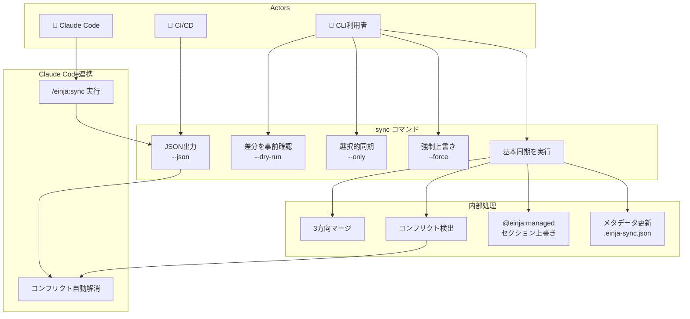

# sync コマンド 要件定義書

## 概要
AI駆動開発ツール（カスタムコマンド、エージェント、スキル、ドキュメント）のテンプレート更新を既存プロジェクトに安全に取り込むため、`@einja/cli`パッケージに`sync`コマンドを追加します。3方向マージによりローカル変更を保持しつつ、テンプレートの最新機能を継続的に反映できる仕組みを提供します。

## AS-IS（現状）

### 現在の実装状況
- CLIは`init`コマンドでプロジェクト初期セットアップを実行
- `.claude/`, `docs/templates/`, `docs/steering/`, `CLAUDE.md`を一括生成
- プリセット（minimal, turborepo-pandacss）から選択して初期化
- パッケージ名は`@einja/claude-cli`

### 現状の課題
- **テンプレート更新の反映が困難**: initコマンドは初回セットアップ専用で、既存プロジェクトへの更新適用手段がない
- **手動マージの負担**: テンプレートの改善（新エージェント追加、バグ修正）を手動でコピー・編集する必要がある
- **上書きリスク**: 既存ファイルを単純上書きするとカスタマイズが失われる
- **変更差分の把握困難**: どのファイルがテンプレートから変更されたか追跡できない
- **プロジェクト固有ファイルの保護不足**: `_`プレフィックスファイルなど、同期対象外とすべきファイルの管理が曖昧

## TO-BE（目標状態）

### 実現したい姿
- **継続的な更新適用**: 既存プロジェクトに対して`npx @einja/cli sync`で最新テンプレートを安全に取り込める
- **3方向マージによる変更保持**: ローカルのカスタマイズを保持しつつ、テンプレート更新をマージ
- **CLI管理セクションの上書き**: `@einja:managed`マーカーで特定セクションをCLIが完全管理
- **選択的同期**: `--only agents,commands`で特定カテゴリのみ更新
- **Claude Code連携**: `/einja:sync`コマンドによるコンフリクト自動解消

### 期待される改善
- **開発効率向上**: テンプレート更新を数秒で適用、手動コピー作業を削減
- **品質向上**: 最新のベストプラクティスやバグ修正を常に反映
- **安全性向上**: 3方向マージにより意図しない上書きを防止
- **透明性向上**: `--dry-run`で変更内容を事前確認可能

## ビジネス価値
- **問題**: テンプレートの継続的改善が既存プロジェクトに反映されず、開発効率とコード品質が低下
- **解決策**: 3方向マージによる安全な更新同期コマンドの提供
- **期待効果**: CLI利用者の手動マージ時間を80%削減、テンプレート改善の反映率100%達成

## スコープ
### 含まれるもの
- `sync`コマンドの実装（基本同期機能）
- 3方向マージロジック（ローカル・テンプレート・ベース）
- `@einja:managed`マーカーによるセクション上書き
- `einja/`サブディレクトリへのファイル分離
- 選択的同期オプション（`--only`）
- ドライラン機能（`--dry-run`）
- コンフリクト検出と報告
- パッケージ名変更（`@einja/claude-cli` → `@einja/cli`）

### 含まれないもの
- 自動コンフリクト解消UI（今後のフェーズで検討）
- Webベースの差分ビューア
- Git統合（git addやcommitの自動化）
- ロールバック機能（今後のフェーズで検討）

## ユースケース図



### アクター定義

| アクター | 説明 |
|---------|------|
| CLI利用者 | einja-inc orgメンバー。CLIを直接実行してテンプレート同期を行う |
| CI/CD | 自動化パイプライン。`--json`出力を解析して処理を行う |
| Claude Code | AIアシスタント。`/einja:sync`コマンドでコンフリクト自動解消を行う |

### ユースケース一覧

| UC | ユースケース | アクター | 説明 |
|----|-------------|---------|------|
| UC1 | 基本同期を実行 | CLI利用者 | テンプレート更新をプロジェクトにマージ |
| UC2 | 差分を事前確認 | CLI利用者 | `--dry-run`で変更内容を確認（ファイル変更なし） |
| UC3 | 選択的同期 | CLI利用者 | `--only agents,commands`で特定カテゴリのみ同期 |
| UC4 | 強制上書き | CLI利用者 | `--force`でローカル変更を無視して上書き |
| UC5 | JSON出力 | CI/CD | `--json`で機械可読な出力を取得 |
| UC6 | /einja:sync実行 | Claude Code | スラッシュコマンドで同期を実行 |
| UC7 | コンフリクト自動解消 | Claude Code | AIがコンフリクトを分析・解消 |

## 権限マトリクス

### ロール定義

| ロール | 説明 | 認証方法 |
|--------|------|----------|
| einja-inc Orgメンバー | einja-inc GitHub Organizationのメンバー | GitHub Packages認証（`GITHUB_TOKEN`） |
| 外部ユーザー | Orgメンバー以外のユーザー | - |

### 操作可否表

| 操作 | einja-inc Orgメンバー | 外部ユーザー | 備考 |
|------|:---------------------:|:------------:|------|
| パッケージインストール | ✅ | ❌ | GitHub Packages認証必須 |
| `npx @einja/cli sync` | ✅ | ❌ | 認証済み環境でのみ実行可能 |
| `npx @einja/cli init` | ✅ | ❌ | 認証済み環境でのみ実行可能 |
| `--dry-run` オプション | ✅ | ❌ | 同期コマンドのオプション |
| `--force` オプション | ✅ | ❌ | ローカル変更上書き |
| `/einja:sync` (Claude Code) | ✅ | ❌ | Claude Code内からの実行 |

### アクセス制御ルール

1. **パッケージアクセス**
   - `@einja/cli`はGitHub Packages経由でeinja-inc orgメンバーのみに配布
   - `.npmrc`に`@einja:registry=https://npm.pkg.github.com`と`GITHUB_TOKEN`の設定が必要

2. **コマンド実行権限**
   - 全てのコマンドはeinja-inc orgメンバーのみ実行可能
   - パッケージのインストール自体が認証で保護されているため、コマンドレベルでの追加認証は不要

3. **ファイル操作権限**
   - syncコマンドはローカルファイルシステムを操作
   - 実行ユーザーのファイルシステム権限に従う
   - `einja/`ディレクトリ内のファイルのみを同期対象とする

## ユーザーストーリー

### Story 1: 基本的なテンプレート同期
**As a** CLI利用者
**I want to** `npx @einja/cli sync`でテンプレート更新を取り込みたい
**So that** 手動マージ作業なしに最新機能を利用できる

#### 受け入れ基準
- [ ] **AC1.1**: Given: 既存プロジェクトに`.claude/`, `docs/`が存在する
             When: `npx @einja/cli sync`を実行
             Then: テンプレート最新版との差分がマージされ、成功メッセージが表示される
- [ ] **AC1.2**: Given: テンプレート更新がない場合
             When: syncコマンドを実行
             Then: "すでに最新です"とメッセージ表示され、ファイル変更は発生しない
- [ ] **AC1.3**: Given: ローカルでカスタマイズしたファイルが存在
             When: テンプレートも同じファイルを更新している
             Then: 3方向マージが実行され、両方の変更が保持される（コンフリクトがない場合）

#### 実装の優先順位
P0 (必須)

---

### Story 2: ディレクトリ分離による管理
**As a** プロジェクト管理者
**I want to** CLI管理ファイルを`einja/`サブディレクトリに分離したい
**So that** プロジェクト固有のカスタマイズと区別しやすくする

#### 受け入れ基準
- [ ] **AC2.1**: Given: 新規プロジェクトで`sync`コマンド実行
             When: 同期処理が完了
             Then: `.claude/commands/einja/`, `.claude/agents/einja/`, `.claude/skills/einja/`, `docs/einja/`にファイルが配置される
- [ ] **AC2.2**: Given: `_`プレフィックスのファイル（例: `_custom-agent.md`）が存在
             When: syncコマンドを実行
             Then: `_`プレフィックスファイルはスキップされ、変更されない
- [ ] **AC2.3**: Given: `einja/`外のファイル（例: `.claude/commands/my-custom-cmd.md`）が存在
             When: syncコマンドを実行
             Then: `einja/`外のファイルは同期対象外として扱われる

#### 実装の優先順位
P0 (必須)

---

### Story 3: @einja:managedマーカーによるセクション管理
**As a** テンプレート管理者
**I want to** `@einja:managed`マーカーで特定セクションをCLI管理対象にしたい
**So that** 重要なセクション（設定項目など）を常にテンプレート最新版で上書きできる

#### 受け入れ基準
- [ ] **AC3.1**: Given: ファイル内に`<!-- @einja:managed:start -->...<!-- @einja:managed:end -->`セクションが存在
             When: syncコマンドを実行
             Then: マーカー内のセクションはテンプレート版で完全上書きされる
- [ ] **AC3.2**: Given: マーカー外のセクションにローカル変更がある
             When: syncコマンドを実行
             Then: マーカー外のセクションは3方向マージが適用され、ローカル変更が保持される
- [ ] **AC3.3**: Given: マーカーが正しくペアになっていない（startのみ、endのみ）
             When: syncコマンドを実行
             Then: エラーメッセージが表示され、同期処理がスキップされる

#### 実装の優先順位
P1 (重要)

---

### Story 4: 選択的同期
**As a** CLI利用者
**I want to** `--only`オプションで特定カテゴリのみ同期したい
**So that** 必要な部分だけを更新し、変更範囲を限定できる

#### 受け入れ基準
- [ ] **AC4.1**: Given: `--only commands,agents`オプション指定
             When: syncコマンドを実行
             Then: `.claude/commands/einja/`, `.claude/agents/einja/`のみ同期され、skills, docsはスキップされる
- [ ] **AC4.2**: Given: `--only skills`オプション指定
             When: syncコマンドを実行
             Then: `.claude/skills/einja/`のみ同期され、他のカテゴリはスキップされる
- [ ] **AC4.3**: Given: 無効なカテゴリ名（例: `--only invalid-category`）を指定
             When: syncコマンドを実行
             Then: エラーメッセージ"無効なカテゴリ: invalid-category"が表示され、有効なカテゴリ一覧が提示される

#### 実装の優先順位
P1 (重要)

---

### Story 5: ドライラン機能
**As a** CLI利用者
**I want to** `--dry-run`オプションで変更内容を事前確認したい
**So that** 実際の変更前に差分を把握し、安全性を確認できる

#### 受け入れ基準
- [ ] **AC5.1**: Given: `--dry-run`オプション指定
             When: syncコマンドを実行
             Then: ファイル変更は発生せず、変更予定のファイル一覧と差分サマリーが表示される
- [ ] **AC5.2**: Given: `--dry-run --json`オプション指定
             When: syncコマンドを実行
             Then: JSON形式で差分情報が出力される（CI/CD連携用）
- [ ] **AC5.3**: Given: コンフリクトが検出される状況
             When: `--dry-run`を実行
             Then: コンフリクト箇所がハイライト表示され、ファイルパスと行番号が示される

#### 実装の優先順位
P0 (必須)

---

### Story 6: 強制上書きオプション
**As a** プロジェクト初期化を再実行したいCLI利用者
**I want to** `--force`オプションでローカル変更を無視して同期したい
**So that** クリーンな状態でテンプレートを再適用できる

#### 受け入れ基準
- [ ] **AC6.1**: Given: `--force`オプション指定
             When: syncコマンドを実行
             Then: すべてのファイルがテンプレート版で上書きされ、3方向マージはスキップされる
- [ ] **AC6.2**: Given: `--force`オプション指定
             When: syncコマンドを実行
             Then: 実行前に確認プロンプト"すべてのローカル変更が失われます。続けますか？"が表示される
- [ ] **AC6.3**: Given: `--force --yes`オプション指定
             When: syncコマンドを実行
             Then: 確認プロンプトなしで強制上書きが実行される

#### 実装の優先順位
P2 (あれば良い)

---

### Story 7: コンフリクト検出と報告
**As a** CLI利用者
**I want to** マージコンフリクトを検出してもらいたい
**So that** 手動解決が必要な箇所を明確に把握できる

#### 受け入れ基準
- [ ] **AC7.1**: Given: ローカルとテンプレートで同じ行を異なる内容で変更
             When: syncコマンドを実行
             Then: コンフリクトマーカー（`<<<<<<< LOCAL`, `=======`, `>>>>>>> TEMPLATE`）が挿入され、ファイルパスが報告される
- [ ] **AC7.2**: Given: コンフリクトが検出された
             When: syncコマンドが完了
             Then: 終了コード1で終了し、コンフリクト解消方法のヘルプメッセージが表示される
- [ ] **AC7.3**: Given: コンフリクトファイルが存在
             When: 再度syncコマンドを実行
             Then: "未解決のコンフリクトが存在します"とエラー表示され、同期処理がスキップされる

#### 実装の優先順位
P0 (必須)

---

### Story 8: JSON出力オプション
**As a** CI/CDパイプライン管理者
**I want to** `--json`オプションで同期結果をJSON形式で取得したい
**So that** 自動化スクリプトで同期結果を処理できる

#### 受け入れ基準
- [ ] **AC8.1**: Given: `--json`オプション指定
             When: syncコマンドを実行
             Then: 標準出力にJSON形式で結果が出力される（`{"status": "success", "files": {...}}`）
- [ ] **AC8.2**: Given: `--json`オプション指定かつコンフリクト発生
             When: syncコマンドを実行
             Then: JSON内に`"conflicts": [...]`配列でコンフリクト情報が含まれる
- [ ] **AC8.3**: Given: `--json`オプション指定
             When: syncコマンドを実行
             Then: ログメッセージ（spinner等）は標準エラー出力に出力され、JSONのみが標準出力に出力される

#### 実装の優先順位
P2 (あれば良い)

---

### Story 9: パッケージ名変更
**As a** CLIユーザー
**I want to** パッケージ名を`@einja/cli`として使用したい
**So that** より短くシンプルな名前でコマンドを実行できる

#### 受け入れ基準
- [ ] **AC9.1**: Given: 新規インストール
             When: `npx @einja/cli sync`を実行
             Then: コマンドが正常に実行される
- [ ] **AC9.2**: Given: package.jsonの`name`フィールド
             When: ファイルを確認
             Then: `"name": "@einja/cli"`と記載されている
- [ ] **AC9.3**: Given: 既存の`@einja/claude-cli`ユーザー
             When: `npx @einja/claude-cli`を実行
             Then: 非推奨警告"パッケージ名が変更されました。@einja/cliを使用してください"が表示される

#### 実装の優先順位
P0 (必須)

## 詳細なビジネス要件

### ディレクトリ構造要件
#### einja/サブディレクトリ構造
**要件内容**:
- CLI管理ファイルは`einja/`サブディレクトリに配置
- ディレクトリ構造:
  ```
  .claude/
  ├── commands/
  │   ├── einja/           # CLI管理（同期対象）
  │   │   ├── spec-create.md
  │   │   └── task-exec.md
  │   └── my-custom.md     # プロジェクト固有（同期対象外）
  ├── agents/
  │   └── einja/           # CLI管理（同期対象）
  ├── skills/
  │   └── einja/           # CLI管理（同期対象）
  docs/
  ├── einja/               # CLI管理（同期対象）
  ├── steering/            # プロジェクト固有（同期対象外）
  └── templates/           # プロジェクト固有（同期対象外）
  ```

**同期対象ディレクトリ**:
- `.claude/commands/einja/`
- `.claude/agents/einja/`
- `.claude/skills/einja/`
- `docs/einja/`

**同期対象外ディレクトリ**:
- `.claude/commands/` (einja/外)
- `.claude/agents/` (einja/外)
- `.claude/skills/` (einja/外)
- `docs/steering/`
- `docs/templates/`
- `docs/specs/`

### ファイル除外ルール
#### スキップ対象ファイル
**要件内容**:
- `_`プレフィックスで始まるファイルは同期対象外
- `.gitignore`パターンに一致するファイルは同期対象外
- バイナリファイルは同期対象外

**OK例（同期対象）**:
- `.claude/agents/einja/spec-requirements.md`
- `.claude/commands/einja/task-exec.md`
- `docs/einja/acceptance-criteria-and-qa-guide.md`

**NG例（同期対象外）**:
- `.claude/agents/einja/_my-custom-agent.md` - `_`プレフィックス
- `.claude/commands/my-project-specific.md` - einja/外
- `docs/steering/development/testing-strategy.md` - 同期対象外ディレクトリ

### 3方向マージ仕様
#### マージアルゴリズム
**要件内容**:
- **ベース版（Base）**: 前回の同期時点のテンプレート版（メタデータで管理）
- **ローカル版（Local）**: 現在のプロジェクトのファイル
- **テンプレート版（Template）**: 最新のテンプレートファイル

**マージルール**:
1. ベース→ローカルのみ変更: ローカルの変更を採用
2. ベース→テンプレートのみ変更: テンプレートの変更を採用
3. 両方変更かつコンフリクトなし: 両方の変更をマージ
4. 両方変更かつコンフリクトあり: コンフリクトマーカーを挿入

**コンフリクトマーカー形式**:
```
<<<<<<< LOCAL (your changes)
ローカルの内容
=======
テンプレートの内容
>>>>>>> TEMPLATE (from @einja/cli)
```

### @einja:managedマーカー仕様
#### マーカー構文
**要件内容**:
- Markdown/テキストファイル: `<!-- @einja:managed:start -->...<!-- @einja:managed:end -->`
- YAML/JSONファイル: `# @einja:managed:start`...`# @einja:managed:end`
- マーカー内のセクションは3方向マージをスキップし、テンプレート版で完全上書き

**使用例**:
```markdown
# カスタムコマンド

<!-- @einja:managed:start -->
## 標準コマンド一覧
- /spec-create
- /task-exec
<!-- @einja:managed:end -->

## プロジェクト固有コマンド
- /my-custom-command
```

この場合、"標準コマンド一覧"セクションは常にテンプレート版で上書きされ、"プロジェクト固有コマンド"は3方向マージが適用される。

### メタデータ管理
#### .einja-sync.jsonファイル
**要件内容**:
- 同期メタデータを`.einja-sync.json`に保存
- 保存内容:
  - 前回同期時のテンプレートバージョン
  - ファイルごとのハッシュ値（ベース版として使用）
  - 最終同期日時

**ファイル形式**:
```json
{
  "version": "0.2.0",
  "lastSync": "2026-01-03T10:00:00Z",
  "files": {
    ".claude/agents/einja/spec-requirements.md": {
      "hash": "abc123...",
      "syncedAt": "2026-01-03T10:00:00Z"
    }
  }
}
```

## 非機能要件

### パフォーマンス
- ファイル100個の同期: 3秒以内
- 差分計算: ファイル1個あたり50ms以内
- メモリ使用量: 100MB以下

### セキュリティ
- ファイルパストラバーサル攻撃の防止（`../`等のパス検証）
- シンボリックリンクの追跡制限
- 実行権限の保持（既存ファイルの権限を変更しない）

### 可用性
- ネットワーク不要（オフライン実行可能）
- 部分的な同期失敗時のロールバック機能
- エラー発生時の詳細なログ出力

## 使用可能者の要件

### 対象ユーザー
- einja-inc GitHub Organizationのメンバー全員

### 前提条件
- Node.js >= 20.0.0
- GitHub アカウント（einja-inc orgメンバー）
- npm/pnpm への GitHub Packages 認証設定済み

### パッケージ配布方式
- **配布先**: GitHub Packages（`npm.pkg.github.com`）
- **スコープ**: `@einja`
- **アクセス制御**: einja-inc orgメンバー全員

### 認証設定（利用者側）
プロジェクトの`.npmrc`に以下を設定：
```
@einja:registry=https://npm.pkg.github.com
//npm.pkg.github.com/:_authToken=${GITHUB_TOKEN}
```

## 技術的制約
- Node.js >= 20.0.0必須
- 既存の`@einja/claude-cli`アーキテクチャを踏襲
- `commander`, `chalk`, `ora`, `fs-extra`の継続使用
- TypeScript strict mode準拠

## 依存関係
- `diff`ライブラリ（3方向マージ用）- 候補: `diff3`, `node-diff3`
- `minimatch`（ファイルパターンマッチング）
- 既存の`preset.ts`, `file-system.ts`モジュール

## リスクと対策
| リスク | 影響度 | 発生確率 | 対策 |
|--------|--------|----------|------|
| 3方向マージの複雑性 | 高 | 中 | 段階的実装（まず単純マージから）、十分なテストケース |
| コンフリクト頻発 | 中 | 中 | `@einja:managed`マーカーの活用推奨、ドキュメント整備 |
| バックアップ失敗 | 高 | 低 | 同期前の自動バックアップ、ロールバック機能 |
| パフォーマンス劣化 | 中 | 低 | ファイルハッシュキャッシュ、差分計算の最適化 |

## 成功指標
- `sync`コマンドの実行成功率: 95%以上
- 手動マージ時間の削減: 80%以上
- テンプレート更新の反映率: 100%（リリース後1週間以内）
- ユーザー満足度スコア: 4.0/5.0以上

## タイムライン
- Phase 1: 基本的な同期機能（Story 1, 2, 5, 7, 9） - 2週間
- Phase 2: 高度な機能（Story 3, 4） - 1週間
- Phase 3: 最適化とオプション機能（Story 6, 8） - 1週間
