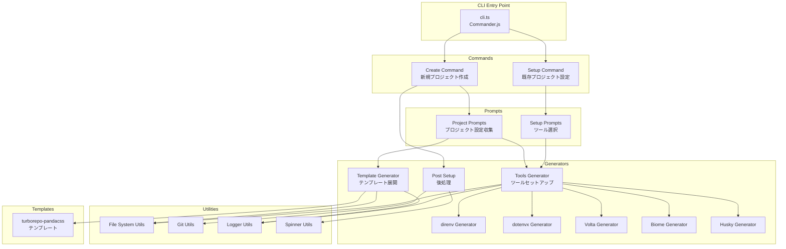
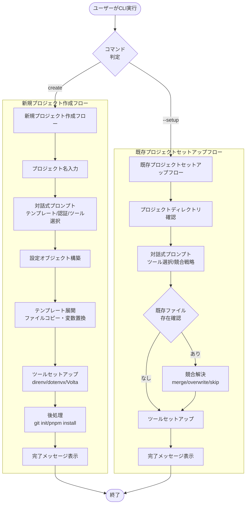
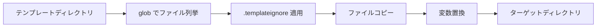
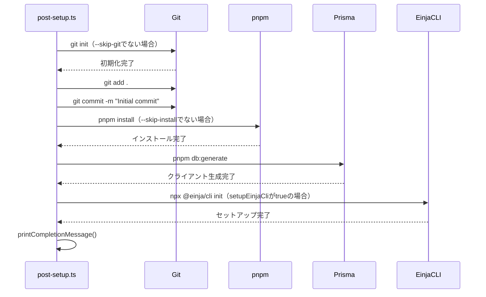
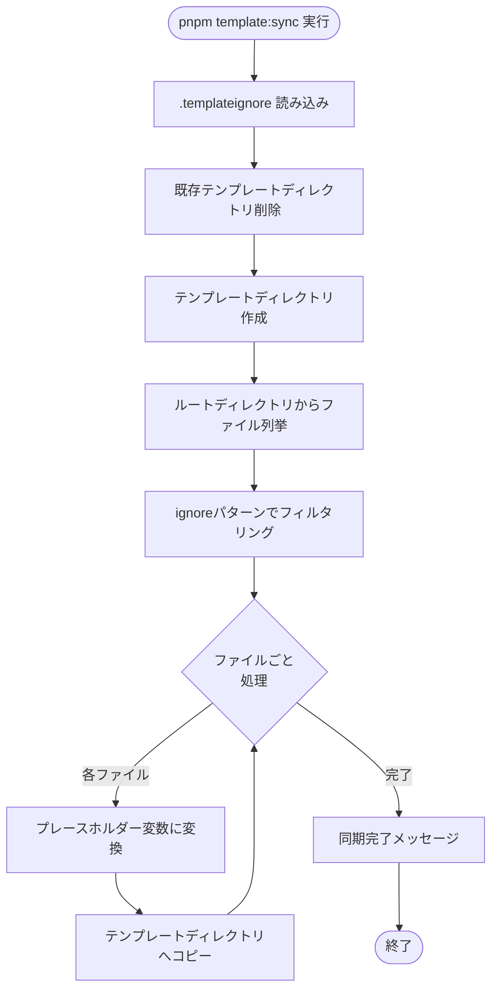
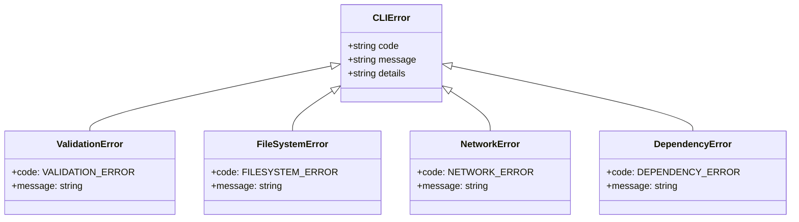
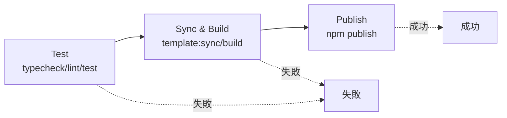

# create-einja-app 設計書

## 1. 概要

### 1.1 ドキュメント情報

| 項目 | 内容 |
|------|------|
| 機能名 | create-einja-app |
| GitHub Issue | [#22](https://github.com/einja-inc/einja-management-template/issues/22) |
| 関連ドキュメント | [requirements.md](./requirements.md) |
| 作成日 | 2026-01-04 |
| ステータス | Draft |

### 1.2 設計方針

`npx create-einja-app my-project` でプロジェクトテンプレートを一発展開できるCLIパッケージを新規作成します。Turborepo + Next.js 15 + Auth.js + Prisma 構成を効率的に展開し、既存プロジェクトにも環境ツールを追加できる機能を提供します。

**主要な技術的課題と解決方針：**

1. **テンプレート管理の効率化**
   - 解決策: メインリポジトリと同期する自動化スクリプト（pnpm template:sync）
   - .templateignoreによる除外ファイル管理
   - プレースホルダー変数による柔軟なカスタマイズ

2. **対話式プロンプトのユーザビリティ**
   - 解決策: inquirerによる直感的なプロンプトシステム
   - デフォルト値の適切な設定
   - --yesオプションによる非対話モード

3. **既存プロジェクトへの安全な追加**
   - 解決策: 競合戦略（merge/overwrite/skip）の選択
   - 既存ファイルの検知とバックアップ機能
   - 段階的なツール追加のサポート

4. **モジュールエクスポート管理**
   - 解決策: package.jsonのワイルドカードexports
   - index.ts不使用方針の徹底
   - ファイル追加時のpackage.json更新不要

---

## 2. システムアーキテクチャ

### 2.1 全体構成図



### 2.2 データフロー図（DFD）



### 2.3 データフロー説明

**新規プロジェクト作成フロー：**
1. ユーザーが `npx create-einja-app my-project` を実行
2. プロジェクト名の入力（引数指定時はスキップ）
3. 対話式プロンプトで設定を収集（テンプレート、認証方式、環境ツール等）
4. 設定オブジェクトの構築
5. テンプレートファイルの展開とプレースホルダー変数の置換
6. 選択されたツールのセットアップ（direnv、dotenvx、Volta等）
7. 後処理（Git初期化、依存関係インストール、Prismaクライアント生成）
8. 完了メッセージと次のステップの表示

**既存プロジェクトセットアップフロー：**
1. ユーザーが `npx create-einja-app --setup` を実行
2. 現在のディレクトリがプロジェクトか確認
3. 対話式プロンプトでツール選択と競合戦略を収集
4. 既存ファイルの存在確認
5. 競合戦略に基づく処理（merge/overwrite/skip）
6. 選択されたツールのセットアップ
7. 完了メッセージの表示

---

## 3. コンポーネントとインターフェース

### 3.1 CLIエントリーポイント

**ファイル**: `src/cli.ts`

**責務**: Commanderを使用したCLI引数のパース、サブコマンドの登録

**主要な機能**:
- `create` コマンドの登録
- `--setup` オプションの処理
- バージョン情報の表示
- ヘルプメッセージの表示

### 3.2 Commands モジュール

#### create.ts - 新規プロジェクト作成コマンド

**配置**: `src/commands/create.ts`

| 項目 | 内容 |
|------|------|
| **引数** | `[project-name]` - プロジェクト名（オプション） |
| **オプション** | `--template` - テンプレート名<br/>`--skip-git` - Git初期化スキップ<br/>`--skip-install` - インストールスキップ<br/>`-y, --yes` - 対話プロンプトスキップ |
| **処理フロー** | 1. プロンプトで設定収集<br/>2. テンプレート展開<br/>3. ツールセットアップ<br/>4. 後処理 |

#### setup.ts - 既存プロジェクトセットアップコマンド

**配置**: `src/commands/setup.ts`

| 項目 | 内容 |
|------|------|
| **引数** | なし |
| **オプション** | なし |
| **処理フロー** | 1. プロジェクトディレクトリ確認<br/>2. プロンプトで設定収集<br/>3. ツールセットアップ |

### 3.3 Prompts モジュール

#### project.ts - プロジェクト作成プロンプト

**配置**: `src/prompts/project.ts`

**ProjectConfig型**:

| フィールド | 型 | 説明 |
|-----------|-----|------|
| projectName | string | プロジェクト名 |
| template | "turborepo-pandacss" \| "minimal" | テンプレート種別 |
| authMethod | "google" \| "credentials" \| "github" \| "none" | 認証方式 |
| tools.direnv | boolean | direnv使用可否 |
| tools.dotenvx | boolean | dotenvx使用可否 |
| tools.volta | boolean | Volta使用可否 |
| setupEinjaCli | boolean | @einja/cli自動セットアップ可否 |
| worktreeConfig | WorktreeConfig? | Worktree設定（オプション） |

**WorktreeConfig型**:

| フィールド | 型 | 説明 |
|-----------|-----|------|
| postgres.port | number | PostgreSQLポート番号 |
| postgres.containerName | string | Dockerコンテナ名 |
| apps | App[] | アプリケーション設定配列 |

**App型**:

| フィールド | 型 | 説明 |
|-----------|-----|------|
| id | string | アプリケーションID |
| portRangeStart | number | ポート範囲開始 |
| rangeSize | number | ポート範囲サイズ |

#### setup.ts - セットアッププロンプト

**配置**: `src/prompts/setup.ts`

**SetupConfig型**:

| フィールド | 型 | 説明 |
|-----------|-----|------|
| tools.direnv | boolean | direnv使用可否 |
| tools.dotenvx | boolean | dotenvx使用可否 |
| tools.volta | boolean | Volta使用可否 |
| tools.biome | boolean | Biome使用可否 |
| tools.husky | boolean | Husky使用可否 |
| conflictStrategy | "merge" \| "overwrite" \| "skip" | 競合戦略 |

### 3.4 Generators モジュール

#### template.ts - テンプレート展開

**配置**: `src/generators/template.ts`

**責務**:
- テンプレートディレクトリからファイルをコピー
- プレースホルダー変数の置換
- 認証方式に応じたファイル除外

**TemplateVariables型**:

| フィールド | 型 | 説明 |
|-----------|-----|------|
| projectName | string | プロジェクト名 |
| packageName | string | パッケージ名 |
| description | string | プロジェクト説明 |

**主要な処理**:



#### tools/ - ツールジェネレーター

各ツールのセットアップを担当する独立したジェネレーター：

**direnv.ts**:

| 処理項目 | 説明 |
|---------|------|
| .envrc 生成 | dotenv_if_exists設定 |
| .envrc.example 生成 | テンプレートファイル |
| .gitignore 追加 | .envrcをgitignore |
| direnv allow 確認 | ユーザーに確認プロンプト |

**dotenvx.ts**:

| 処理項目 | 説明 |
|---------|------|
| package.json 更新 | @dotenvx/dotenvx 依存追加 |
| npm scripts 追加 | env:encrypt, env:decrypt |
| .env.example 生成 | 環境変数テンプレート |

**volta.ts**:

| 処理項目 | 説明 |
|---------|------|
| package.json 更新 | volta フィールド追加 |
| .node-version 生成 | Node.jsバージョン指定 |

**biome.ts**:

| 処理項目 | 説明 |
|---------|------|
| biome.json 生成 | Biome設定ファイル |
| package.json 更新 | @biomejs/biome 依存追加<br/>lint/format スクリプト追加 |
| VSCode設定追加 | .vscode/settings.json |

**husky.ts**:

| 処理項目 | 説明 |
|---------|------|
| package.json 更新 | husky, lint-staged 依存追加<br/>prepare スクリプト追加<br/>lint-staged 設定追加 |
| .husky/ 作成 | Huskyディレクトリ |
| pre-commit フック作成 | lint-staged実行 |

#### post-setup.ts - 後処理

**配置**: `src/generators/post-setup.ts`

**処理フロー**:



### 3.5 Utilities モジュール

**fs.ts - ファイルシステム操作**:

| 関数 | 説明 |
|------|------|
| writeWithStrategy | 競合戦略に基づくファイル書き込み |
| ensureDir | ディレクトリ作成（存在しない場合） |
| appendToGitignore | .gitignoreへの追記 |

**git.ts - Git操作**:

| 関数 | 説明 |
|------|------|
| isGitRepository | Gitリポジトリか確認 |
| initRepository | Git初期化 |
| commitFiles | ファイルコミット |

**logger.ts - ログ出力**:

| 関数 | 説明 |
|------|------|
| info | 情報メッセージ |
| success | 成功メッセージ（緑色） |
| warn | 警告メッセージ（黄色） |
| error | エラーメッセージ（赤色） |

**spinner.ts - プログレス表示**:

| 関数 | 説明 |
|------|------|
| start | スピナー開始 |
| succeed | 成功表示 |
| fail | 失敗表示 |
| warn | 警告表示 |

---

## 4. テンプレート構成

### 4.1 turborepo-pandacss テンプレート

**ディレクトリ構造**:

```
templates/turborepo-pandacss/
├── apps/
│   └── web/
│       ├── src/
│       │   ├── app/
│       │   │   ├── (authenticated)/
│       │   │   │   └── dashboard/
│       │   │   ├── signin/
│       │   │   ├── signup/
│       │   │   └── api/auth/
│       │   └── components/
│       └── package.json.template
├── packages/
│   ├── config/
│   ├── types/
│   ├── database/
│   ├── auth/
│   └── ui/
├── .claude/
│   ├── commands/einja/
│   ├── agents/einja/
│   └── skills/einja/
├── docs/einja/
├── .envrc.template
├── .env.example
├── docker-compose.yml
├── turbo.json
├── pnpm-workspace.yaml
└── package.json.template
```

**認証方式ごとのファイル除外**:

| 認証方式 | 除外対象 |
|---------|---------|
| none | `**/api/auth/**`<br/>`**/packages/auth/**`<br/>`**/signin/**`<br/>`**/signup/**` |
| google | なし |
| credentials | なし |
| github | なし |

### 4.2 .templateignore

**除外対象**:

```
packages/cli/
packages/create-einja-app/
node_modules/
.git/
.next/
out/
*.log
logs/
.env
.env.local
.env.*.local
.idea/
.vscode/settings.json
.DS_Store
Thumbs.db
coverage/
packages/database/prisma/migrations/
styled-system/
```

### 4.3 プレースホルダー変数

| 変数 | 置換内容 | 使用例 |
|------|---------|--------|
| `{{projectName}}` | プロジェクト名 | `my-project` |
| `{{packageName}}` | パッケージ名 | `@my-project` |
| `{{description}}` | プロジェクト説明 | `my-project - Einja Management Template` |

---

## 5. テンプレート同期システム

### 5.1 同期フロー図



### 5.2 同期スクリプト設計

**配置**: `scripts/template-sync.ts`

**処理ステップ**:

| ステップ | 処理内容 |
|---------|---------|
| 1. 準備 | 既存テンプレートディレクトリを削除し、新規作成 |
| 2. 除外パターン読み込み | .templateignoreファイルを読み込みignoreオブジェクト生成 |
| 3. ファイル列挙 | ルートディレクトリから全ファイルを列挙（globパターン使用） |
| 4. フィルタリング | ignoreパターンに基づきコピー対象ファイルを選定 |
| 5. 変数変換 | package.jsonのnameフィールド等を`{{projectName}}`に置換 |
| 6. コピー | テンプレートディレクトリへファイルをコピー |
| 7. 完了 | 同期完了メッセージとファイル数を表示 |

**変数変換ロジック**:

| 対象ファイル | 変換処理 |
|------------|---------|
| package.json | `name` フィールドを `{{projectName}}` に置換<br/>JSON形式を保持してシリアライズ |
| その他 | 変換なし（そのままコピー） |

---

## 6. Worktree設定システム

### 6.1 設定スキーマ（WorktreeConfig）

**ファイル**: `worktree.config.json`

| フィールド | 型 | デフォルト値 | 説明 |
|-----------|-----|-------------|------|
| schemaVersion | number | 1 | スキーマバージョン |
| postgres.port | number | 25432 | PostgreSQLポート |
| postgres.containerName | string | `{{projectName}}-postgres` | Dockerコンテナ名 |
| apps[].id | string | "web" | アプリケーションID |
| apps[].portRangeStart | number | 3000 | ポート範囲開始 |
| apps[].rangeSize | number | 1000 | ポート範囲サイズ |

### 6.2 Worktreeポート割り当て

**ロジック**:
1. ブランチ名からSHA-256ハッシュを計算
2. ハッシュの先頭4バイトを整数化
3. `portRangeStart + (hash % rangeSize)` でポート番号を決定

**例**:

| ブランチ名 | ハッシュ（先頭） | ポート番号 |
|-----------|---------------|-----------|
| main | 0x3C... | 3195 |
| feature/auth | 0x12... | 3122 |

---

## 7. エラーハンドリング

### 7.1 エラー分類



### 7.2 エラーハンドリング戦略

| エラー種別 | ユーザー向けメッセージ | 対処方法 |
|-----------|---------------------|---------|
| ValidationError | 入力値が不正です: {詳細} | プロンプト再表示、修正を促す |
| FileSystemError | ファイル操作に失敗しました: {詳細} | ロールバック、権限確認案内 |
| NetworkError | ネットワークエラーが発生しました | リトライ、オフラインモード案内 |
| DependencyError | 依存関係のインストールに失敗しました | 手動インストール手順を表示 |

### 7.3 リトライ戦略

| 処理 | リトライ回数 | リトライ間隔 |
|------|------------|------------|
| npm/pnpm install | 3回 | 5秒 |
| Git操作 | 3回 | 2秒 |
| ネットワーク通信 | 5回 | 指数バックオフ（1s, 2s, 4s, 8s, 16s） |

---

## 8. ビルド・配布設定

### 8.1 package.json

**主要フィールド**:

| フィールド | 値 |
|-----------|-----|
| name | create-einja-app |
| version | 1.0.0 |
| type | module |
| bin.create-einja-app | ./dist/cli.js |
| files | ["dist", "templates"] |
| engines.node | >=20.0.0 |
| publishConfig.access | public |

**依存関係**:

| パッケージ | バージョン | 用途 |
|-----------|----------|------|
| chalk | ^5.3.0 | カラー出力 |
| commander | ^12.1.0 | CLIパーサー |
| execa | ^9.5.1 | コマンド実行 |
| fs-extra | ^11.2.0 | ファイル操作 |
| glob | ^11.0.0 | ファイル検索 |
| ignore | ^7.0.0 | ignoreパターン処理 |
| inquirer | ^12.0.0 | 対話式プロンプト |
| ora | ^8.1.1 | プログレス表示 |

**開発依存関係**:

| パッケージ | バージョン | 用途 |
|-----------|----------|------|
| @types/fs-extra | ^11.0.4 | 型定義 |
| @types/inquirer | ^9.0.7 | 型定義 |
| @types/node | ^22.10.2 | 型定義 |
| tsup | ^8.3.5 | ビルドツール |
| typescript | ^5.7.2 | TypeScript |
| vitest | ^2.1.8 | テストランナー |

**npm scripts**:

| スクリプト | コマンド | 説明 |
|-----------|---------|------|
| build | tsup | ビルド |
| dev | tsup --watch | 開発モード |
| typecheck | tsc --noEmit | 型チェック |
| lint | biome lint . | Lint |
| test | vitest | テスト |
| prepublishOnly | pnpm build | npm publish前ビルド |

### 8.2 tsup設定

**tsup.config.ts**:

| 設定項目 | 値 | 説明 |
|---------|-----|------|
| entry | ["src/cli.ts"] | エントリーポイント |
| format | ["esm"] | ESM形式 |
| dts | true | 型定義生成 |
| clean | true | ビルド前クリーン |
| shims | true | Node.js shimを追加 |
| banner.js | "#!/usr/bin/env node" | CLIシバン |

---

## 9. テスト戦略

### 9.1 テストカテゴリ

| カテゴリ | ツール | 対象 | テストファイル配置 |
|---------|--------|------|-----------------|
| ユニットテスト | Vitest | 個別モジュール | `tests/unit/` |
| 統合テスト | Vitest | コマンド全体フロー | `tests/integration/` |
| E2Eテスト | Vitest + execa | 実際のプロジェクト生成 | `tests/e2e/` |

### 9.2 テストディレクトリ構造

```
packages/create-einja-app/
├── src/
│   ├── cli.ts
│   └── ...
├── tests/
│   ├── unit/
│   │   ├── generators/
│   │   │   ├── template.test.ts
│   │   │   └── tools/
│   │   │       ├── direnv.test.ts
│   │   │       ├── dotenvx.test.ts
│   │   │       └── volta.test.ts
│   │   └── utils/
│   │       ├── fs.test.ts
│   │       └── git.test.ts
│   ├── integration/
│   │   ├── create.test.ts
│   │   └── setup.test.ts
│   └── e2e/
│       └── project-generation.test.ts
└── vitest.config.ts
```

### 9.3 テストケース設計

#### ユニットテスト

**template.test.ts**:

| テストケース | Given | When | Then |
|------------|-------|------|------|
| テンプレート展開 | 有効なProjectConfig | generateTemplate実行 | ファイルがコピーされる |
| 変数置換 | `{{projectName}}`を含むファイル | generateTemplate実行 | プレースホルダーが実際の値に置換される |
| 認証なし除外 | authMethod="none" | generateTemplate実行 | 認証関連ファイルが除外される |

**direnv.test.ts**:

| テストケース | Given | When | Then |
|------------|-------|------|------|
| .envrc生成 | 新規プロジェクト | setupDirenv実行 | .envrcファイルが作成される |
| .gitignore追加 | 既存.gitignore | setupDirenv実行 | .envrcが追記される |
| 競合戦略（merge） | 既存.envrc | setupDirenv(merge)実行 | 既存内容に追記される |
| 競合戦略（skip） | 既存.envrc | setupDirenv(skip)実行 | 既存ファイルが保持される |

#### 統合テスト

**create.test.ts**:

| テストケース | Given | When | Then |
|------------|-------|------|------|
| 完全なプロジェクト作成 | デフォルト設定 | create実行 | プロジェクトディレクトリが作成され、すべてのファイルが存在する |
| Git初期化スキップ | --skip-gitオプション | create実行 | .gitディレクトリが作成されない |
| インストールスキップ | --skip-installオプション | create実行 | node_modulesディレクトリが作成されない |

**setup.test.ts**:

| テストケース | Given | When | Then |
|------------|-------|------|------|
| 既存プロジェクト追加 | 既存Next.jsプロジェクト | setup実行 | 選択したツールがセットアップされる |
| 競合マージ | 既存.envrc | setup(merge)実行 | 既存内容が保持され、新規設定が追記される |

#### E2Eテスト

**project-generation.test.ts**:

| テストケース | Given | When | Then |
|------------|-------|------|------|
| プロジェクト作成とビルド | デフォルト設定 | create→pnpm install→pnpm build | ビルドが成功する |
| 開発サーバー起動 | 生成されたプロジェクト | pnpm dev | サーバーが起動し、http://localhost:3000が応答する |

---

## 10. CI/CDパイプライン

### 10.1 GitHub Actionsワークフロー

**ファイル**: `.github/workflows/create-einja-app.yml`

**トリガー**:

| イベント | 対象パス |
|---------|---------|
| push (main) | `packages/create-einja-app/**`<br/>`apps/**`<br/>`packages/**`（`packages/cli/`除く） |
| pull_request | `packages/create-einja-app/**` |

**ジョブフロー**:



**ジョブ詳細**:

| ジョブ | ステップ | 説明 |
|-------|---------|------|
| test | pnpm -F create-einja-app typecheck | 型チェック |
|  | pnpm -F create-einja-app lint | Lint |
|  | pnpm -F create-einja-app test | テスト実行 |
| sync-and-build | pnpm template:sync | テンプレート同期 |
|  | pnpm -F create-einja-app build | ビルド |
|  | actions/upload-artifact | 成果物アップロード |
| publish | actions/download-artifact | 成果物ダウンロード |
|  | pnpm -F create-einja-app publish | npm公開 |

---

## 11. セキュリティ考慮事項

### 11.1 機密情報管理

**絶対に含めてはいけないファイル**:
- `.env`
- `.env.local`
- `.env.*.local`
- 認証トークン
- APIキー

**対策**:
- .templateignoreで明示的に除外
- テンプレート同期前の自動チェック
- `.env.example`のみを含め、実際の値は空にする

### 11.2 入力値バリデーション

| 入力項目 | バリデーション内容 |
|---------|-----------------|
| プロジェクト名 | 英数字・ハイフン・アンダースコアのみ許可<br/>先頭は英字<br/>1〜50文字 |
| ポート番号 | 1024〜65535の範囲 |
| ディレクトリパス | パストラバーサル攻撃の防止<br/>絶対パスまたは相対パスの正規化 |

### 11.3 外部コマンド実行

**原則**:
- ユーザー入力を直接シェルコマンドに渡さない
- execaのarray形式を使用し、シェルインジェクションを防止

**例**:

| ❌ 危険 | ✅ 安全 |
|-------|-------|
| `exec('git commit -m ' + userInput)` | `execa('git', ['commit', '-m', userInput])` |

---

## 12. パフォーマンス最適化

### 12.1 テンプレート展開の最適化

| 最適化項目 | 手法 |
|-----------|------|
| ファイルコピー | stream APIの使用で大容量ファイルに対応 |
| 並列処理 | Promise.allによる複数ファイルの並列コピー |
| 除外パターン | globのignoreオプションで不要なファイル走査を削減 |

### 12.2 ユーザビリティの向上

| 項目 | 実装 |
|------|------|
| プログレス表示 | oraによるスピナー表示 |
| 処理時間推定 | ファイル数に基づく進捗率表示 |
| エラー詳細 | スタックトレースのログファイル出力 |

---

## 13. 実装上の注意点

### 13.1 コード品質

**TypeScript厳格モード**:
- `strict: true` を必須とする
- any型の使用禁止（unknownを使用）
- すべての引数と返り値に型注釈を付ける

**ファイル構造**:
- index.ts完全不使用（package.jsonのワイルドカードexportsを使用）
- ファイル追加時にpackage.json更新不要

### 13.2 エラーメッセージ設計

**ユーザー向けメッセージの原則**:
- 何が起きたかを明確に伝える
- 次に何をすべきかを提示する
- 技術的詳細は詳細モードで表示

**例**:

| 状況 | メッセージ | 次のアクション |
|------|-----------|--------------|
| プロジェクトディレクトリ既存 | `エラー: ディレクトリ 'my-project' は既に存在します` | `別の名前を指定するか、--force オプションで上書きしてください` |
| Git未インストール | `警告: Gitがインストールされていません` | `Git初期化をスキップします。後で手動でgit initを実行してください` |
| pnpm未インストール | `エラー: pnpmがインストールされていません` | `pnpmをインストールしてください: npm install -g pnpm` |

### 13.3 テスタビリティ

**依存性注入**:
- ファイルシステム操作、Git操作はインターフェースとして抽出
- テスト時はモック実装を注入

**テストカバレッジ目標**:
- ユニットテスト: 80%以上
- 統合テスト: 主要フローの100%
- E2Eテスト: プロジェクト作成とセットアップの正常系100%

---

## 14. まとめ

この設計書に従うことで、以下を実現します：

✅ **モジュラー設計**: 独立したモジュールで保守性向上
✅ **テスタビリティ**: 依存性注入による高いテストカバレッジ
✅ **拡張性**: プラグインアーキテクチャの基盤
✅ **ユーザビリティ**: 直感的なCLI体験とわかりやすいメッセージ
✅ **型安全性**: TypeScript厳格モードによる堅牢性
✅ **自動化**: テンプレート同期とCI/CDパイプラインによる効率化

すべての実装は、この設計原則に従って行ってください。
