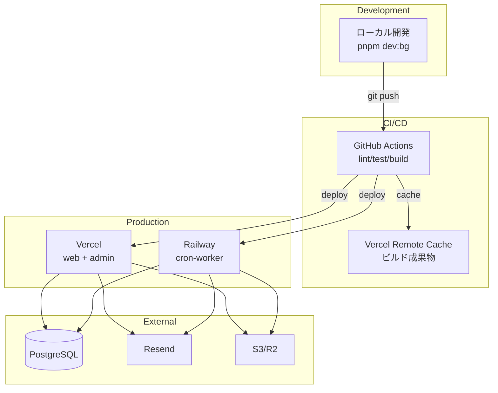
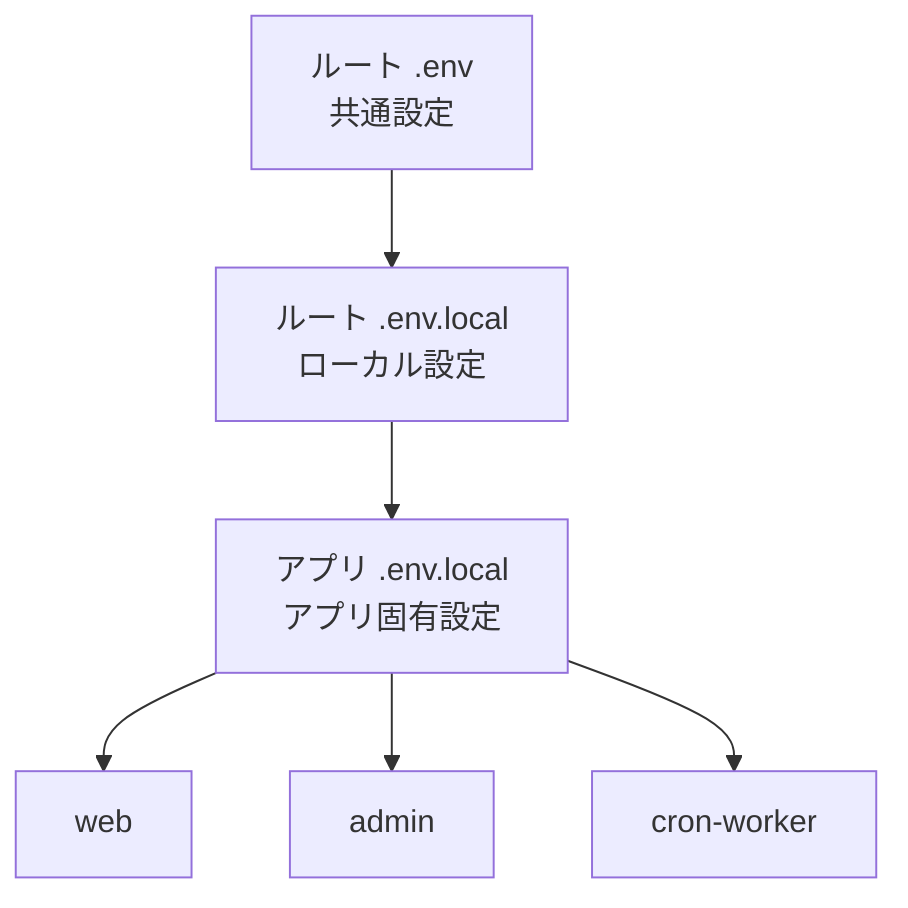

# システムアーキテクチャ概要

## 概要

このドキュメントでは、Turborepo + Next.jsモノレポプロジェクトの全体像を、図を中心に説明します。

バックエンド・フロントエンド横断で、リポジトリ内のアプリケーションとパッケージがどのように関連し、どのような技術スタックで構成されているかを理解できます。

---

## 目次

1. [システム構成図](#1-システム構成図)
2. [アプリケーション](#2-アプリケーション)
3. [共有パッケージ](#3-共有パッケージ)
4. [依存関係グラフ](#4-依存関係グラフ)
5. [技術スタック](#5-技術スタック)
6. [デプロイ先](#6-デプロイ先)
7. [環境管理](#7-環境管理)

---

## 1. システム構成図

### モノレポ全体構成

```mermaid
graph TB
    subgraph "Monorepo Root"
        RootConfig[Root Configuration<br/>biome.json<br/>tsconfig.base.json<br/>.env + .env.local]

        subgraph "Apps"
            WebApp[web<br/>Next.js 14 App Router<br/>Port: 3000 or dynamic]
            AdminApp[admin<br/>Next.js 14 App Router<br/>Port: 3001 or dynamic]
            CronWorker[cron-worker<br/>CLI Jobs (tsx)<br/>On demand execution]
        end

        subgraph "Shared Packages"
            ServerCore[@repo/server-core<br/>Domain Layer<br/>Infrastructure Layer<br/>Prisma Client<br/>(Application層は各アプリに配置)]
        end

        subgraph "Environment Management"
            DotenvCLI[dotenv-cli<br/>Hierarchical env loading]
            WorktreeScript[scripts/worktree/dev.ts<br/>Dynamic port allocation]
        end
    end

    subgraph "External Services"
        Vercel[Vercel Platform<br/>Deployment + Remote Cache]
        PostgreSQL[(PostgreSQL<br/>Database)]
        Railway[Railway<br/>Cron Worker Host]
        Resend[Resend<br/>Email Service]
        S3[S3/Cloudflare R2<br/>Storage]
    end

    RootConfig -.->|Inherits Config| WebApp
    RootConfig -.->|Inherits Config| AdminApp
    RootConfig -.->|Inherits Config| CronWorker
    RootConfig -.->|Inherits Config| ServerCore

    DotenvCLI -.->|Load .env| WebApp
    DotenvCLI -.->|Load .env| AdminApp
    DotenvCLI -.->|Load .env| CronWorker

    WorktreeScript -.->|Set ENV vars| WebApp
    WorktreeScript -.->|Set ENV vars| AdminApp
    WorktreeScript -.->|Set ENV vars| CronWorker

    WebApp --> ServerCore
    AdminApp --> ServerCore
    CronWorker --> ServerCore

    ServerCore -->|Connect| PostgreSQL
    ServerCore -->|Email| Resend
    ServerCore -->|Storage| S3

    WebApp -.->|Deploy| Vercel
    AdminApp -.->|Deploy| Vercel
    CronWorker -.->|Deploy| Railway

    WebApp -.->|Cache| Vercel
    AdminApp -.->|Cache| Vercel
    CronWorker -.->|Cache| Vercel
```

### ディレクトリ構造

```
project-root/
├── apps/                         # アプリケーション層
│   ├── web/                     # ユーザー向けWebアプリ
│   │   ├── src/
│   │   │   ├── app/            # Next.js App Router
│   │   │   ├── application/    # アプリケーション層（UseCases）⭐
│   │   │   ├── components/     # Reactコンポーネント
│   │   │   ├── lib/            # ライブラリ（Hono Client、API呼び出し）
│   │   │   └── hooks/          # カスタムフック（Tanstack Query）
│   │   └── package.json
│   ├── admin/                   # 管理画面
│   │   ├── src/
│   │   │   ├── app/
│   │   │   ├── application/    # アプリケーション層（UseCases）⭐
│   │   │   ├── components/
│   │   │   ├── lib/
│   │   │   └── hooks/
│   │   └── package.json
│   └── cron-worker/             # バッチ処理・定期実行
│       ├── src/
│       │   ├── application/    # アプリケーション層（UseCases）⭐
│       │   └── jobs/           # CLIジョブ定義
│       └── package.json
│
├── packages/                     # 共有パッケージ層
│   └── server-core/             # サーバーサイド共通ロジック
│       ├── src/
│       │   ├── domain/         # ドメイン層
│       │   ├── infrastructure/ # インフラ層
│       │   └── utils/          # ユーティリティ
│       └── package.json
│
├── scripts/                      # スクリプト
│   └── worktree/
│       └── dev.ts              # Worktree用ポート計算
│
├── .github/                      # CI/CD
│   └── workflows/
│       ├── ci.yml
│       └── deploy.yml
│
├── turbo.json                    # Turborepoパイプライン設定
├── pnpm-workspace.yaml           # pnpmワークスペース
├── biome.json                    # Linter/Formatter
├── tsconfig.base.json            # TypeScript基本設定
├── .env                          # 環境変数（ルート）
└── .env.local                    # 環境変数（ローカル）
```

---

## 2. アプリケーション

### 2.1 web（ユーザー向けWebアプリ）

| 項目 | 内容 |
|------|------|
| **フレームワーク** | Next.js 14 App Router |
| **ポート** | 3000（デフォルト） or Worktree動的割り当て |
| **用途** | エンドユーザー向けのフロントエンド機能 |
| **主要機能** | 投稿一覧・作成・詳細、ユーザー認証 |
| **デプロイ先** | Vercel |

**技術構成**:
- **UI**: React 18 + Tailwind CSS
- **データフェッチング**: Tanstack Query + Hono Client
- **フォーム管理**: React Hook Form + zodResolver
- **バリデーション**: Zod

### 2.2 admin（管理画面）

| 項目 | 内容 |
|------|------|
| **フレームワーク** | Next.js 14 App Router |
| **ポート** | 3001（デフォルト） or Worktree動的割り当て |
| **用途** | システム管理者向けの管理機能 |
| **主要機能** | 投稿管理、ユーザー管理、システム設定 |
| **デプロイ先** | Vercel |

**技術構成**:
- webと同様（React、Tanstack Query、React Hook Form）
- 管理者専用のUIコンポーネント

### 2.3 cron-worker（バッチ処理・定期実行）

| 項目 | 内容 |
|------|------|
| **実行形式** | CLI（tsxによる直接実行） |
| **用途** | バックグラウンドジョブ、定期実行タスク |
| **主要機能** | データクリーンアップ、メール送信、集計処理 |
| **デプロイ先** | Railway（Cron設定） |

**技術構成**:
- Node.js CLI（tsxランタイム）
- JobCoordinatorによるジョブロック機構
- @repo/server-coreへの直接アクセス

**Cronスケジュール例**:
```yaml
# railway.toml
[[crons]]
command = "pnpm job:cleanup"
schedule = "0 0 * * *"  # 毎日午前0時

[[crons]]
command = "pnpm job:email-digest"
schedule = "0 9 * * *"  # 毎日午前9時
```

---

## 3. 共有パッケージ

### @repo/server-core

**用途**: サーバーサイドの共通ロジックを一元管理

**提供機能**:
- **Domain層**: エンティティ、バリューオブジェクト、リポジトリインターフェース
- **Infrastructure層**: Prisma実装、Mapper、外部サービス連携
- **Utils**: Result型、エラークラス、共通関数

**注意**: Application層（UseCases）は各アプリケーション（web、admin、cron-worker）に配置します。

**依存関係**:
- web → @repo/server-core
- admin → @repo/server-core
- cron-worker → @repo/server-core

**主要コンポーネント**:

| コンポーネント | 役割 |
|--------------|------|
| **Prisma Client** | データベースアクセス（型安全なORM） |
| **Repository** | データアクセスの抽象化 |
| **Mapper** | Prismaモデル ⇔ Domainエンティティ変換 |
| **Validator** | Zodスキーマによるバリデーション |
| **Result型** | 例外を使わないエラーハンドリング |

**各アプリケーション固有のコンポーネント**:

| コンポーネント | 配置場所 | 役割 |
|--------------|---------|------|
| **UseCase** | apps/*/src/application/ | アプリ固有のビジネスロジック（オブジェクトリテラル形式） |

---

## 4. 依存関係グラフ

### パッケージ依存関係

```mermaid
graph TD
    subgraph "Layer 1: Root Configuration"
        RootConfig[Root Config Files<br/>biome.json<br/>tsconfig.base.json]
    end

    subgraph "Layer 2: Shared Package"
        ServerCore[@repo/server-core<br/>Domain + Infrastructure<br/>Prisma Client]
    end

    subgraph "Layer 3: Applications"
        Web[web<br/>Local Components]
        Admin[admin<br/>Local Components]
        Cron[cron-worker<br/>Background Jobs]
    end

    RootConfig -.->|Inherits| ServerCore
    RootConfig -.->|Inherits| Web
    RootConfig -.->|Inherits| Admin
    RootConfig -.->|Inherits| Cron

    ServerCore --> Web
    ServerCore --> Admin
    ServerCore --> Cron

    style RootConfig fill:#e1f5ff
    style ServerCore fill:#fff3e0
    style Web fill:#e8f5e9
    style Admin fill:#e8f5e9
    style Cron fill:#e8f5e9
```

### ビルド依存関係（Turborepo）

```mermaid
graph LR
    ServerCore[@repo/server-core]
    Web[web]
    Admin[admin]
    Cron[cron-worker]

    ServerCore -->|build| Web
    ServerCore -->|build| Admin
    ServerCore -->|build| Cron

    style ServerCore fill:#fff3e0
    style Web fill:#e8f5e9
    style Admin fill:#e8f5e9
    style Cron fill:#e8f5e9
```

**ビルド順序**:
1. @repo/server-coreをビルド
2. web、admin、cron-workerを並列ビルド

---

## 5. 技術スタック

### モノレポ管理

| カテゴリ | 技術 | 用途 |
|---------|------|------|
| モノレポ管理 | Turborepo 1.x | ビルドオーケストレーション |
| パッケージマネージャー | pnpm 8.x | ワークスペース管理 |
| CI/CD | GitHub Actions | 自動化 |
| リモートキャッシュ | Vercel Remote Cache | ビルド成果物共有 |

### フレームワーク

| カテゴリ | 技術 | 用途 |
|---------|------|------|
| フレームワーク | Next.js 14.x | Web/Admin |
| APIフレームワーク | Hono 4.x | 型安全なWebフレームワーク |
| 言語 | TypeScript 5.x | 型安全性 |
| UI | React 18.x | フロントエンド |
| スタイリング | Tailwind CSS 3.x | CSS |

### データベース・ORM

| カテゴリ | 技術 | 用途 |
|---------|------|------|
| ORM | Prisma 5.x | データアクセス |
| データベース | PostgreSQL 15.x | データストア |

### データ管理

| カテゴリ | 技術 | 用途 |
|---------|------|------|
| データフェッチング | Tanstack Query 5.x | キャッシング・状態管理 |
| フォーム管理 | React Hook Form 7.x | フォームバリデーション |
| バリデーション | Zod 3.x | スキーマ検証 |

### 開発ツール

| カテゴリ | 技術 | 用途 |
|---------|------|------|
| Linter & Formatter | Biome 1.9.4+ | コード品質・フォーマット |
| 環境変数管理 | dotenv-cli 7.3.0 | 階層的env読み込み |
| 日付処理 | date-fns 3.x | 日付ユーティリティ |

### 外部サービス

| カテゴリ | 技術 | 用途 |
|---------|------|------|
| メール送信 | Resend | Email Service |
| ストレージ | AWS S3 / Cloudflare R2 | ファイル保存 |

---

## 6. デプロイ先

### デプロイアーキテクチャ



### デプロイ先詳細

| アプリケーション | デプロイ先 | 方式 | URL |
|----------------|-----------|------|-----|
| **web** | Vercel | Next.js Standaloneビルド | https://web.example.com |
| **admin** | Vercel | Next.js Standaloneビルド | https://admin.example.com |
| **cron-worker** | Railway | Dockerコンテナ | - |

**デプロイトリガー**:
- main ブランチへのpush → 本番環境デプロイ
- PR作成 → プレビュー環境デプロイ（Vercelのみ）

---

## 7. 環境管理

### 環境変数の階層



**読み込み順序**:
1. ルート `.env`（共通設定）
2. ルート `.env.local`（ローカルオーバーライド）
3. アプリ `.env.local`（アプリ固有設定）

### Worktree対応

**ブランチ別ポート自動割り当て**:

```typescript
// scripts/worktree/dev.ts
import crypto from 'crypto'

export function calculatePorts(branchName: string): WorktreePorts {
  const hash = crypto.createHash('md5').update(branchName).digest('hex')
  const seed = parseInt(hash.substring(0, 4), 16)

  return {
    PORT_WEB: 3000 + (seed % 7000),
    PORT_ADMIN: PORT_WEB + 1,
    PORT_WORKER: PORT_WEB + 2,
    POSTGRES_PORT: 5432 + (seed % 1000),
  }
}
```

**利点**:
- 複数ブランチの同時起動が可能
- ポート競合が自動的に回避される

---

## まとめ

このプロジェクトは、以下の構成で開発されています：

1. **3つのアプリケーション**:
   - web（ユーザー向け）→ Vercel
   - admin（管理画面）→ Vercel
   - cron-worker（バッチ）→ Railway

2. **1つの共有パッケージ**:
   - @repo/server-core（サーバーサイド共通ロジック）

3. **モノレポ管理**:
   - Turborepo（高速ビルド）
   - pnpm workspaces（依存関係管理）
   - Vercel Remote Cache（80%ビルド時間削減）

4. **統一されたツールチェーン**:
   - TypeScript（型安全性）
   - Biome（Linter/Formatter）
   - Prisma（ORM）
   - Hono（API）
   - Tanstack Query（データフェッチング）

より詳細な設計情報は、以下のドキュメントを参照してください：
- **[バックエンドアーキテクチャ](development/backend-architecture.md)** - 4層アーキテクチャ、デザインパターン
- **[API開発ガイド](development/api-development.md)** - Hono API実装
- **[フロントエンド開発ガイド](development/frontend-development.md)** - React、Tanstack Query
- **[CI/CDパイプライン](infrastructure/ci-cd.md)** - ビルド・デプロイ自動化
