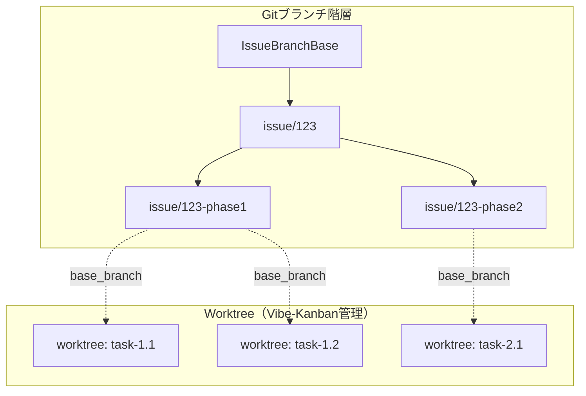
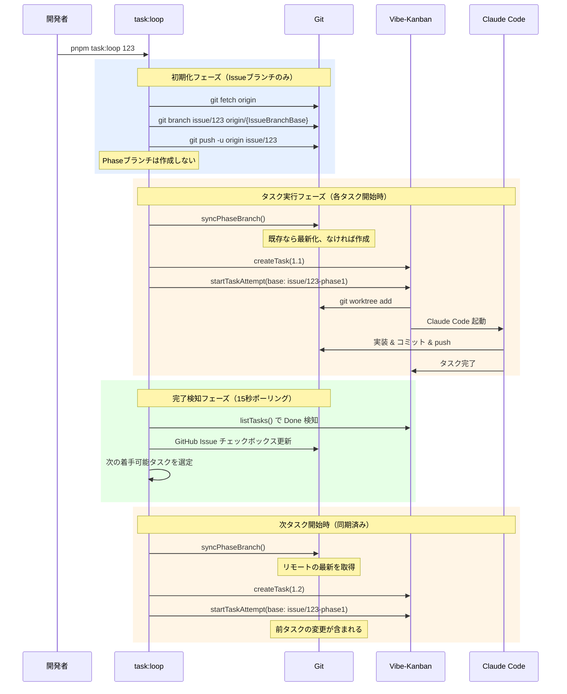
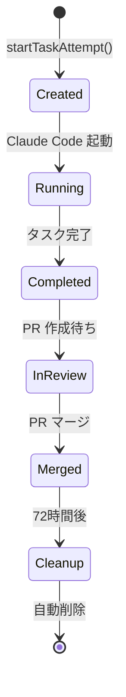
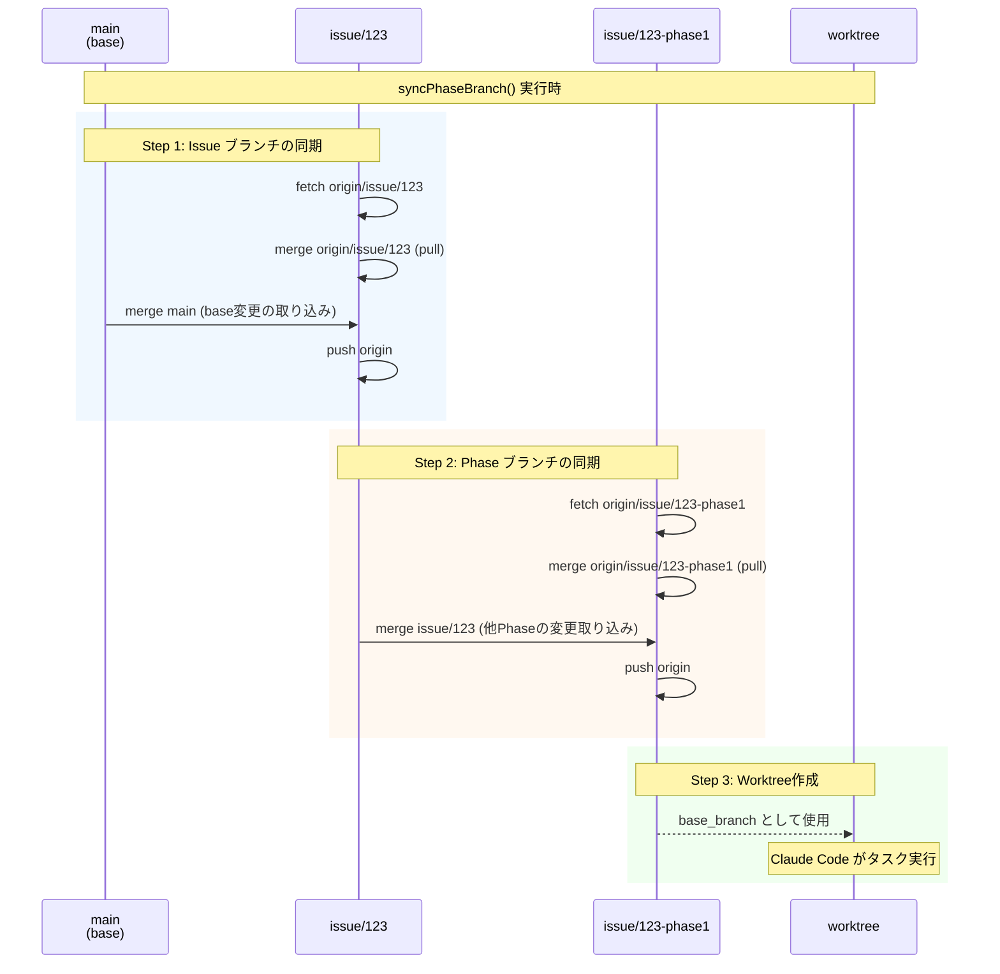

# ブランチ運用戦略

## 概要

このドキュメントでは、タスク実行時のブランチ運用戦略を定義します。

※ **IssueBranchBase**: Issue ブランチの作成元ブランチ（main, develop など）

## ブランチ階層構造

```
IssueBranchBase（main, develop など）
  └─ issue/{issue番号} (Issueブランチ)
       ├─ issue/{issue番号}-phase1 (フェーズ1ブランチ)
       ├─ issue/{issue番号}-phase2 (フェーズ2ブランチ)
       └─ issue/{issue番号}-phase3 (フェーズ3ブランチ)
```

**注意**: Git の制約により、`issue/25` と `issue/25/phase1` は共存できません。
そのため、Phase ブランチはハイフン区切り（`issue/25-phase1`）を使用します。

### ブランチと Worktree の関係



## ブランチ命名規則

### 1. Issueブランチ

**命名規則**: `issue/{issue番号}`

**例**:
- `issue/123`
- `issue/456`
- `issue/789`

**作成元**: IssueBranchBase（`--base` オプションで指定、デフォルトは main）

**目的**:
- GitHub Issue全体の作業を統合する親ブランチ
- すべてのフェーズブランチはこのブランチから派生

### 2. フェーズごとのブランチ

**命名規則**: `issue/{issue番号}-phase{N}`

**例**:
- `issue/123-phase1`
- `issue/456-phase2`
- `issue/789-phase1`

**作成元**: Issueブランチ

**目的**:
- フェーズ単位での作業を分離
- Vibe-Kanbanタスクの実行ベースブランチとして使用（原則）
- フェーズ完了後、親ブランチにマージ

## ブランチ命名例

| 仕様書ディレクトリパス | Issueブランチ | Phase 1ブランチ | Phase 2ブランチ |
|------------------|---------------|----------------|----------------|
| `docs/specs/issues/monorepo/issue123-turborepo-setup/` | `issue/123` | `issue/123-phase1` | `issue/123-phase2` |
| `docs/specs/issues/auth/issue456-magic-link/` | `issue/456` | `issue/456-phase1` | `issue/456-phase2` |
| `docs/specs/issues/user/issue789-profile/` | `issue/789` | `issue/789-phase1` | `issue/789-phase2` |

---

## task:loop 実行時のブランチ運用

### タスク実行シーケンス



### ブランチ CRUD タイミング

| 操作 | タイミング | 実行者 | 備考 |
|-----|----------|--------|------|
| **Create** Issue ブランチ | スクリプト起動時 | task:loop | IssueBranchBase から作成 |
| **Sync** Issue ブランチ | タスク着手時 | task:loop | リモート最新化 + IssueBranchBase の変更取り込み |
| **Create** Phase ブランチ | タスク着手時 | task:loop | 必要に応じて Issue ブランチから作成 |
| **Sync** Phase ブランチ | タスク着手時 | task:loop | リモート最新化 + Issue ブランチの変更取り込み |
| **Create** Worktree | タスク開始時 | Vibe-Kanban | 同期済み Phase ブランチをベースに作成 |
| **Update** Phase ブランチ | PR マージ時 | GitHub | タスク完了後のマージで更新 |
| **Merge** Phase → Issue | Phase 全タスク完了時 | task:loop | 完了した Phase を Issue ブランチに自動マージ |
| **Delete** Worktree | タスク完了後 | Vibe-Kanban | 72時間後に自動削除 |
| **Delete** Phase ブランチ | Issue 完了後 | 手動 | Issue ブランチにマージ後 |

### Worktree ライフサイクル



### syncPhaseBranch の動作

タスク着手時に呼び出される `syncPhaseBranch` 関数は、以下のシーケンスでブランチを同期します：



**同期の原則**:
- ローカルの変更は保持（削除→再作成はしない）
- リモートとローカルが分岐した場合はマージで統合
- コンフリクト発生時はエラーで停止（手動解決を促す）

### 変更の取り込み対象

| 取り込み元 | 取り込み先 | 取り込み内容 |
|-----------|-----------|-------------|
| IssueBranchBase | Issue ブランチ | 他の Issue やホットフィックスがマージした変更 |
| リモートの Issue ブランチ | ローカル Issue ブランチ | 他の Phase がマージした変更 |
| リモートの Phase ブランチ | ローカル Phase ブランチ | 同じ Phase の先行タスクがマージした変更 |
| Issue ブランチ | Phase ブランチ | 他の Phase がマージした変更（Phase 間の変更共有） |

### 変更の伝播フロー

```
IssueBranchBase（main, develop など）
    ↓ マージ
issue/123
    ↓ マージ
issue/123-phase1
    ↓ base_branch として使用
worktree（タスク実行）
```

これにより：
- IssueBranchBase の最新変更が全タスクに反映される
- 同じ Phase 内の先行タスクの変更が後続タスクに反映される
- 他の Phase の完了した変更も全ての Phase に伝播される

---

## 手動ブランチ操作

### 初回実行時

```bash
# 0. IssueBranchBase を決定（デフォルトブランチを取得する場合）
DEFAULT_BRANCH=$(git remote show origin | grep 'HEAD branch' | awk '{print $NF}')

# 1. Issueブランチを作成（IssueBranchBase から）
git checkout $DEFAULT_BRANCH
git pull origin $DEFAULT_BRANCH
git checkout -b issue/123

# 2. フェーズ1ブランチを作成（Issueブランチから）
git checkout -b issue/123-phase1

# 3. リモートにプッシュ
git push -u origin issue/123-phase1
```

### 次のフェーズへ移行時

```bash
# 1. 親ブランチに戻る
git checkout issue/123

# 2. 前フェーズの完了内容をマージ
git merge issue/123-phase1

# 3. 次のフェーズブランチを作成
git checkout -b issue/123-phase2

# 4. リモートにプッシュ
git push -u origin issue/123-phase2
```

### 全フェーズ完了後

```bash
# 1. Issueブランチに最終フェーズをマージ
git checkout issue/123
git merge issue/123-phase3

# 2. IssueBranchBase にPRを作成
gh pr create --base main --head issue/123 \
  --title "feat: Monorepo Turborepoセットアップ完了" \
  --body "全フェーズ完了。Phase 1-3の統合PR。"
```

---

## ブランチマージ戦略

### フェーズ完了時

```bash
# フェーズブランチを親ブランチにマージ
git checkout issue/123
git merge --no-ff issue/123-phase1
git push origin issue/123
```

### タスク完了時

```bash
# IssueブランチをIssueBranchBaseにPRとしてマージ
gh pr create --base main --head issue/123 \
  --title "feat: Monorepo Turborepoセットアップ" \
  --body "..."
```

---

## ブランチ削除ポリシー

### フェーズブランチ

- 親ブランチにマージ後、削除可能
- ただし、トレーサビリティのため残しておくことを推奨

### Issueブランチ

- IssueBranchBase にマージ後、PRクローズと同時に削除

---

## 注意事項

1. **ブランチ名の一貫性**: すべてのブランチは命名規則に従うこと
2. **フェーズ番号の明示**: フェーズ番号は必ず数字で明示（phase1, phase2, ...）
3. **親ブランチの更新**: フェーズ完了時は必ず親ブランチにマージすること
4. **リモート同期**: ブランチ作成後は必ずリモートにプッシュすること

---

## トラブルシューティング

### ブランチが存在しない場合

```bash
# リモートから最新情報を取得
git fetch origin

# ブランチ一覧を確認
git branch -a
```

### ブランチ名を間違えた場合

```bash
# ブランチ名を変更
git branch -m 旧ブランチ名 新ブランチ名

# リモートのブランチ名も更新
git push origin :旧ブランチ名 新ブランチ名
git push origin -u 新ブランチ名
```

### マージコンフリクト発生時

```bash
# コンフリクトを解決後、マージを完了
git add .
git commit -m "Merge phase1 into task branch"
git push origin タスクブランチ名
```

---

## 関連ドキュメント

- [task:loop コマンド](../instructions/task-vibe-kanban-loop.md) - コマンドの使用方法と Vibe-Kanban 操作手順
- [タスク管理](task-management.md) - タスク階層と粒度基準
- [開発ワークフロー](development-workflow.md) - 仕様書作成からタスク実行までの全体フロー
