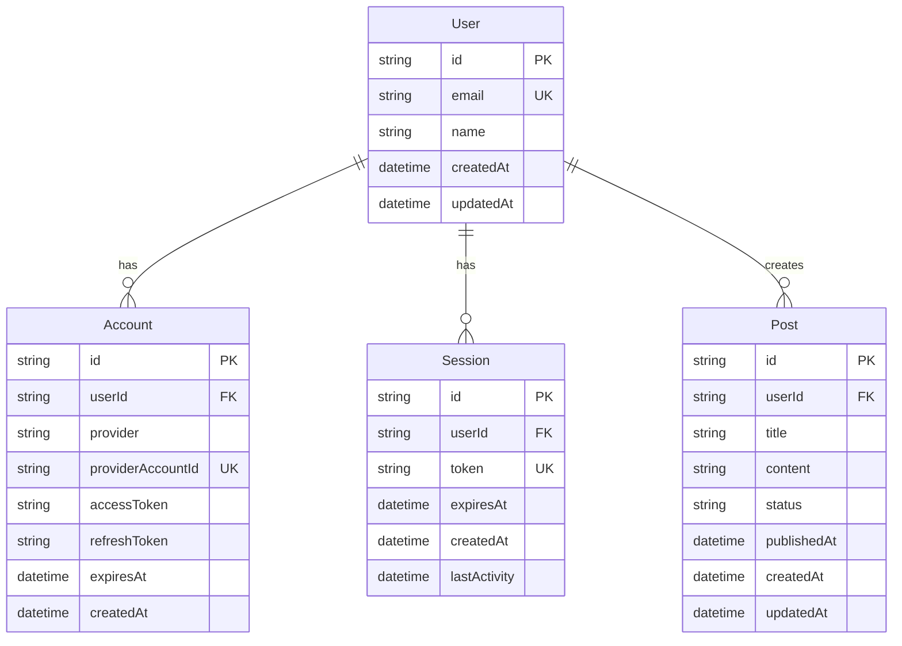
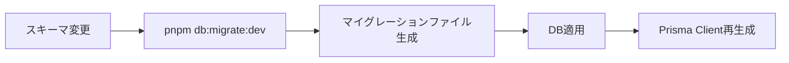
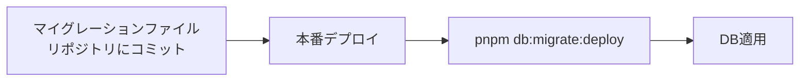

# スキーマ設計

TODO
以下はサンプルで、まだDBは未作成です。

## 概要

このドキュメントでは、Prismaを使用したデータベーススキーマ設計と、テーブル定義、リレーション設計、マイグレーション戦略について説明します。

PostgreSQLをデータベースとして使用し、Prismaをグローバルキャッシュパターンで運用します。

---

## 目次

1. [データベース技術スタック](#1-データベース技術スタック)
2. [ERD（エンティティ関連図）](#2-erdエンティティ関連図)
3. [Prismaスキーマ定義](#3-prismaスキーマ定義)
4. [テーブル定義](#4-テーブル定義)
5. [リレーション設計](#5-リレーション設計)
6. [インデックス設計](#6-インデックス設計)
7. [Prisma Client設定](#7-prisma-client設定)
8. [マイグレーション戦略](#8-マイグレーション戦略)

---

## 1. データベース技術スタック

| カテゴリ | 技術 | 用途 |
|---------|------|------|
| データベース | PostgreSQL | リレーショナルデータベース |
| ORM | Prisma | データベースアクセス |
| クライアント | @prisma/client | Prisma Client |
| CLI | prisma | マイグレーション、生成 |

**Prismaの利点**:
- 型安全なデータベースアクセス
- 自動生成されたクライアント
- マイグレーション管理
- クエリの最適化

---

## 2. ERD（エンティティ関連図）



**エンティティ間のリレーション**:
- **User → Account**: 1対多（1ユーザーは複数のアカウント（OAuth）を持つ）
- **User → Session**: 1対多（1ユーザーは複数のセッションを持つ）
- **User → Post**: 1対多（1ユーザーは複数の投稿を作成）

---

## 3. Prismaスキーマ定義

### スキーマファイル

**配置場所**: `packages/server-core/src/infrastructure/database/prisma/schema.prisma`

### generator設定

```prisma
generator client {
  provider = "prisma-client-js"
  output   = "../../../../node_modules/.prisma/client"
}
```

**設計ポイント**:
- `provider`: Prisma Clientの生成に使用
- `output`: モノレポ対応のため、クライアント生成先を `node_modules/.prisma/client` に設定

### datasource設定

```prisma
datasource db {
  provider = "postgresql"
  url      = env("DATABASE_URL")
}
```

**設計ポイント**:
- `provider`: PostgreSQLを使用
- `url`: 環境変数 `DATABASE_URL` で接続URL指定

### 完全なスキーマ定義

```prisma
// packages/server-core/src/infrastructure/database/prisma/schema.prisma

generator client {
  provider = "prisma-client-js"
  output   = "../../../../node_modules/.prisma/client"
}

datasource db {
  provider = "postgresql"
  url      = env("DATABASE_URL")
}

model User {
  id        String   @id @default(cuid())
  email     String   @unique
  name      String?
  createdAt DateTime @default(now())
  updatedAt DateTime @updatedAt

  accounts Account[]
  sessions Session[]
  posts    Post[]

  @@index([email])
}

model Account {
  id                String   @id @default(cuid())
  userId            String
  provider          String
  providerAccountId String
  accessToken       String?
  refreshToken      String?
  expiresAt         DateTime?
  createdAt         DateTime @default(now())

  user User @relation(fields: [userId], references: [id], onDelete: Cascade)

  @@unique([provider, providerAccountId])
  @@index([userId])
}

model Session {
  id           String   @id @default(cuid())
  userId       String
  token        String   @unique
  expiresAt    DateTime
  createdAt    DateTime @default(now())
  lastActivity DateTime @default(now())

  user User @relation(fields: [userId], references: [id], onDelete: Cascade)

  @@index([userId])
  @@index([token])
  @@index([expiresAt])
}

model Post {
  id          String    @id @default(cuid())
  userId      String
  title       String
  content     String
  status      String    @default("draft")
  publishedAt DateTime?
  createdAt   DateTime  @default(now())
  updatedAt   DateTime  @updatedAt

  user User @relation(fields: [userId], references: [id], onDelete: Cascade)

  @@index([userId])
  @@index([status])
  @@index([publishedAt])
}
```

---

## 4. テーブル定義

### Userテーブル

| カラム | 型 | 制約 | 説明 |
|--------|----|----|------|
| id | String | PK, @default(cuid()) | ユーザーID（CUID） |
| email | String | UNIQUE, NOT NULL | メールアドレス |
| name | String | NULLABLE | ユーザー名 |
| createdAt | DateTime | @default(now()) | 作成日時 |
| updatedAt | DateTime | @updatedAt | 更新日時 |

**インデックス**:
- `email` - ログイン時の検索を高速化

**リレーション**:
- `accounts` - Account[] (1対多)
- `sessions` - Session[] (1対多)
- `posts` - Post[] (1対多)

### Accountテーブル

| カラム | 型 | 制約 | 説明 |
|--------|----|----|------|
| id | String | PK, @default(cuid()) | アカウントID |
| userId | String | FK, NOT NULL | ユーザーID |
| provider | String | NOT NULL | OAuth プロバイダ (google, github等) |
| providerAccountId | String | NOT NULL | プロバイダ側のアカウントID |
| accessToken | String | NULLABLE | アクセストークン |
| refreshToken | String | NULLABLE | リフレッシュトークン |
| expiresAt | DateTime | NULLABLE | トークン有効期限 |
| createdAt | DateTime | @default(now()) | 作成日時 |

**ユニーク制約**:
- `[provider, providerAccountId]` - プロバイダごとに一意

**インデックス**:
- `userId` - ユーザーのアカウント一覧取得を高速化

**リレーション**:
- `user` - User (多対1, onDelete: Cascade)

### Sessionテーブル

| カラム | 型 | 制約 | 説明 |
|--------|----|----|------|
| id | String | PK, @default(cuid()) | セッションID |
| userId | String | FK, NOT NULL | ユーザーID |
| token | String | UNIQUE, NOT NULL | セッショントークン |
| expiresAt | DateTime | NOT NULL | セッション有効期限 |
| createdAt | DateTime | @default(now()) | 作成日時 |
| lastActivity | DateTime | @default(now()) | 最終アクティビティ日時 |

**インデックス**:
- `userId` - ユーザーのセッション一覧取得を高速化
- `token` - トークンによるセッション検索を高速化
- `expiresAt` - 期限切れセッションのクリーンアップを高速化

**リレーション**:
- `user` - User (多対1, onDelete: Cascade)

### Postテーブル

| カラム | 型 | 制約 | 説明 |
|--------|----|----|------|
| id | String | PK, @default(cuid()) | 投稿ID |
| userId | String | FK, NOT NULL | 作成者ID |
| title | String | NOT NULL | タイトル |
| content | String | NOT NULL | 本文 |
| status | String | @default("draft") | ステータス (draft, published, archived) |
| publishedAt | DateTime | NULLABLE | 公開日時 |
| createdAt | DateTime | @default(now()) | 作成日時 |
| updatedAt | DateTime | @updatedAt | 更新日時 |

**インデックス**:
- `userId` - ユーザーの投稿一覧取得を高速化
- `status` - ステータスによる投稿検索を高速化
- `publishedAt` - 公開日時順のソートを高速化

**リレーション**:
- `user` - User (多対1, onDelete: Cascade)

---

## 5. リレーション設計

### リレーションの種類

#### 1対多リレーション

**User → Post**:

```prisma
model User {
  id    String @id
  posts Post[]
}

model Post {
  id     String @id
  userId String
  user   User   @relation(fields: [userId], references: [id], onDelete: Cascade)
}
```

**削除時の動作** (`onDelete: Cascade`):
- ユーザーを削除すると、関連する投稿もすべて削除される

#### 外部キー制約

すべての外部キーには、以下のポリシーを適用：

| ポリシー | 説明 |
|---------|------|
| onDelete: Cascade | 親レコード削除時に子レコードも削除 |
| onUpdate: Cascade | 親レコード更新時に子レコードも更新（Prismaのデフォルト） |

**理由**:
- データ整合性の保証
- 孤立レコードの防止
- アプリケーションロジックの簡素化

---

## 6. インデックス設計

### インデックス戦略

#### 検索頻度の高いカラム

**Userテーブル**:
- `email` - ログイン時の検索

**Sessionテーブル**:
- `token` - トークンによるセッション検索
- `userId` - ユーザーのセッション一覧
- `expiresAt` - 期限切れセッションのクリーンアップ

**Postテーブル**:
- `userId` - ユーザーの投稿一覧
- `status` - ステータスによる投稿検索
- `publishedAt` - 公開日時順のソート

#### ユニークインデックス

**Userテーブル**:
- `email` - メールアドレスの重複防止

**Accountテーブル**:
- `[provider, providerAccountId]` - プロバイダごとのアカウントID重複防止

**Sessionテーブル**:
- `token` - セッショントークンの重複防止

### インデックスのパフォーマンス影響

| 操作 | インデックスあり | インデックスなし |
|------|---------------|--------------|
| SELECT (WHERE句) | O(log n) | O(n) |
| INSERT | O(log n) | O(1) |
| UPDATE (インデックスカラム) | O(log n) | O(1) |

**トレードオフ**:
- 検索速度の向上 vs 挿入/更新速度の低下
- 本プロジェクトでは、読み取り頻度が高いため、インデックス作成を優先

---

## 7. Prisma Client設定

### グローバルキャッシュパターン

**目的**: 開発環境でのHot Reload対応

**実装ファイル**: `packages/server-core/src/infrastructure/database/client.ts`

```typescript
import { PrismaClient } from '@prisma/client'

declare global {
  // eslint-disable-next-line no-var
  var prisma: PrismaClient | undefined
}

export const prisma =
  global.prisma ||
  new PrismaClient({
    log: process.env.NODE_ENV === 'development' ? ['query', 'error', 'warn'] : ['error'],
  })

if (process.env.NODE_ENV !== 'production') {
  global.prisma = prisma
}
```

**設計ポイント**:
- **開発環境**: globalオブジェクトにキャッシュし、Hot Reload時に再利用
- **本番環境**: 通常のインスタンス化（グローバル化しない）
- **ログレベル**: 開発環境では `query`, `error`, `warn`、本番環境では `error` のみ

### ログ設定

| 環境 | ログレベル | 用途 |
|------|-----------|------|
| development | query, error, warn | デバッグ、パフォーマンス分析 |
| production | error | エラー監視 |

**クエリログの例**:

```
prisma:query SELECT "User"."id", "User"."email" FROM "User" WHERE "User"."email" = $1
```

---

## 8. マイグレーション戦略

### マイグレーションコマンド

**開発環境での実行**:

```bash
# マイグレーション作成
pnpm db:migrate:dev

# マイグレーション適用（本番環境）
pnpm db:migrate:deploy

# Prisma Client再生成
pnpm db:generate

# Prisma Studio起動（GUIでデータ確認）
pnpm db:studio
```

**package.json定義**:

```json
{
  "scripts": {
    "db:migrate:dev": "dotenv -e .env -e .env.local -- prisma migrate dev --schema=packages/server-core/src/infrastructure/database/prisma/schema.prisma",
    "db:migrate:deploy": "dotenv -e .env -- prisma migrate deploy --schema=packages/server-core/src/infrastructure/database/prisma/schema.prisma",
    "db:generate": "prisma generate --schema=packages/server-core/src/infrastructure/database/prisma/schema.prisma",
    "db:studio": "dotenv -e .env -e .env.local -- prisma studio --schema=packages/server-core/src/infrastructure/database/prisma/schema.prisma",
    "db:push": "dotenv -e .env -e .env.local -- prisma db push --schema=packages/server-core/src/infrastructure/database/prisma/schema.prisma",
    "db:seed": "dotenv -e .env -e .env.local -- tsx packages/server-core/src/infrastructure/database/seed.ts"
  }
}
```

### マイグレーションワークフロー

#### 開発環境



**実行例**:

```bash
# 1. schema.prismaを編集

# 2. マイグレーション作成
pnpm db:migrate:dev --name add_post_table

# 3. 確認
pnpm db:studio
```

#### 本番環境



**実行例** (CIパイプライン):

```yaml
# .github/workflows/deploy.yml
- name: Run migrations
  run: pnpm db:migrate:deploy
  env:
    DATABASE_URL: ${{ secrets.DATABASE_URL }}
```

### マイグレーションファイル

**配置場所**: `packages/server-core/src/infrastructure/database/prisma/migrations/`

**例**:

```
migrations/
├── 20231201120000_init/
│   └── migration.sql
├── 20231205130000_add_post_table/
│   └── migration.sql
└── migration_lock.toml
```

**migration.sql例**:

```sql
-- CreateTable
CREATE TABLE "Post" (
    "id" TEXT NOT NULL,
    "userId" TEXT NOT NULL,
    "title" TEXT NOT NULL,
    "content" TEXT NOT NULL,
    "status" TEXT NOT NULL DEFAULT 'draft',
    "publishedAt" TIMESTAMP(3),
    "createdAt" TIMESTAMP(3) NOT NULL DEFAULT CURRENT_TIMESTAMP,
    "updatedAt" TIMESTAMP(3) NOT NULL,

    CONSTRAINT "Post_pkey" PRIMARY KEY ("id")
);

-- CreateIndex
CREATE INDEX "Post_userId_idx" ON "Post"("userId");

-- CreateIndex
CREATE INDEX "Post_status_idx" ON "Post"("status");

-- CreateIndex
CREATE INDEX "Post_publishedAt_idx" ON "Post"("publishedAt");

-- AddForeignKey
ALTER TABLE "Post" ADD CONSTRAINT "Post_userId_fkey" FOREIGN KEY ("userId") REFERENCES "User"("id") ON DELETE CASCADE ON UPDATE CASCADE;
```

### シード（初期データ投入）

**シードファイル**: `packages/server-core/src/infrastructure/database/seed.ts`

```typescript
import { prisma } from './client'

async function main() {
  console.log('Seeding database...')

  // ユーザー作成
  const user = await prisma.user.create({
    data: {
      email: 'admin@example.com',
      name: 'Admin User',
    },
  })

  // 投稿作成
  await prisma.post.create({
    data: {
      userId: user.id,
      title: 'Welcome Post',
      content: 'This is the first post',
      status: 'published',
      publishedAt: new Date(),
    },
  })

  console.log('Seeding complete!')
}

main()
  .catch(e => {
    console.error(e)
    process.exit(1)
  })
  .finally(async () => {
    await prisma.$disconnect()
  })
```

**実行**:

```bash
pnpm db:seed
```

---

## まとめ

このスキーマ設計ドキュメントに従うことで、以下を実現できます：

1. **データ整合性**: 外部キー制約とCascadeポリシーによる整合性保証
2. **パフォーマンス**: 適切なインデックス設計による高速検索
3. **型安全性**: Prismaによる型安全なデータベースアクセス
4. **保守性**: マイグレーション管理とシードデータによる環境再現性
5. **スケーラビリティ**: PostgreSQLとPrismaの組み合わせによる高いスケーラビリティ

すべてのスキーマ変更は、このガイドラインに従って実装してください。
