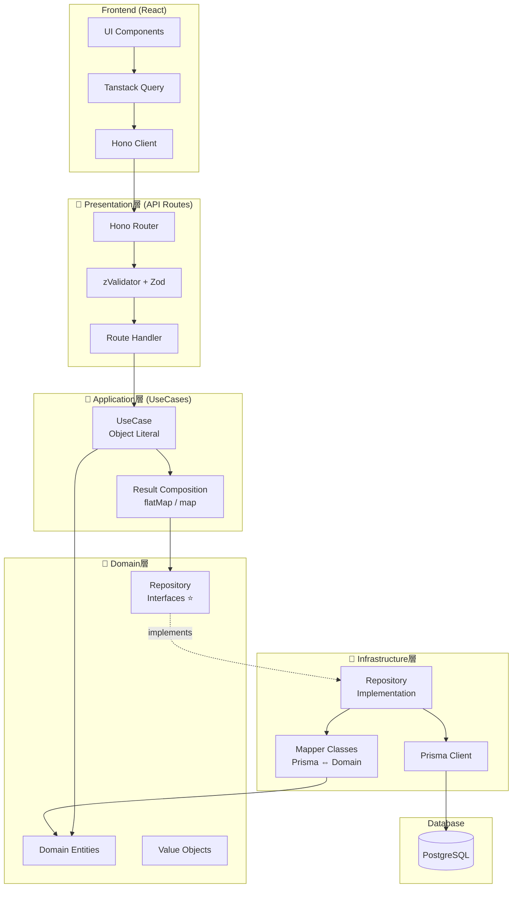

# バックエンドアーキテクチャ

## タスク: Turborepo Next.js モノレポ構築 (20251104)

**反映日時**: 2025-11-17
**ソース**: docs/specs/tasks/monorepo/20251104-monorepo-turborepo-nextjs-setup/
**抽出元**: design/architecture.md, design/implementation.md

---

## 概要

Vercel TurborepoとNext.jsをベースとしたエンタープライズグレードのモノレポアーキテクチャです。

複数のアプリケーション（Web、Admin、Cron Worker）と1つの共有パッケージ（@repo/server-core）を統合し、**4層レイヤードアーキテクチャ**と**Result型パターン**による型安全なバックエンド開発を実現します。

### 主要な技術的課題と解決方針

1. **コードの重複と保守性**
   - 解決策: @repo/server-core による DRY 原則の徹底
   - Repositoryパターンでドメイン層とインフラ層を分離
   - Mapperパターンで Prisma ⇔ Domain の変換を Infrastructure層に集約

2. **型安全性とエラーハンドリング**
   - 解決策: Result型パターンによる例外を使わないエラーハンドリング
   - Hono + zValidatorによるリクエストバリデーションの型安全性
   - ApplicationErrorクラス階層による構造化されたエラー表現

3. **モジュールエクスポート管理**
   - 解決策: **index.ts完全不使用方針**
   - package.jsonのワイルドカードexports (`"./*": "./src/*.ts"`)
   - ファイル追加時のpackage.json更新不要（自動対応）

---

## 1. ディレクトリ構造

### モノレポ全体構造

```
drlove_demo_app/
├── apps/
│   ├── web/              # メインWebアプリ（Next.js 14 App Router）
│   ├── admin/            # 管理画面（Next.js 14 App Router）
│   └── cron-worker/      # バッチ処理（CLI型）
│
├── packages/
│   └── server-core/      # 共有バックエンドロジック⭐
│       ├── domain/           # Domain層
│       ├── infrastructure/   # Infrastructure層
│       └── utils/
│
├── apps/
│   ├── web/src/application/        # Application層（webアプリ固有）⭐
│   ├── admin/src/application/      # Application層（adminアプリ固有）⭐
│   └── cron-worker/src/application/ # Application層（cron-worker固有）⭐
│
├── biome.json            # ルートLinter設定
├── tsconfig.base.json    # ベースTS設定
├── turbo.json            # Turborepo設定
├── pnpm-workspace.yaml   # ワークスペース定義
└── docker-compose.yml    # PostgreSQL動的ポート設定
```

### apps/ の役割

| アプリ | ポート | 用途 | 技術スタック |
|-------|-------|------|------------|
| **web** | 3000 | メインWebアプリケーション | Next.js 14 App Router + Hono API |
| **admin** | 4000 | 管理画面 | Next.js 14 App Router + Hono API |
| **cron-worker** | 5000 | バッチ処理（CLI型） | Next.js + tsx実行 |

**Worktree環境対応**: ブランチ名のMD5ハッシュから動的にポート番号を計算し、複数ブランチの並行開発をサポート。

---

### @repo/server-core の内部構造（4層アーキテクチャ）

```
packages/server-core/
├── src/
│   ├── domain/              # 📗 Domain層（ビジネスロジック）
│   │   ├── entities/        # エンティティ
│   │   │   ├── User.ts
│   │   │   ├── Post.ts
│   │   │   └── Session.ts
│   │   │
│   │   ├── value-objects/   # 値オブジェクト
│   │   │   ├── Email.ts
│   │   │   └── Password.ts
│   │   │
│   │   ├── repository-interfaces/  # リポジトリインターフェース⭐
│   │   │   ├── IUserRepository.ts
│   │   │   ├── IPostRepository.ts
│   │   │   └── ISessionRepository.ts
│   │   │
│   │   └── validators/      # Zodバリデーター
│   │       ├── user.ts
│   │       ├── post.ts
│   │       └── session.ts
│   │
│   ├── infrastructure/      # 📙 Infrastructure層（実装）
│   │   ├── database/
│   │   │   ├── prisma/
│   │   │   │   ├── schema.prisma
│   │   │   │   └── migrations/
│   │   │   │
│   │   │   ├── client.ts    # Prismaクライアント⭐
│   │   │   │
│   │   │   ├── repositories/  # リポジトリ実装⭐
│   │   │   │   ├── UserRepository.ts
│   │   │   │   ├── PostRepository.ts
│   │   │   │   └── SessionRepository.ts
│   │   │   │
│   │   │   └── mappers/      # Prisma ⇔ Domain変換⭐
│   │   │       ├── UserMapper.ts
│   │   │       ├── PostMapper.ts
│   │   │       └── SessionMapper.ts
│   │   │
│   │   ├── email/           # メール送信
│   │   │   ├── EmailService.ts
│   │   │   └── ResendEmailService.ts
│   │   │
│   │   └── storage/         # ストレージ
│   │       ├── StorageService.ts
│   │       └── S3StorageService.ts
│   │
│   └── utils/               # ユーティリティ
│       ├── result.ts        # Result型定義⭐
│       └── errors.ts        # ApplicationError階層⭐
│
└── package.json
    └── "exports": { "./*": "./src/*.ts" }  # index.ts不使用⭐
```

---

## 2. 4層レイヤードアーキテクチャ

### アーキテクチャ図



### 各層の責務と配置

#### 📕 Presentation層（API Routes）

**配置**: `apps/web/src/app/api/`, `apps/admin/src/app/api/`

**責務**:
- HTTPリクエスト/レスポンスの処理
- Zodバリデーション（zValidator）
- UseCaseの呼び出し
- エラーのHTTPステータスコードへのマッピング

**技術**: Hono、zValidator、Zod

**実装例**:
```typescript
// apps/web/src/app/api/posts/route.ts
import { Hono } from "hono"
import { zValidator } from "@hono/zod-validator"
import { postSchema } from "@repo/server-core/domain/validators/post"
import { postUseCases } from "@/application/use-cases/PostUseCases"  // アプリ内のApplication層

const app = new Hono()
  .post("/", zValidator("json", postSchema), async (c) => {
    const data = c.req.valid("json")
    const result = await postUseCases.create(data)

    if (!result.isSuccess) {
      return c.json({ error: result.error.message }, result.error.statusCode)
    }

    return c.json(result.value, 201)
  })

export const GET = app.fetch
export const POST = app.fetch
```

---

#### 📘 Application層（UseCases）

**配置**: `apps/*/src/application/use-cases/` （各アプリケーション固有）⭐

**重要**: Application層は各アプリケーション（web、admin、cron-worker）に配置します。@repo/server-coreには配置しません。

**責務**:
- ビジネスフロー（複数Repositoryの調整）
- トランザクション管理
- Result型による安全なエラー伝播

**技術**: Result型、UseCase統合パターン

**設計パターン: UseCase統合パターン**

従来のCRUD操作ごとにファイルを分けるのではなく、**リソース単位で1ファイルに統合**します。

```typescript
// ❌ 旧パターン: CRUD操作ごとにファイル分割（過度な細分化）
// - ListPostsUseCase.ts
// - CreatePostUseCase.ts
// - UpdatePostUseCase.ts
// - DeletePostUseCase.ts

// ✅ 新パターン: リソース単位で統合（シンプル）
// apps/web/src/application/use-cases/PostUseCases.ts

// 型定義例
export type PostSearchCriteria = {
  userId?: string
  published?: boolean
  createdAfter?: Date
}

export type CreatePostInput = {
  title: string
  content: string
  userId: string
}

export type UpdatePostInput = {
  title?: string
  content?: string
  published?: boolean
}

export const postUseCases = {
  list: async (criteria: PostSearchCriteria) => {
    // ...
  },

  create: async (data: CreatePostInput) => {
    // ...
  },

  update: async (id: string, data: UpdatePostInput) => {
    // ...
  },

  delete: async (id: string) => {
    // ...
  },
}
```

**メリット**:
- 各ファイル150行程度で十分に可読性が高い
- 関連操作が1箇所にまとまり、変更が容易
- 呼び出しがシンプル: `postUseCases.create()` vs `createPostUseCase(repo).execute()`

---

#### 📗 Domain層（ビジネスロジック）

**配置**: `packages/server-core/src/domain/`

**責務**:
- ビジネスルールの定義
- エンティティと値オブジェクトの管理
- リポジトリインターフェースの定義⭐
- ドメインバリデーション（Zod）

**技術**: TypeScript、Zod

**重要な原則**:
- **インフラ層に依存しない**（Prismaを知らない）
- リポジトリは**インターフェース**のみ定義
- データベースの実装詳細から独立

**実装例: Entity**

```typescript
// packages/server-core/src/domain/entities/User.ts
export class User {
  constructor(
    public readonly id: string,
    public readonly email: Email,  // 値オブジェクト
    public readonly name: string,
    public readonly createdAt: Date,
  ) {}

  // ビジネスロジック
  canDelete(): boolean {
    // 作成後30日以内は削除不可
    const daysSinceCreation = (Date.now() - this.createdAt.getTime()) / (1000 * 60 * 60 * 24)
    return daysSinceCreation > 30
  }
}
```

**実装例: Repository Interface**

```typescript
// packages/server-core/src/domain/repository-interfaces/IUserRepository.ts

// SearchCriteria型: すべてのフィールドはオプショナル
export type UserSearchCriteria = {
  id?: string
  email?: string
  name?: string
  createdAfter?: Date
  createdBefore?: Date
}

export interface IUserRepository {
  find(criteria: UserSearchCriteria): Promise<Result<User | null, DatabaseError>>
  search(criteria: UserSearchCriteria): Promise<Result<User[], DatabaseError>>
  create(user: User): Promise<Result<User, DatabaseError>>
  update(id: string, user: Partial<User>): Promise<Result<User, DatabaseError>>
  delete(id: string): Promise<Result<void, DatabaseError>>
}
```

---

#### 📙 Infrastructure層（実装）

**配置**: `packages/server-core/src/infrastructure/`

**責務**:
- データベースアクセス（Prisma）
- 外部サービス連携（メール、ストレージ）
- リポジトリインターフェースの**実装**⭐
- Prismaモデル ⇔ Domainエンティティの変換（Mapper）⭐

**技術**: Prisma、Mapper、外部API

**実装例: Repository Implementation**

```typescript
// packages/server-core/src/infrastructure/database/repositories/UserRepository.ts
import type { IUserRepository, UserSearchCriteria } from "@repo/server-core/domain/repository-interfaces/IUserRepository"
import { UserMapper } from "../mappers/UserMapper"
import { prisma } from "../client"

export const userRepository: IUserRepository = {
  find: async (criteria: UserSearchCriteria) => {
    const prismaUser = await prisma.user.findFirst({
      where: {
        id: criteria.id,
        email: criteria.email,
        createdAt: {
          gte: criteria.createdAfter,
          lte: criteria.createdBefore,
        },
      },
    })

    if (!prismaUser) {
      return { isSuccess: true, value: null }
    }

    const user = UserMapper.toDomain(prismaUser)
    return { isSuccess: true, value: user }
  },

  create: async (user) => {
    const createInput = UserMapper.toPrismaCreate(user)
    const prismaUser = await prisma.user.create({ data: createInput })
    const domainUser = UserMapper.toDomain(prismaUser)
    return { isSuccess: true, value: domainUser }
  },

  // ...
}
```

**実装例: Mapper**

```typescript
// packages/server-core/src/infrastructure/database/mappers/UserMapper.ts
import type { User as PrismaUser } from "@prisma/client"
import { User } from "@repo/server-core/domain/entities/User"
import { Email } from "@repo/server-core/domain/value-objects/Email"

export class UserMapper {
  static toDomain(prismaUser: PrismaUser): User {
    return new User(
      prismaUser.id,
      new Email(prismaUser.email),
      prismaUser.name,
      prismaUser.createdAt,
    )
  }

  static toPrismaCreate(user: User): Prisma.UserCreateInput {
    return {
      id: user.id,
      email: user.email.value,
      name: user.name,
    }
  }

  static toPrismaUpdate(user: Partial<User>): Prisma.UserUpdateInput {
    return {
      email: user.email?.value,
      name: user.name,
    }
  }
}
```

---

### 層間の依存関係ルール

```
上位層 → 下位層のみ依存可能

Presentation → Application → Domain ← Infrastructure
                                ↑
                        インターフェースに依存
```

**重要な原則**:
1. **Presentation層**: Application層のUseCaseを呼び出す
2. **Application層**: Domain層のエンティティとリポジトリ**インターフェース**を使用
3. **Domain層**: どの層にも依存しない（最も純粋）
4. **Infrastructure層**: Domain層の**インターフェース**を実装

この設計により：
- ✅ テストが容易（モックRepositoryで差し替え可能）
- ✅ データベースの変更がドメイン層に影響しない
- ✅ ビジネスロジックが永続化の詳細から独立

---

## 3. デザインパターン

### 3.1 Repositoryパターン

**目的**: データアクセスロジックの抽象化

**設計の特徴**:
- **検索条件ベース設計**: `find(criteria)`, `search(criteria)` で統一
- **Result型**: すべてのメソッドがResult型を返す
- **SearchCriteria**: 柔軟な検索条件（すべてのフィールドはオプショナル）

**SearchCriteria型の設計原則**:
```typescript
// ✅ すべてのフィールドはオプショナル
export type UserSearchCriteria = {
  id?: string
  email?: string
  name?: string
  createdAfter?: Date
  createdBefore?: Date
}

// ❌ 必須フィールドを設けない
export type UserSearchCriteria = {
  email: string  // NG: 必須にすると柔軟性が失われる
  name?: string
}
```

**重要な原則**:
- すべての検索条件フィールドは**オプショナル**とする
- これにより、同一のRepositoryメソッドで多様な検索パターンに対応可能
- 必須パラメータはメソッドの引数として別途定義する（例: `update(id: string, data)`）

**主要メソッド**:

| メソッド | 説明 | 返り値 |
|---------|------|--------|
| `find(criteria)` | 単一レコード検索 | `Result<T \| null, E>` |
| `search(criteria, options)` | 複数レコード検索 | `Result<T[], E>` |
| `create(entity)` | 作成 | `Result<T, E>` |
| `update(id, data)` | 更新 | `Result<T, E>` |
| `delete(id)` | 削除 | `Result<void, E>` |
| `exists(criteria)` | 存在確認 | `Result<boolean, E>` |
| `count(criteria)` | カウント | `Result<number, E>` |

---

### 3.2 Mapperパターン

**目的**: Prismaモデル ⇔ Domainエンティティの変換

**設計のポイント**:
- Infrastructure層に配置
- 変換ロジックを一箇所に集約
- Domain層をPrismaの実装詳細から保護

**変換方向**:
1. **toDomain**: PrismaモデルからDomainエンティティへ
2. **toPrismaCreate**: DomainエンティティからPrisma CreateInputへ
3. **toPrismaUpdate**: DomainエンティティからPrisma UpdateInputへ

---

### 3.3 Result型パターン

**目的**: 例外を使わないエラー表現

**型定義**:
```typescript
// packages/server-core/src/utils/result.ts
type Success<T> = { isSuccess: true; value: T }
type Failure<E> = { isSuccess: false; error: E }
type Result<T, E> = Success<T> | Failure<E>

// ヘルパー関数
export function success<T>(value: T): Success<T> {
  return { isSuccess: true, value }
}

export function failure<E>(error: E): Failure<E> {
  return { isSuccess: false, error }
}
```

**使用例**:
```typescript
// UseCase
const userResult = await userRepository.find({ email })
if (!userResult.isSuccess) {
  return failure(userResult.error)  // エラーを伝播
}

const user = userResult.value
// 型安全: userResult.isSuccessのチェック後は、user は User型として扱える
```

**メリット**:
- ✅ 型レベルでエラーハンドリングを強制
- ✅ try-catchが不要
- ✅ flatMap/mapでエラーをチェーン可能

---

## 4. パッケージエクスポート戦略

### index.ts不使用方針

従来のindex.tsパターンは、ファイル追加のたびにindex.tsとpackage.jsonの両方を更新する必要があり、メンテナンス負担が大きいため、**完全に使用しません**。

**package.json設定**:
```json
{
  "exports": {
    "./*": "./src/*.ts"
  }
}
```

**インポート例**:
```typescript
// ✅ 推奨: 直接ファイルパス指定
import { User } from "@repo/server-core/domain/entities/User"
import { userRepository } from "@repo/server-core/infrastructure/database/repositories/UserRepository"
import { postUseCases } from "@/application/use-cases/PostUseCases"  // Application層は各アプリ内

// ❌ 非推奨: index.ts経由（使用不可）
import { User } from "@repo/server-core"
import { User } from "@repo/server-core/domain/entities"  // index.tsなし
```

**メリット**:
- ✅ ファイル追加時にpackage.json更新不要（ワイルドカードで自動対応）
- ✅ index.tsの管理コストゼロ
- ✅ インポート元が明確
- ✅ IDEのジャンプ機能が正確に動作

---

## 5. 技術スタック

| カテゴリ | 技術 | バージョン | 用途 |
|---------|------|-----------|------|
| **モノレポ管理** | Turborepo | 1.x | ビルドオーケストレーション |
| **パッケージマネージャー** | pnpm | 8.x | ワークスペース管理 |
| **フレームワーク** | Next.js | 14.x | Web/Admin/Cron Worker |
| **APIフレームワーク** | Hono | 4.x | 型安全なWebフレームワーク |
| **言語** | TypeScript | 5.x | 型安全性 |
| **環境変数管理** | dotenv-cli | 7.3.0 | 階層的env読み込み |
| **データベース** | Prisma | 5.x | ORM |
| **DB本体** | PostgreSQL | 15.x | データストア |
| **Linter & Formatter** | Biome | 1.9.4+ | コード品質・フォーマット |
| **バリデーション** | Zod | 3.x | スキーマ検証 |
| **日付処理** | date-fns | 3.x | 日付ユーティリティ |

---

## 6. Prisma Client設定

### グローバル化パターン（Hot Reload対応）

**配置**: `packages/server-core/src/infrastructure/database/client.ts`

**設計の要点**:
- 開発環境でのHot Reload時にPrismaクライアントの再作成を防ぐ
- `global`オブジェクトにPrismaインスタンスをキャッシュ
- ログレベルを環境別に設定

```typescript
// packages/server-core/src/infrastructure/database/client.ts
import { PrismaClient } from "@prisma/client"

const globalForPrisma = global as unknown as { prisma: PrismaClient }

export const prisma =
  globalForPrisma.prisma ||
  new PrismaClient({
    log: process.env.NODE_ENV === "development" ? ["query", "error", "warn"] : ["error"],
  })

if (process.env.NODE_ENV !== "production") globalForPrisma.prisma = prisma
```

---

## 7. 環境変数管理

### 階層的環境変数読み込み

```
ルート.env                    （共通設定、コミット可能）
  ↓
ルート.env.local              （ローカル固有、gitignore）
  ↓
各アプリ.env.local            （アプリ固有、gitignore、オプション）
```

### dotenv-cli による自動読み込み

**ルートpackage.json**:
```json
{
  "scripts": {
    "dev": "dotenv -e .env -e .env.local -- turbo run dev"
  }
}
```

**各アプリのpackage.json**:
```json
{
  "scripts": {
    "dev": "dotenv -e ../../.env -e ../../.env.local -e .env.local -- next dev"
  }
}
```

---

## 8. 参照ドキュメント

### 開発ガイド
- **[API開発ガイド](api-development.md)** - Hono API実装ルール、エンドポイント設計
- **[フロントエンド開発ガイド](frontend-development.md)** - Tanstack Query、React Hook Form

### データベース
- **[スキーマ設計](../schema-design.md)** - Prismaスキーマ、テーブル定義、ERD

### インフラ
- **[CI/CDパイプライン](../infrastructure/ci-cd.md)** - GitHub Actions、Turborepoキャッシュ
- **[デプロイメント戦略](../infrastructure/deployment.md)** - Vercel、Docker、環境変数管理

### 品質管理
- **[コードレビューガイドライン](../review-guidelines.md)** - 品質基準とチェックリスト
- **[テスト戦略](../testing-strategy.md)** - テストの書き方

---

## まとめ

このバックエンドアーキテクチャは、以下を実現します：

✅ **4層アーキテクチャ**: 責務の明確化と保守性の向上
✅ **Result型パターン**: 型安全なエラーハンドリング
✅ **Repositoryパターン**: テスト容易性とドメイン独立性
✅ **Mapperパターン**: 永続化層からのドメイン保護
✅ **index.ts不使用**: シンプルで拡張しやすいモジュール管理

すべての開発者は、この設計原則に従ってバックエンド開発を行ってください。
