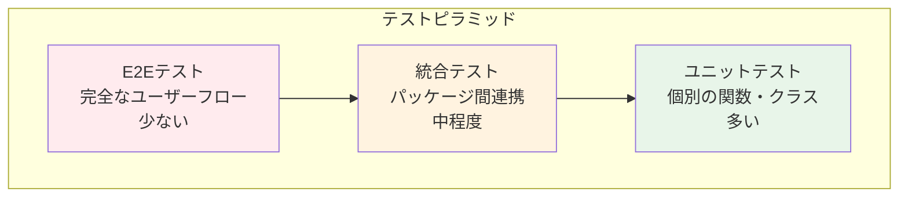

# テスト戦略

## 概要

このドキュメントでは、ユニットテスト、統合テスト、E2Eテスト（Playwrightコード）の戦略と実装ガイドラインを説明します。

テストカバレッジ目標を達成し、高品質なコードを維持するためのベストプラクティスを提供します。

> **Note**: このドキュメントは開発者向けの自動テスト戦略を扱います。QAエージェント（task-qa）が実行するBrowserテスト（Playwright MCP）については、`docs/steering/terminology.md` および `docs/steering/acceptance-criteria-and-qa-guide.md` を参照してください。

---

## 目次

1. [テスト戦略の全体像](#1-テスト戦略の全体像)
2. [ユニットテスト](#2-ユニットテスト)
3. [統合テスト](#3-統合テスト)
4. [E2Eテスト](#4-e2eテスト)
5. [テストカバレッジ](#5-テストカバレッジ)
6. [テストツール](#6-テストツール)
7. [テストの実行](#7-テストの実行)
8. [モックとスタブ](#8-モックとスタブ)

---

## 1. テスト戦略の全体像

### テストピラミッド



### テスト種別と目的

| テスト種別 | 目的 | 対象 | 実行頻度 |
|-----------|------|------|---------|
| ユニットテスト | 個別の関数・クラスの動作確認 | Repository, UseCase, Entity, Validator | 毎コミット |
| 統合テスト | パッケージ間の連携確認 | @repo/server-core ⇔ apps/* | 毎PR |
| E2Eテスト | 完全なユーザーフローの確認 | Web, Admin, Cron Worker | デプロイ前 |

---

## 2. ユニットテスト

### 対象コンポーネント

1. **Repository**（Infrastructure層）
2. **UseCase**（Application層）
3. **Entity**（Domain層）
4. **Validator**（Domain層）
5. **Mapper**（Infrastructure層）

### 正常系テストケース

#### Repositoryのテスト

**Given-When-Then形式**:

```typescript
// packages/server-core/src/infrastructure/database/repositories/__tests__/UserRepository.test.ts
import { userRepository } from '../UserRepository'
import { prisma } from '../../client'

describe('UserRepository', () => {
  beforeEach(async () => {
    // テストデータのクリーンアップ
    await prisma.user.deleteMany()
  })

  describe('create', () => {
    it('有効なユーザーデータを渡すと、データベースにユーザーが作成され、ドメインエンティティが返る', async () => {
      // Given: 有効なユーザーデータ
      const userData = {
        email: 'test@example.com',
        name: 'Test User',
      }

      // When: createメソッドを呼び出す
      const result = await userRepository.create(userData)

      // Then: 成功結果が返り、ユーザーが作成される
      expect(result.isSuccess).toBe(true)
      if (result.isSuccess) {
        expect(result.value.email).toBe('test@example.com')
        expect(result.value.name).toBe('Test User')
        expect(result.value.id).toBeDefined()
      }

      // データベースに保存されているか確認
      const savedUser = await prisma.user.findUnique({
        where: { email: 'test@example.com' }
      })
      expect(savedUser).toBeDefined()
    })
  })

  describe('find', () => {
    it('存在するユーザーのメールアドレスで検索すると、ユーザーが返る', async () => {
      // Given: ユーザーが存在する
      await prisma.user.create({
        data: {
          email: 'existing@example.com',
          name: 'Existing User',
        }
      })

      // When: メールアドレスで検索
      const result = await userRepository.find({ email: 'existing@example.com' })

      // Then: ユーザーが見つかる
      expect(result.isSuccess).toBe(true)
      if (result.isSuccess) {
        expect(result.value).not.toBeNull()
        expect(result.value?.email).toBe('existing@example.com')
      }
    })
  })
})
```

#### バリデーションのテスト

```typescript
// packages/server-core/src/domain/validators/__tests__/user.test.ts
import { createUserSchema, updateUserSchema } from '../user'

describe('User Validators', () => {
  describe('createUserSchema', () => {
    it('有効なメールアドレスと名前が渡されると、バリデーションが成功する', () => {
      // Given: 有効なユーザーデータ
      const validData = {
        email: 'test@example.com',
        name: 'Test User',
      }

      // When: バリデーションを実行
      const result = createUserSchema.safeParse(validData)

      // Then: バリデーション成功
      expect(result.success).toBe(true)
      if (result.success) {
        expect(result.data.email).toBe('test@example.com')
        expect(result.data.name).toBe('Test User')
      }
    })

    it('不正な形式のメールアドレスが渡されると、バリデーションが失敗する', () => {
      // Given: 不正なメールアドレス
      const invalidData = {
        email: 'invalid-email',
        name: 'Test User',
      }

      // When: バリデーションを実行
      const result = createUserSchema.safeParse(invalidData)

      // Then: バリデーション失敗
      expect(result.success).toBe(false)
      if (!result.success) {
        expect(result.error.issues[0].path).toContain('email')
      }
    })
  })
})
```

#### エンティティのテスト

```typescript
// packages/server-core/src/domain/entities/__tests__/Post.test.ts
import { Post } from '../Post'

describe('Post Entity', () => {
  describe('publish', () => {
    it('下書き状態の投稿をpublishすると、公開状態になり、公開日時が設定される', () => {
      // Given: 下書き状態の投稿
      const post = new Post({
        id: '1',
        userId: 'user1',
        title: 'Test Post',
        content: 'Content',
        status: 'draft',
        publishedAt: null,
        createdAt: new Date(),
        updatedAt: new Date(),
      })

      // When: publish メソッドを呼び出す
      post.publish()

      // Then: 公開状態になる
      expect(post.status).toBe('published')
      expect(post.publishedAt).toBeInstanceOf(Date)
      expect(post.isPublished()).toBe(true)
    })
  })

  describe('isOwnedBy', () => {
    it('投稿の所有者IDと一致するユーザーIDを渡すと、trueが返る', () => {
      // Given: ユーザー'user1'が作成した投稿
      const post = new Post({
        id: '1',
        userId: 'user1',
        title: 'Test Post',
        content: 'Content',
        status: 'draft',
        publishedAt: null,
        createdAt: new Date(),
        updatedAt: new Date(),
      })

      // When: 所有者チェック
      const isOwned = post.isOwnedBy('user1')

      // Then: trueが返る
      expect(isOwned).toBe(true)
    })

    it('投稿の所有者IDと異なるユーザーIDを渡すと、falseが返る', () => {
      // Given: ユーザー'user1'が作成した投稿
      const post = new Post({
        id: '1',
        userId: 'user1',
        title: 'Test Post',
        content: 'Content',
        status: 'draft',
        publishedAt: null,
        createdAt: new Date(),
        updatedAt: new Date(),
      })

      // When: 別のユーザーIDで所有者チェック
      const isOwned = post.isOwnedBy('user2')

      // Then: falseが返る
      expect(isOwned).toBe(false)
    })
  })
})
```

### 異常系テストケース

#### 無効な入力値のテスト

```typescript
describe('createUserSchema - 異常系', () => {
  it('メールアドレスが空文字の場合、バリデーションエラーが発生する', () => {
    // Given: 空のメールアドレス
    const invalidData = {
      email: '',
      name: 'Test User',
    }

    // When: バリデーション実行
    const result = createUserSchema.safeParse(invalidData)

    // Then: エラーが返る
    expect(result.success).toBe(false)
    if (!result.success) {
      expect(result.error.issues[0].message).toContain('email')
    }
  })

  it('名前が100文字を超える場合、バリデーションエラーが発生する', () => {
    // Given: 100文字を超える名前
    const invalidData = {
      email: 'test@example.com',
      name: 'a'.repeat(101),
    }

    // When: バリデーション実行
    const result = createUserSchema.safeParse(invalidData)

    // Then: エラーが返る
    expect(result.success).toBe(false)
  })
})
```

#### データベースエラーのテスト

```typescript
describe('UserRepository - データベースエラー', () => {
  it('重複したメールアドレスでユーザーを作成すると、エラーが返る', async () => {
    // Given: 既に存在するメールアドレス
    await prisma.user.create({
      data: {
        email: 'duplicate@example.com',
        name: 'Existing User',
      }
    })

    // When: 同じメールアドレスでユーザー作成
    const result = await userRepository.create({
      email: 'duplicate@example.com',
      name: 'New User',
    })

    // Then: エラーが返る
    expect(result.isSuccess).toBe(false)
    if (!result.isSuccess) {
      expect(result.error.code).toBe('CONFLICT')
    }
  })
})
```

---

## 3. 統合テスト

### パッケージ間の連携テスト

#### webから@repo/server-coreの使用

```typescript
// apps/web/__tests__/integration/post-api.test.ts
import { apiClient } from '@/lib/api-client'
import { prisma } from '@repo/server-core/infrastructure/database/client'

describe('Post API統合テスト', () => {
  beforeEach(async () => {
    // テストデータのクリーンアップ
    await prisma.post.deleteMany()
    await prisma.user.deleteMany()
  })

  it('投稿一覧APIを呼び出すと、@repo/server-coreのRepositoryが使用され、データが取得できる', async () => {
    // Given: ユーザーと投稿が存在する
    const user = await prisma.user.create({
      data: {
        email: 'test@example.com',
        name: 'Test User',
      }
    })

    await prisma.post.create({
      data: {
        userId: user.id,
        title: 'Test Post',
        content: 'Content',
        status: 'published',
      }
    })

    // When: API呼び出し
    const response = await apiClient.posts.$get({
      query: { page: '1', limit: '10' }
    })

    // Then: データが取得できる
    expect(response.ok).toBe(true)
    const data = await response.json()
    expect(data.posts).toHaveLength(1)
    expect(data.posts[0].title).toBe('Test Post')
  })

  it('Repositoryパターンが正しく動作し、型定義が適切に共有される', async () => {
    // Given: ユーザーが存在する
    const user = await prisma.user.create({
      data: {
        email: 'test@example.com',
        name: 'Test User',
      }
    })

    // When: 投稿作成APIを呼び出し
    const response = await apiClient.posts.$post({
      json: {
        title: 'New Post',
        content: 'Content',
        status: 'draft',
      }
    })

    // Then: 作成成功
    expect(response.ok).toBe(true)
    const data = await response.json()
    expect(data.post.title).toBe('New Post')
    expect(data.post.status).toBe('draft')

    // 型推論が正しく機能しているか確認（TypeScriptコンパイルエラーが出ないこと）
    const title: string = data.post.title
    const status: 'draft' | 'published' | 'archived' = data.post.status
    expect(title).toBeDefined()
    expect(status).toBeDefined()
  })
})
```

### ビルドパイプラインのテスト

```typescript
// __tests__/integration/build.test.ts
import { execSync } from 'child_process'

describe('ビルドパイプライン統合テスト', () => {
  it('turbo run buildで全アプリケーションがビルド成功する', () => {
    // When: ビルド実行
    expect(() => {
      execSync('pnpm turbo run build', { stdio: 'inherit' })
    }).not.toThrow()
  })

  it('依存関係の順序が正しく解決される', () => {
    // Given: @repo/server-coreがwebより先にビルドされる必要がある
    // When: ビルド実行
    const output = execSync('pnpm turbo run build --dry-run', { encoding: 'utf-8' })

    // Then: 依存関係の順序が正しい
    expect(output).toContain('@repo/server-core')
    expect(output.indexOf('@repo/server-core')).toBeLessThan(output.indexOf('web'))
  })
})
```

---

## 4. E2Eテスト（Playwrightコード）

> **用語の明確化**: このセクションで説明する「E2Eテスト」は、`pnpm test:e2e` で実行されるPlaywrightコードベースの自動テストを指します。QAエージェントがPlaywright MCPを使用して実行する「Browserテスト」とは異なります。詳細は `docs/steering/terminology.md` を参照してください。

### Playwright設定

**playwright.config.ts**:

```typescript
import { defineConfig, devices } from '@playwright/test'

export default defineConfig({
  testDir: './e2e',
  fullyParallel: true,
  forbidOnly: !!process.env.CI,
  retries: process.env.CI ? 2 : 0,
  workers: process.env.CI ? 1 : undefined,
  reporter: 'html',
  use: {
    baseURL: 'http://localhost:3000',
    trace: 'on-first-retry',
  },

  projects: [
    {
      name: 'chromium',
      use: { ...devices['Desktop Chrome'] },
    },
    {
      name: 'firefox',
      use: { ...devices['Desktop Firefox'] },
    },
  ],

  webServer: {
    command: 'pnpm dev',
    url: 'http://localhost:3000',
    reuseExistingServer: !process.env.CI,
  },
})
```

### 完全なユーザーフロー

```typescript
// e2e/post-creation.spec.ts
import { test, expect } from '@playwright/test'

test.describe('投稿作成フロー', () => {
  test('ユーザーがwebにアクセスし、ログインして投稿を作成すると、データベースに保存され、一覧ページに表示される', async ({ page }) => {
    // Given: ユーザーがログインページにアクセス
    await page.goto('/auth/login')

    // When: ログイン
    await page.fill('[data-testid="email-input"]', 'test@example.com')
    await page.fill('[data-testid="password-input"]', 'password123')
    await page.click('[data-testid="login-button"]')

    // Then: ダッシュボードにリダイレクト
    await expect(page).toHaveURL('/dashboard')

    // When: 投稿作成ページに移動
    await page.click('[data-testid="create-post-button"]')
    await expect(page).toHaveURL('/posts/new')

    // When: 投稿フォームを入力
    await page.fill('[data-testid="title-input"]', 'E2E Test Post')
    await page.fill('[data-testid="content-input"]', 'This is E2E test content')
    await page.selectOption('[data-testid="status-select"]', 'published')
    await page.click('[data-testid="submit-button"]')

    // Then: 投稿一覧ページにリダイレクト
    await expect(page).toHaveURL('/posts')

    // Then: 作成した投稿が一覧に表示される
    await expect(page.locator('text=E2E Test Post')).toBeVisible()
  })
})
```

### 管理画面フロー

```typescript
// e2e/admin-user-management.spec.ts
import { test, expect } from '@playwright/test'

test.describe('管理画面ユーザー管理フロー', () => {
  test('管理者がadminにログインし、ユーザー一覧を表示し、ユーザーを削除すると、データベースから削除され、webに反映される', async ({ page, context }) => {
    // Given: 管理者がログイン
    await page.goto('/admin/login')
    await page.fill('[data-testid="email-input"]', 'admin@example.com')
    await page.fill('[data-testid="password-input"]', 'admin123')
    await page.click('[data-testid="login-button"]')

    // Then: 管理画面ダッシュボードにリダイレクト
    await expect(page).toHaveURL('/admin/dashboard')

    // When: ユーザー一覧ページに移動
    await page.click('[data-testid="users-link"]')
    await expect(page).toHaveURL('/admin/users')

    // Then: ユーザー一覧が表示される
    await expect(page.locator('table[data-testid="users-table"]')).toBeVisible()

    // When: ユーザーを削除
    await page.click('[data-testid="delete-user-button-1"]')
    await page.click('[data-testid="confirm-delete-button"]')

    // Then: ユーザーが一覧から削除される
    await expect(page.locator('[data-testid="user-row-1"]')).not.toBeVisible()

    // When: webアプリで確認（別タブ）
    const webPage = await context.newPage()
    await webPage.goto('http://localhost:3000/users')

    // Then: 削除されたユーザーが表示されない
    await expect(webPage.locator('[data-testid="user-1"]')).not.toBeVisible()
  })
})
```

### Cronジョブフロー

```typescript
// e2e/cron-cleanup.spec.ts
import { test, expect } from '@playwright/test'
import { execSync } from 'child_process'
import { prisma } from '@repo/server-core/infrastructure/database/client'

test.describe('Cronジョブフロー', () => {
  test('クリーンアップジョブが実行されると、期限切れセッションが削除される', async () => {
    // Given: 期限切れセッションが存在する
    const expiredSession = await prisma.session.create({
      data: {
        userId: 'user1',
        token: 'expired-token',
        expiresAt: new Date(Date.now() - 1000 * 60 * 60), // 1時間前
      }
    })

    // When: クリーンアップジョブを実行
    execSync('pnpm job:cleanup', { stdio: 'inherit' })

    // Then: 期限切れセッションが削除される
    const deletedSession = await prisma.session.findUnique({
      where: { id: expiredSession.id }
    })
    expect(deletedSession).toBeNull()
  })
})
```

---

## 5. テストカバレッジ

### カバレッジ目標

| 対象 | カバレッジ目標 | 優先度 |
|------|--------------|--------|
| 共有パッケージ (@repo/server-core) | 80%以上 | 最優先 |
| アプリケーション (web, admin, cron-worker) | 70%以上 | 高 |
| 統合テスト | 主要フロー100% | 高 |
| E2Eテスト | クリティカルパス100% | 中 |

### カバレッジレポートの生成

```bash
# カバレッジレポート生成
pnpm test:coverage

# カバレッジレポートの確認
open coverage/index.html
```

### カバレッジ確認コマンド

```json
{
  "scripts": {
    "test": "vitest",
    "test:coverage": "vitest run --coverage",
    "test:watch": "vitest watch"
  }
}
```

---

## 6. テストツール

### テストフレームワーク

| ツール | 用途 | 対象 |
|--------|------|------|
| Vitest | ユニットテスト、統合テスト | @repo/server-core, apps/* |
| Playwright (コード) | E2Eテスト（`pnpm test:e2e`で実行） | web, admin |
| Playwright MCP | Browserテスト（task-qaが実行） | 画面フロー確認 |
| Testing Library | Reactコンポーネントテスト | web, admin |

### Vitest設定

**vitest.config.ts**:

```typescript
import { defineConfig } from 'vitest/config'

export default defineConfig({
  test: {
    globals: true,
    environment: 'node',
    setupFiles: ['./vitest.setup.ts'],
    coverage: {
      provider: 'v8',
      reporter: ['text', 'html', 'json'],
      exclude: [
        'node_modules/',
        '**/*.test.ts',
        '**/*.spec.ts',
        '**/dist/**',
        '**/.next/**',
      ],
    },
  },
})
```

**vitest.setup.ts**:

```typescript
import { beforeEach } from 'vitest'
import { prisma } from '@repo/server-core/infrastructure/database/client'

// 各テスト前にデータベースをクリーンアップ
beforeEach(async () => {
  await prisma.post.deleteMany()
  await prisma.session.deleteMany()
  await prisma.account.deleteMany()
  await prisma.user.deleteMany()
})
```

---

## 7. テストの実行

### ローカルでのテスト実行

```bash
# すべてのユニットテストを実行
pnpm test

# 特定のファイルのみテスト
pnpm test UserRepository.test.ts

# ウォッチモード
pnpm test:watch

# カバレッジ付きでテスト
pnpm test:coverage

# E2Eテスト実行
pnpm test:e2e

# E2Eテスト（UI付き）
pnpm test:e2e:ui
```

### CI/CDでのテスト実行

```yaml
# .github/workflows/ci.yml
- name: Run tests
  run: pnpm turbo run test
  env:
    DATABASE_URL: ${{ secrets.TEST_DATABASE_URL }}

- name: Run E2E tests
  run: pnpm test:e2e
  env:
    DATABASE_URL: ${{ secrets.TEST_DATABASE_URL }}

- name: Upload coverage
  uses: codecov/codecov-action@v3
  with:
    files: ./coverage/coverage-final.json
```

---

## 8. モックとスタブ

### Repositoryのモック

```typescript
// __tests__/mocks/userRepository.mock.ts
import type { IUserRepository } from '@repo/server-core/domain/repository-interfaces/IUserRepository'
import type { User } from '@repo/server-core/domain/entities/User'

export const createMockUserRepository = (): IUserRepository => ({
  find: vi.fn().mockResolvedValue({
    isSuccess: true,
    value: {
      id: '1',
      email: 'test@example.com',
      name: 'Test User',
      createdAt: new Date(),
      updatedAt: new Date(),
    } as User,
  }),

  create: vi.fn().mockResolvedValue({
    isSuccess: true,
    value: {
      id: '1',
      email: 'test@example.com',
      name: 'Test User',
      createdAt: new Date(),
      updatedAt: new Date(),
    } as User,
  }),

  // 他のメソッドも同様にモック
})
```

### UseCaseでのモック使用

```typescript
// __tests__/use-cases/UserUseCase.test.ts
import { createMockUserRepository } from '../mocks/userRepository.mock'
import { userUseCase } from '@repo/server-core/application/use-cases/UserUseCase'

describe('UserUseCase', () => {
  it('createメソッドが正しく動作する', async () => {
    // Given: モックRepository
    const mockRepo = createMockUserRepository()

    // When: UseCase実行（依存性注入）
    const result = await userUseCase.create({
      email: 'test@example.com',
      name: 'Test User',
    })

    // Then: Repository呼び出しを確認
    expect(mockRepo.create).toHaveBeenCalledWith({
      email: 'test@example.com',
      name: 'Test User',
    })
  })
})
```

---

## まとめ

このテスト戦略に従うことで、以下を実現できます：

1. **高品質**: カバレッジ目標達成により、バグの早期発見
2. **自動化**: CI/CDパイプラインでの自動テスト実行
3. **保守性**: モックとスタブによるテストの独立性確保
4. **信頼性**: E2Eテストによる完全なユーザーフロー検証
5. **効率性**: Vitestによる高速なテスト実行

すべてのテストは、このガイドラインに従って実装してください。
