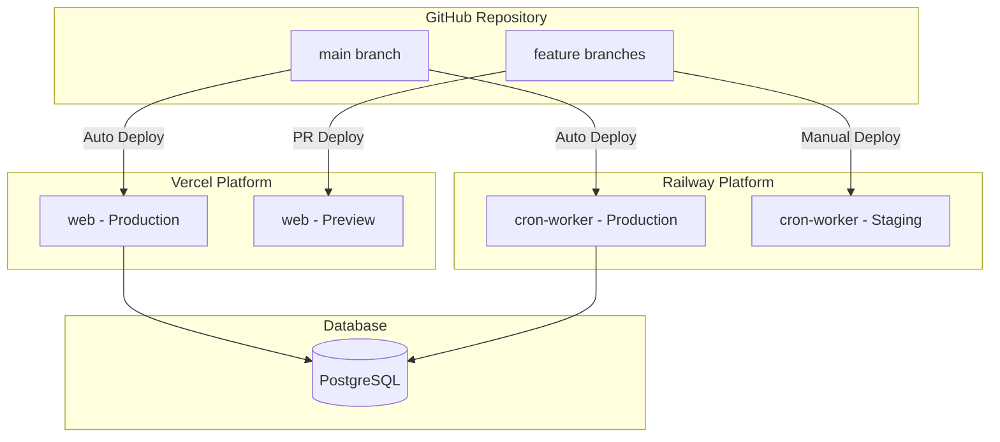
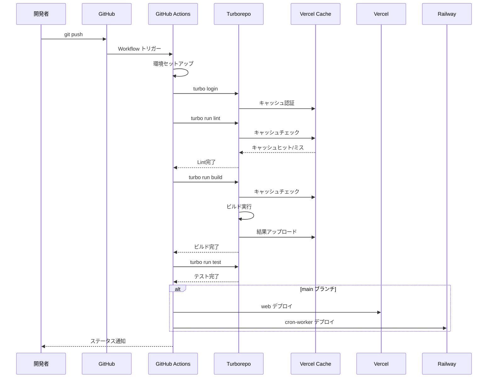
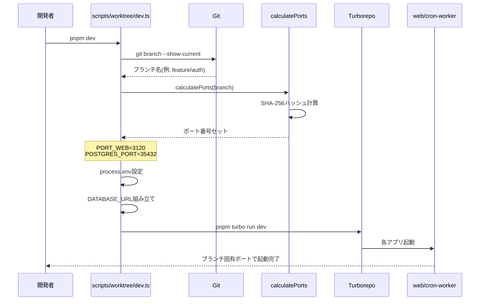

# デプロイメント・CI/CD設計方針

## 概要

このドキュメントでは、プロジェクトのデプロイメントとCI/CDパイプラインの**設計方針**を説明します。

具体的な設定手順については以下を参照してください：
- [デプロイセットアップ手順](../../instructions/deployment-setup.md)
- [環境変数セットアップ手順](../../instructions/environment-setup.md)

---

## 目次

1. [デプロイメントアーキテクチャ](#1-デプロイメントアーキテクチャ)
2. [プラットフォーム選定理由](#2-プラットフォーム選定理由)
3. [CI/CDパイプライン設計](#3-cicdパイプライン設計)
4. [キャッシュ戦略](#4-キャッシュ戦略)
5. [Worktree対応設計](#5-worktree対応設計)
6. [ロールバック戦略](#6-ロールバック戦略)

---

## 1. デプロイメントアーキテクチャ

### 全体構成

### デプロイメント対象

| アプリケーション | プラットフォーム | デプロイトリガー | 環境 |
|----------------|--------------|--------------|------|
| web | Vercel | main push, PR作成 | Production, Preview |
| cron-worker | Railway | main push | Production |

---

## 2. プラットフォーム選定理由

### Vercel（Web/Admin）

**選定理由**:
- Next.jsの開発元であり、最適化が保証されている
- Edge NetworkによるグローバルCDN配信
- Preview Deploymentsによる迅速なレビュー
- Turborepo Remote Cacheとの統合

**採用機能**:
- Standalone Build（コンテナサイズ最小化）
- ISR（Incremental Static Regeneration）
- Edge Middleware

### Railway（Cron Worker）

**選定理由**:
- ネイティブCronジョブサポート
- Dockerコンテナのシンプルなデプロイ
- 環境変数のシームレスな管理
- 従量課金で低コスト運用可能

**採用機能**:
- Cron Job Scheduling
- Docker Image Deploy
- Health Checks

---

## 3. CI/CDパイプライン設計

### パイプラインフロー

### ステージ構成

| ステージ | タスク | 並列実行 | キャッシュ |
|---------|-------|---------|----------|
| Setup | pnpm install, turbo login | - | ✅ |
| Lint | turbo run lint | ✅ | ✅ |
| Type Check | turbo run typecheck | ✅ | ✅ |
| Test | turbo run test | ✅ | ✅ |
| Build | turbo run build | ✅ | ✅ |
| Deploy | Vercel, Railway | ✅ | ❌ |

### 設計方針

1. **高速フィードバック**: Lint・Type Checkを並列実行し、早期エラー検出
2. **キャッシュ最大活用**: Turborepo Remote Cacheで86%の時間削減
3. **環境分離**: dotenvxによる暗号化環境変数でセキュアなCI/CD

---

## 4. キャッシュ戦略

### Turborepo Remote Cache

**設計方針**:
- ビルド成果物をVercel Remote Cacheに保存
- チーム間でキャッシュを共有し、ビルド時間を大幅短縮
- 環境変数の変更時は自動でキャッシュ無効化

### キャッシュ対象

| タスク | キャッシュ | 理由 |
|--------|----------|------|
| build | ✅ | ビルド成果物を再利用 |
| lint | ✅ | ソースコード未変更時はスキップ |
| typecheck | ✅ | 型定義未変更時はスキップ |
| test | ✅ | テストコード・対象未変更時はスキップ |
| dev | ❌ | 開発サーバーは継続実行 |
| db:* | ❌ | データベース操作は冪等性なし |

### キャッシュ効果

| タスク | キャッシュなし | キャッシュあり | 削減率 |
|--------|--------------|--------------|--------|
| lint | 10s | 2s | 80% |
| typecheck | 15s | 3s | 80% |
| build | 45s | 5s | 89% |
| test | 30s | 4s | 87% |
| **合計** | **100s** | **14s** | **86%** |

---

## 5. Worktree対応設計

### 課題

複数のブランチを並行開発する際、ポート番号が衝突する問題がある。

### 解決策

SHA-256ハッシュベースの動的ポート割り当てを採用。

**設計方針**:
1. ブランチ名からSHA-256ハッシュを生成
2. ハッシュ値からポート番号を算出（衝突確率を最小化）
3. 環境変数に自動設定し、Turborepoに引き継ぎ

### ポート割り当て設計

### ポート範囲設計

| ポート | 範囲 | 用途 |
|--------|------|------|
| PORT_WEB | 3000-3999 | Webアプリ |
| POSTGRES_PORT | 35432 (固定) | PostgreSQL |

---

## 6. ロールバック戦略

### 設計方針

1. **即時ロールバック**: デプロイ履歴から1クリックで前バージョンに戻す
2. **DB互換性**: マイグレーションは常に後方互換を維持
3. **Feature Flags**: 大きな変更はフラグで制御し、段階的リリース

### Vercelロールバック

**方針**: Instant Rollbackを活用し、ダウンタイムなしでロールバック

1. Vercel Dashboardで過去のデプロイを選択
2. "Promote to Production" で即座に切り替え
3. DNS/CDN自動更新で反映

### Railwayロールバック

**方針**: Dockerイメージタグによるバージョン管理

1. 各デプロイにgit SHAタグを付与
2. 問題発生時は前バージョンのイメージを再デプロイ

### データベースロールバック

**方針**: 破壊的マイグレーションを避け、後方互換を維持

- カラム削除は2フェーズで実施（非推奨化 → 削除）
- 型変更は新カラム追加 → データ移行 → 旧カラム削除
- インデックス追加は`CREATE CONCURRENTLY`で無停止実行

---

## 関連ドキュメント

- [環境変数設計方針](./environment-variables.md)
- [デプロイセットアップ手順](../../instructions/deployment-setup.md)
- [環境変数セットアップ手順](../../instructions/environment-setup.md)
