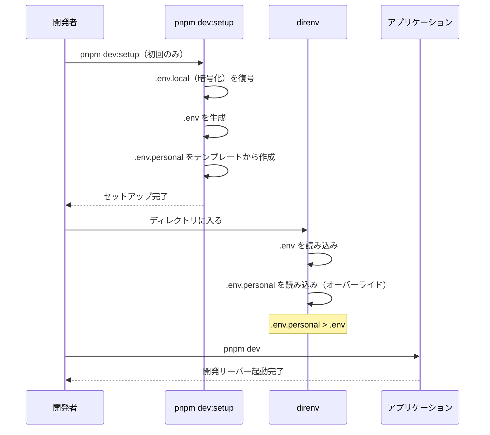

# 環境変数設計方針

## 概要

このドキュメントでは、環境変数管理の**設計方針**と**dotenvx採用理由**を説明します。

具体的な設定手順については以下を参照してください：
- [環境変数セットアップ手順](../../instructions/environment-setup.md)

---

## 目次

1. [設計原則](#1-設計原則)
2. [ローカル開発のファイル構成](#2-ローカル開発のファイル構成)
3. [dotenvx採用理由](#3-dotenvx採用理由)
4. [ファイル構成設計](#4-ファイル構成設計)
5. [階層的ロード設計](#5-階層的ロード設計)
6. [命名規約](#6-命名規約)
7. [シークレット管理方針](#7-シークレット管理方針)

---

## 1. 設計原則

### 環境変数管理の三原則

1. **暗号化**: 秘密情報は必ず暗号化してGit管理
2. **環境分離**: 開発・ステージング・本番で明確に分離
3. **ローカル優先**: ローカル開発では復号不要で即座に起動可能

### 環境別の管理方針

| 環境 | 管理ファイル | 暗号化 | Git追跡 |
|------|-------------|--------|--------|
| ローカル開発 | `.env.local` → `.env` + `.env.personal` | ✅ | `.env.local`のみ |
| dev検証 | `.env.development` | ✅ | ✅ |
| ステージング | `.env.staging` | ✅ | ✅ |
| 本番 | `.env.production` | ✅ | ✅ |
| CI/CD | `.env.ci` | ✅ | ✅ |

**ポイント**: ローカル開発も暗号化ファイル(`.env.local`)を使用。`pnpm dev:setup`で復号して`.env`を生成。

---

## 2. ローカル開発のファイル構成

### ファイルの関係

```
┌─────────────────────────────────────────────────────────────────┐
│  .env.local（暗号化済み・Gitで共有）                              │
│  ├─ DATABASE_URL=encrypted:xxxxx...                            │
│  ├─ AUTH_SECRET=encrypted:xxxxx...                             │
│  └─ チーム全員が使う共通設定                                      │
└─────────────────────────────────────────────────────────────────┘
                              │
                              │ pnpm dev:setup で自動復号
                              ▼
┌─────────────────────────────────────────────────────────────────┐
│  .env（平文・Gitで共有しない）                                    │
│  ├─ DATABASE_URL=postgresql://...                              │
│  ├─ AUTH_SECRET=your-secret-key                                │
│  └─ direnvが読み込む作業用ファイル                                │
│  ⚠️ pnpm dev で毎回再生成される                                   │
└─────────────────────────────────────────────────────────────────┘
                              +
┌─────────────────────────────────────────────────────────────────┐
│  .env.personal（平文・Gitで共有しない）                           │
│  ├─ GITHUB_TOKEN=ghp_xxxx...（あなた専用）                       │
│  └─ 個人固有のトークン                                           │
└─────────────────────────────────────────────────────────────────┘
```

### 各ファイルの役割

| ファイル | 暗号化 | Git追跡 | 内容 | 編集するとき |
|---------|:-----:|:------:|------|------------|
| `.env.local` | ✅ | ✅ | ローカル開発の共通設定 | チーム共有の設定を変更したいとき |
| `.env` | ❌ | ❌ | ↑を復号したもの | **直接編集しない**（pnpm devで再生成） |
| `.env.personal` | ❌ | ❌ | 個人トークン | 自分のトークンを設定するとき |

### よくある質問

**Q: なぜ `.env.local` を direnv で直接読まないの？**

A: `.env.local` は暗号化されているため、direnv では読めません。
   `pnpm dev:setup` が復号して `.env` を作成し、それを direnv が読みます。

**Q: チームで共有する設定を変えたいときは？**

A: `.env.local` を復号 → 編集 → 再暗号化 → コミット の流れです。
   詳しくは「[セットアップ手順 - 暗号化手順](../../instructions/environment-setup.md#4-暗号化手順)」を参照。

**Q: 個人のGITHUB_TOKENはどこに書く？**

A: `.env.personal` に書きます。このファイルはGitに含まれません。

**Q: pnpm dev を実行すると秘密情報が消える？**

A: `.env` は毎回再生成されますが、秘密情報は `.env.local`（暗号化）から
   マージされます。個人トークンは `.env.personal` に書いておけば消えません。

---

## 3. dotenvx採用理由

### 課題

従来の環境変数管理には以下の問題があった：

1. **秘密情報の共有困難**: `.env`ファイルをGit管理できず、チーム間で安全に共有できない
2. **環境間の不整合**: 手動設定によるミスで環境ごとに設定が異なる
3. **CI/CDでの秘密管理**: GitHub Secretsの数が増え、管理が煩雑

### dotenvxの解決策

**dotenvx**は環境変数を暗号化し、安全にGit管理できるツール：

```
┌─────────────────────────────────────────────────────────────┐
│                     dotenvx暗号化フロー                       │
├─────────────────────────────────────────────────────────────┤
│                                                              │
│  .env.production        dotenvx encrypt        暗号化済み    │
│  ┌──────────────┐      ────────────────>      ┌──────────┐  │
│  │ SECRET=plain │                             │ encrypted │  │
│  │ API_KEY=xxx  │                             │ xxxxxxxx  │  │
│  └──────────────┘                             └──────────┘  │
│        │                                            │        │
│        │                                            │        │
│        ▼                                            ▼        │
│   .gitignore                                  Git追跡可能    │
│   (Git除外)                                                  │
│                                                              │
│  .env.keys（秘密鍵）                                          │
│  ┌──────────────────────────────────────────────────────┐    │
│  │ DOTENV_PRIVATE_KEY_PRODUCTION=xxxx                   │    │
│  │ DOTENV_PRIVATE_KEY_STAGING=xxxx                      │    │
│  └──────────────────────────────────────────────────────┘    │
│        │                                                     │
│        ▼                                                     │
│   .gitignore（Git除外）+ 1Password等で安全に保管             │
│                                                              │
└─────────────────────────────────────────────────────────────┘
```

### 採用メリット

| 観点 | 従来手法 | dotenvx |
|------|---------|---------|
| Git管理 | ❌ 不可 | ✅ 暗号化して可能 |
| チーム共有 | ❌ 手動共有 | ✅ Git経由で自動 |
| CI/CD設定 | ❌ 多数のSecrets | ✅ 1つの秘密鍵のみ |
| 環境一貫性 | ❌ 手動で不整合 | ✅ コードと同期 |
| 監査証跡 | ❌ なし | ✅ Gitコミット履歴 |

---

## 4. ファイル構成設計

### ファイル一覧

| ファイル | Git追跡 | 暗号化 | 役割 |
|---------|:------:|:-----:|------|
| `.env.example` | ✅ | ❌ | `.env`の参考テンプレート |
| `.env.personal.example` | ✅ | ❌ | 個人用トークンのテンプレート |
| `.env.local` | ✅ | ✅ | ローカル開発用（チーム共有） |
| `.env.development` | ✅ | ✅ | dev検証サーバー用 |
| `.env.staging` | ✅ | ✅ | ステージング用 |
| `.env.production` | ✅ | ✅ | 本番環境用 |
| `.env.ci` | ✅ | ✅ | CI/CD用 |
| `.env.keys` | ❌ | - | 全環境の秘密鍵（1Password等で共有） |
| `.env` | ❌ | ❌ | `.env.local`を復号したもの |
| `.env.personal` | ❌ | ❌ | 個人固有のトークン |

### ディレクトリ構成

```
プロジェクトルート/
├── .env.example            # 参考テンプレート（Git追跡）
├── .env.personal.example   # 個人用トークンテンプレート（Git追跡）
├── .env.local              # ローカル開発用・暗号化済み（Git追跡）★
├── .env.development        # dev検証・暗号化済み（Git追跡）
├── .env.staging            # ステージング・暗号化済み（Git追跡）
├── .env.production         # 本番・暗号化済み（Git追跡）
├── .env.ci                 # CI/CD・暗号化済み（Git追跡）
├── .env.keys               # 秘密鍵（Git除外・1Password等で共有）
├── .env                    # .env.localを復号したもの（Git除外）
└── .env.personal           # 個人用トークン（Git除外）
```

**★ポイント**: `.env.local`は暗号化されてGitで共有。`pnpm dev:setup`で復号して`.env`が生成される。

---

## 5. 階層的ロード設計

### ローカル開発時のフロー



### ロード順序（後勝ち）

1. **`.env`**: チーム共有設定（`.env.local`から復号して自動生成）
2. **`.env.personal`**: 個人固有のトークン（GITHUB_TOKEN等）

### 設計意図

- **全環境で暗号化を統一**: ローカル開発もデプロイ環境と同じ暗号化方式
- **個人トークンの分離**: `.env.personal`で個人固有の設定を管理
- **direnv連携**: ディレクトリに入るだけで環境変数が自動ロード

---

## 6. 命名規約

### 環境変数の命名

| プレフィックス | 用途 | 例 |
|--------------|------|-----|
| `NEXT_PUBLIC_` | クライアント側で使用 | `NEXT_PUBLIC_API_URL` |
| `DATABASE_` | データベース関連 | `DATABASE_URL` |
| `NEXTAUTH_` | 認証関連 | `NEXTAUTH_SECRET` |
| `TURBO_` | Turborepo関連 | `TURBO_TOKEN` |
| `PORT_` | ポート番号 | `PORT_WEB` |
| `DOTENV_` | dotenvx関連 | `DOTENV_PRIVATE_KEY_PRODUCTION` |

### 環境識別子

| 識別子 | 説明 |
|--------|------|
| `_LOCAL` | ローカル開発用 |
| `_DEVELOPMENT` | dev検証環境用 |
| `_STAGING` | ステージング環境用 |
| `_PRODUCTION` | 本番環境用 |
| `_CI` | CI/CD環境用 |

---

## 7. シークレット管理方針

### 秘密鍵の保管

**`.env.keys`の保管先**:

| 保管場所 | 用途 | アクセス権限 |
|---------|------|------------|
| 1Password | チーム共有 | 開発者全員 |
| GitHub Secrets | CI/CD | GitHub Actions |
| Vercel Dashboard | 本番デプロイ | 管理者のみ |
| Railway Variables | Cronワーカー | 管理者のみ |

### GitHub Secretsの最小化

dotenvx採用により、GitHub Secretsは**環境ごとに1つの秘密鍵のみ**に削減：

| Secret名 | 用途 |
|---------|------|
| `DOTENV_PRIVATE_KEY_CI` | CI/CD環境の復号 |
| `DOTENV_PRIVATE_KEY_PRODUCTION` | 本番デプロイ時の復号 |

**注**: `DOTENV_PRIVATE_KEY_LOCAL`はローカル開発用なのでGitHub Secretsには不要。`.env.keys`でチーム内共有。

### ローテーション方針

1. **定期ローテーション**: 90日ごとに秘密鍵を更新
2. **漏洩時対応**: 即座に全環境の秘密鍵を再生成
3. **手順**: `dotenvx encrypt`で新しい鍵を生成し、保管先を更新

---

## 関連ドキュメント

- [デプロイメント・CI/CD設計方針](./deployment.md)
- [環境変数セットアップ手順](../../instructions/environment-setup.md)
- [デプロイセットアップ手順](../../instructions/deployment-setup.md)
