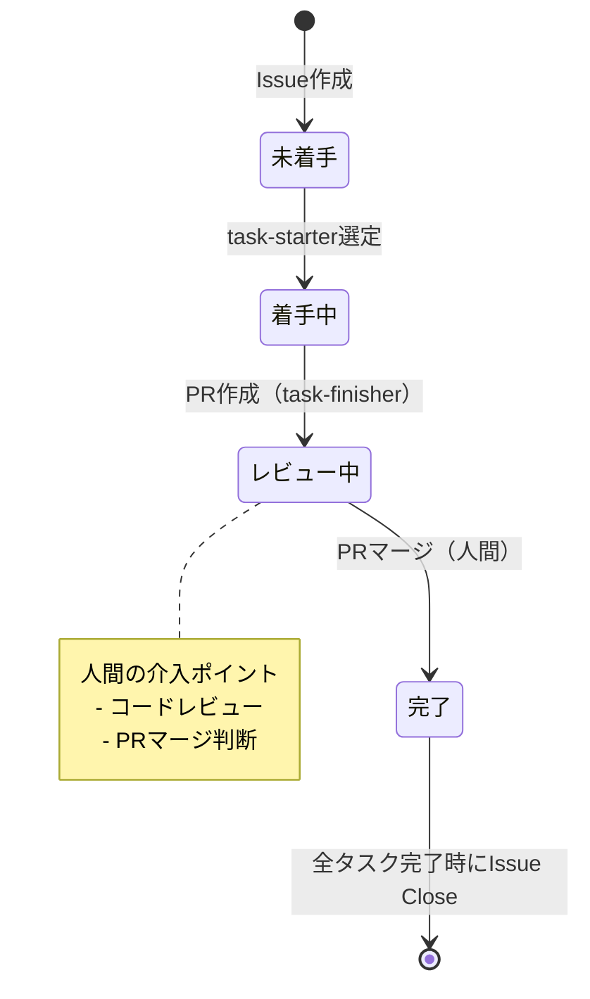
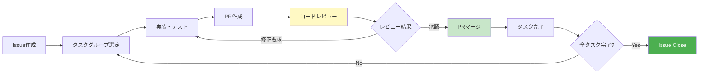

# タスク管理ガイドライン

このドキュメントでは、プロジェクトのタスク管理における階層構造、GitHub Issue管理、用語定義を説明します。

## タスク管理の方法

このプロジェクトでは**GitHub Issue**を使用してタスクを管理します。

### 基本構造

- **1 spec = 1 GitHub Issue**
- 各specフォルダ（`docs/specs/issues/{機能カテゴリ名}/issue{issue番号}-{機能名}/`）に対して1つのGitHub Issueを作成
- requirements.mdとdesign.mdはファイルとして保持
- タスク一覧のみGitHub Issueで管理

### GitHub Issueの構造

Issue本文には以下のセクションを含みます：

```markdown
## AS-IS
<!-- requirements.mdから抽出した現在の状態・問題点 -->

## TO-BE
<!-- requirements.mdから抽出した実装後の期待する状態 -->

## 対応方針
<!-- design.mdから抽出した技術的アプローチ、使用ライブラリ、実装方針 -->

## タスク一覧

### Phase 1: [フェーズ名]

- [ ] **1.1 [タスクグループ名]**
  - 1.1.1 [タスク名]
  - 1.1.2 [タスク名]
  - **依存関係**: なし
  - **完了条件**: [テスト条件]が通ること（AC[番号]を満たす）
  - **対応設計**: design.md「[セクション名]」セクション

- [ ] **1.2 [タスクグループ名]**
  - 1.2.1 [タスク名]
  - **依存関係**: 1.1
  - **完了条件**: ...

### Phase 2: [フェーズ名]

- [ ] **2.1 [タスクグループ名]**
  - 2.1.1 [タスク名]
  - **依存関係**: Phase 1完了
  - **完了条件**: ...

## 関連ドキュメント
- 要件定義: [requirements.md](相対パス)
- 設計書: [design.md](相対パス)
- QAテスト: [qa-tests/](相対パス)
```

### テンプレートの使用

新規タスク作成時は以下のテンプレートを使用してください：

- **GitHub Issue**: `.github/ISSUE_TEMPLATE/task-implementation.yml`
- **要件定義書**: `docs/templates/requirements.md.template`
- **設計書**: `docs/templates/design.md.template`

これらのテンプレートを使用することで、task-execコマンドのサブエージェント（task-executer、task-reviewer、task-qa）が確実に受け入れ条件を参照できます。

#### 重要事項

- **受け入れ基準（Acceptance Criteria）セクションは必須です**
- QAエージェント（task-qa）はこのセクションを参照してテストシナリオを作成します
- Given/When/Then形式を使用してください
- テンプレートの使用方法の詳細は `docs/templates/README.md` を参照してください

### タスクグループのステータス管理

GitHub IssueのチェックボックスとHTMLコメントでタスクグループのステータスを管理します：

#### ステータス一覧

| ステータス | 記法 | 説明 |
|----------|------|------|
| **未着手** | `- [ ] **1.1 名前**` | 作業開始前 |
| **着手中** | `- [ ] **1.1 名前** <!-- 🔄 着手中 -->` | 実装中 |
| **レビュー中** | `- [ ] **1.1 名前** <!-- 👀 レビュー中 -->` | PR作成済み、マージ待ち |
| **完了** | `- [x] **1.1 名前**` | マージ完了 |

#### 状態遷移図



#### 各ステータスの詳細

**未着手**:
```markdown
- [ ] **1.1 タスクグループ名**
```

**着手中**（HTMLコメントで着手中マークを追加）:
```markdown
- [ ] **1.1 タスクグループ名** <!-- 🔄 着手中 -->
```

**レビュー中**（PR作成後、マージ待ち）:
```markdown
- [ ] **1.1 タスクグループ名** <!-- 👀 レビュー中 -->
```
- task-finisherがPR作成時に自動で設定
- 人間がPRをレビュー・マージするまでこの状態を維持
- task-vibe-kanban-loopはこの状態のタスクを検出し、次タスク選定を待機

**完了**（チェックボックスをON、マークを削除）:
```markdown
- [x] **1.1 タスクグループ名**
```

**重要**: ステータスマークはHTMLコメント形式を使用します。これにより、チェックボックスの状態を保持しつつ、視覚的にステータスを示せます。

### Issueのライフサイクル

1. **Issue作成**: `/spec-create`コマンドで仕様書作成時に自動生成
2. **タスクグループ選定**: `/task-exec #{issue_number}`でタスクグループを選定・着手中マークを付与
3. **タスクグループ実行**: 実装・テスト・コミットを実施
4. **PR作成・レビュー中**: task-finisherがPR作成、レビュー中マークに変更
5. **PRマージ（人間）**: コードレビュー後、人間がPRをマージ
6. **タスクグループ完了**: PRマージ後、チェックボックスをON、マークを削除
7. **Issue完了**: すべてのタスクグループが完了したらIssueをClose

#### ライフサイクル図



**人間の介入ポイント**: コードレビュー（E）とPRマージ（G）は人間が実施

## タスク階層の用語定義

プロジェクトのタスク管理では、以下の4階層を使用します：

### 1. Phase（フェーズ）
最上位の開発単位。

**番号形式**: 4, 5, 6...（単一の数字）

**例**:
- Phase 1: モノレポ基盤構築
- Phase 2: Server Core構築
- Phase 3: アプリケーション開発
- Phase 4: ビルド最適化
- Phase 5: CI/CD & ドキュメント

### 2. タスクグループ
**Vibe-KanbanタスクとPRの作成単位**。

**特徴**:
- **番号形式**: X.Y（例: 4.1, 4.2, 5.1）
- **チェックボックス**: 付ける（`- [ ]`）
- **粒度**: 1つの受け入れ条件を満たす／1つの機能が動作する状態（1-4時間）
- **成果物**: 1PR、デプロイ可能な単位、QAテスト対象
- **例**: 「Turborepoビルドパイプライン最適化」「リモートキャッシュ設定」

**GitHub Issue内の記述例**:
```markdown
- [ ] **4.1 Turborepoビルドパイプライン最適化**
  - 4.1.1 turbo.json設定とビルド検証
  - 4.1.2 並列ビルドとベンチマーク
  - **依存関係**: Phase 3完了
  - **完了条件**: turbo.jsonに全タスクが定義され、依存関係が正しく設定されていること（AC8.1を満たす）
  - **対応設計**: design.md「Turborepo設定」セクション
```

### 3. タスク
**作業単位・コミット単位**。

**特徴**:
- **番号形式**: X.Y.Z（例: 4.1.1, 4.1.2）
- **チェックボックス**: 付けない
- **粒度**: 具体的な作業項目（15分〜1時間程度）
- **成果物**: 個別コミット
- **例**: 「turbo.json設定とビルド検証」「並列ビルドとベンチマーク」

**GitHub Issue内の記述例**:
```markdown
- 4.1.1 turbo.json設定とビルド検証
- 4.1.2 並列ビルドとベンチマーク
```

### 4. サブタスク
**タスク内の詳細作業項目**（必要に応じて記載）。

**特徴**:
- **番号形式**: なし
- **チェックボックス**: 付けない
- **粒度**: 具体的な作業内容
- **成果物**: タスクの一部として実施
- **例**: 「turbo.jsonパイプライン設定の確認と調整」「ビルド順序の検証」

**GitHub Issue内での記述**:
サブタスクは通常、requirements.mdやdesign.mdに詳細を記載し、GitHub Issueには含めません。必要に応じてタスク名の下に簡潔に箇条書きで記載できます。

## タスク管理のワークフロー

### 1. GitHub Issueからタスクグループを選定
- `/task-exec #{issue_number}`コマンドを実行
- 依存関係を考慮して実行可能なタスクグループを自動選定
- 選定されたタスクグループに着手中マーク（`<!-- 🔄 着手中 -->`）を付与
- GitHub Issue本文を自動更新

### 2. Vibe-Kanbanタスクを作成（自動）
- **タスクグループ番号**: 4.1
- **タスクグループ名**: Turborepoビルドパイプライン最適化
- **タスク説明**: GitHub Issueからタスク一覧、要件、依存関係、完了条件、対応設計を抽出

### 3. タスクを順次実装し、コミット
- 各タスク（4.1.1, 4.1.2...）完了ごとにコミット
- コミットメッセージにタスク内容を記載
- 例: `feat(build): turbo.json設定とビルド検証`

### 4. タスクグループ完了時にPR作成とIssue更新
- 全タスクが完了したらPR作成
- PR単位でレビュー・デプロイ・QA実施
- PRタイトル: `[タスクグループ番号] タスクグループ名`（例: `[4.1] Turborepoビルドパイプライン最適化`）
- GitHub Issueのチェックボックスを自動でONに変更
- 着手中マークを削除

### 5. Issue完了の判定
- すべてのタスクグループが完了（`- [x]`）したら、Issueを自動でClose

## タスクの粒度基準

### 適切な粒度
✅ **1つの受け入れ条件を満たす**
- 例: ビルドパイプラインの最適化（AC8.1-AC8.4を満たす）

✅ **1つの機能が動作する状態**
- 例: turbo.json設定からビルド時間計測まで（ビルド最適化が検証可能な状態）

✅ **1PR・1デプロイ・1QAテスト対象として適切（1-4時間）**
- PRレビューで全体を把握可能
- デプロイ後に機能として検証可能
- QAテストで受け入れ条件を検証可能

### 不適切な粒度
❌ **細かすぎる**
- 例: 設定ファイル1個の変更だけ、テスト1個の実行だけ
- 問題: PR・デプロイ・QA単位として意味がない

❌ **大きすぎる**
- 例: 複数の受け入れ条件をまたぐ、複数のStoryが混在
- 問題: レビューが困難、デプロイリスクが高い、QAテストが複雑化

## Vibe-Kanbanタスク作成時の必須情報

### タスクタイトル形式
```
[タスクグループ番号] タスクグループ名
```

**例**: `[4.1] Turborepoビルドパイプライン最適化`

### タスク説明形式

```markdown
## GitHub Issue
#{issue_number}

## タスクグループ番号
<タスクグループ番号>

## 概要
<タスクグループの概要>

## タスク
<GitHub Issueから抽出したタスク一覧>

## 依存関係
<依存するタスクグループ番号>

## 完了条件
<受け入れ基準を含む完了条件>

## 対応設計
<design.mdの参照箇所>
```

**例**:
```markdown
## GitHub Issue
#123

## タスクグループ番号
4.1

## 概要
turbo.jsonの設定確認からビルド時間計測まで、ビルドパイプライン全体の最適化を完了

## タスク
- 4.1.1 turbo.json設定とビルド検証
- 4.1.2 並列ビルドとベンチマーク

## 依存関係
Phase 3完了

## 完了条件
ビルドパイプラインが最適化され、AC8.1-AC8.4を満たすこと

## 対応設計
design.md「ビルド最適化」セクション
```

## コマンドリファレンス

### タスク管理関連コマンド

**仕様書作成とIssue生成**:
```bash
/spec-create [タスク内容の説明]
```
- requirements.md、design.mdを作成し、GitHub Issueを自動生成

**タスクグループ実行**:
```bash
/task-exec #{issue_number}           # 自動選定
/task-exec #{issue_number} 1.1       # 明示的指定
```
- GitHub Issueからタスクグループを選定・実行
- Vibe-Kanbanタスク作成、実装、テスト、PR作成、Issue更新を自動化

**自動ループ実行**:
```bash
/task-vibe-kanban-loop #{issue_number} Phase 3まで
```
- 指定されたPhaseまでタスクグループを順次実行
- Vibe-Kanban連携で自動化

**仕様書からドキュメント更新**:
```bash
/update-docs-by-task-specs [タスク仕様書ディレクトリパス]
```
- タスク仕様書の内容をfeature仕様書とsteering仕様書に反映
