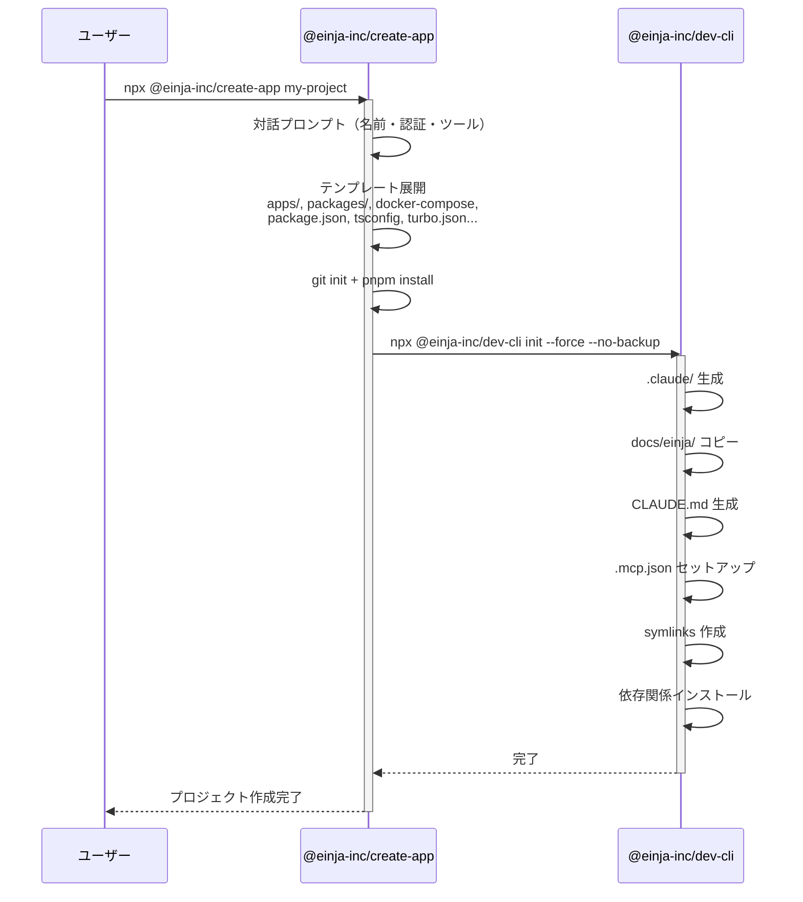
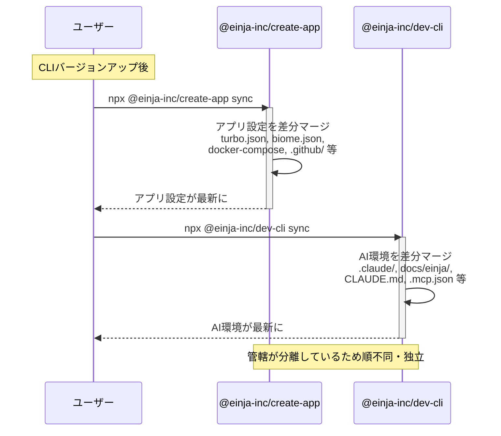
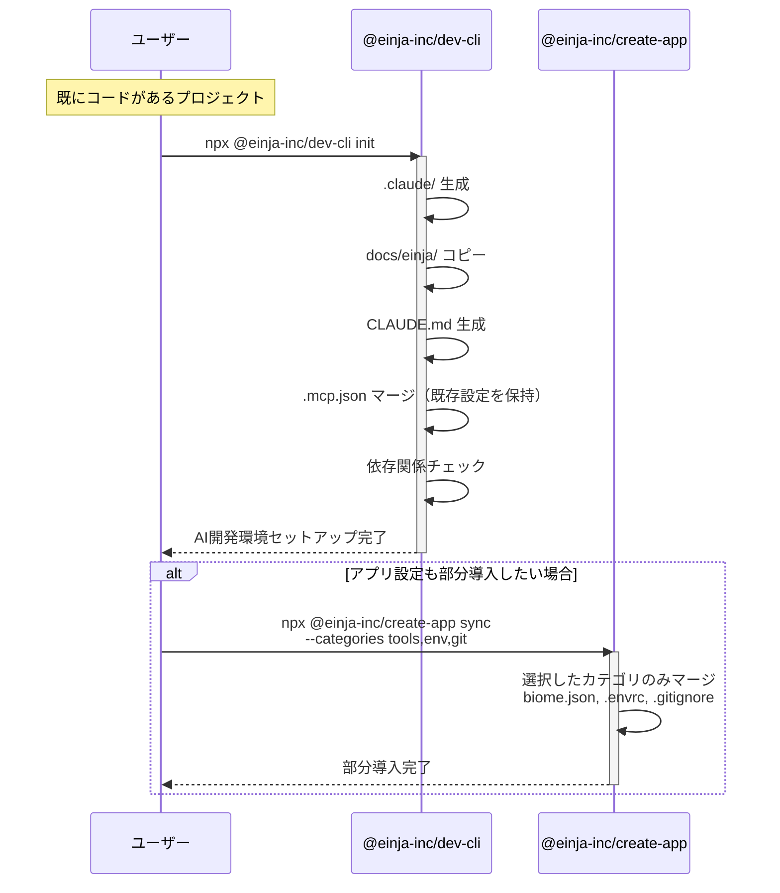

# @einja-inc/dev-cli

Claude Code用の`.claude`設定ディレクトリをnpxでインストールできるCLI。

## クイックスタート

```bash
npx @einja-inc/dev-cli init
```

## 利用シーン

| プロジェクトの状態 | 使うコマンド | 説明 |
|-------------------|------------|------|
| 新規作成（ゼロから） | `npx @einja-inc/create-app my-project` | テンプレートから完全なプロジェクトを生成 |
| 既存プロジェクトに初回導入 | `npx @einja-inc/dev-cli init` | Claude Code設定を追加+不足依存をインストール |
| 設定を最新版に更新 | `pnpm einja:sync` | テンプレートの更新分をマージ+不足依存をインストール |
| 設定を再セットアップ | `npx @einja-inc/dev-cli init --force` | .claudeを上書き（バックアップ自動作成） |

### init vs sync vs @einja-inc/create-app の違い

| | `@einja-inc/create-app` | `dev-cli init` | `dev-cli sync` |
|--|-------------------|----------------|----------------|
| 対象 | 新規プロジェクト | 既存（初回導入） | 既存（更新） |
| .claude/ | 新規生成 | 上書き | マーカーベースでマージ |
| CLAUDE.md | 新規生成 | 上書き | managedのみ更新 |
| ユーザーカスタマイズ | — | ⚠️ 上書き | ✅ 保持 |
| package.json scripts | 全scripts込み | 不足のみ追加 | 不足のみ追加 |
| devDependencies | 全パッケージ | hooks最小限 | hooks最小限 |

> **ポイント**: 設定を更新したいだけなら`sync`を使ってください。`init --force`はユーザーカスタマイズ（seedセクション）を上書きします。

### 利用シーンのフロー

#### シナリオ1: ゼロから新規プロジェクト作成



#### シナリオ2: テンプレート更新の取り込み



#### シナリオ3: 既存プロジェクトに新規導入



#### シナリオ4: 定期的なアップデート

シナリオ2と同じ。`dev-cli sync` と `@einja-inc/create-app sync` を必要に応じて実行。

### dev-cli と @einja-inc/create-app の管轄境界

| ファイル/ディレクトリ | 管轄 | sync カテゴリ |
|---------------------|------|-------------|
| `.claude/agents/einja/` | dev-cli | `agents` |
| `.claude/skills/einja-*/` | dev-cli | `skills` |
| `.claude/hooks/einja/` | dev-cli | `hooks` |
| `.claude/settings.json` | dev-cli | `claude-config` |
| `docs/einja/` | dev-cli | `docs` |
| `scripts/` | dev-cli | `scripts` |
| `CLAUDE.md` | dev-cli | `claude-md` |
| `AGENTS.md` | dev-cli | `claude-md` |
| `.envrc` | dev-cli | `env` |
| `.vscode/settings.json` | dev-cli | `tools` |
| `package.json` | dev-cli | `root-config` |
| `.mcp.json` | dev-cli | `root-config` |
| `biome.json`, `.biomeignore` | @einja-inc/create-app | `tools` |
| `.gitignore`, `.gitattributes` | @einja-inc/create-app | `git` |
| `.husky/`, `.lintstagedrc.js` | @einja-inc/create-app | `git-hooks` |
| `turbo.json`, `pnpm-workspace.yaml` | @einja-inc/create-app | `monorepo` |
| `tsconfig.json`, `vitest.config.ts` 等 | @einja-inc/create-app | `root-config` |
| `Dockerfile*`, `docker-compose*.yml` | @einja-inc/create-app | `docker` |
| `.github/workflows/` | @einja-inc/create-app | `github` |
| `apps/**`, `packages/**` | @einja-inc/create-app | `apps` / `packages` |

## インストール

```bash
# npx（推奨）
npx @einja-inc/dev-cli init

# グローバルインストール
npm install -g @einja-inc/dev-cli
@einja-inc/dev-cli init
```

## コマンド

### `init`

`.claude`ディレクトリをセットアップします。

```bash
npx @einja-inc/dev-cli init
```

**オプション:**

| オプション | 説明 |
|-----------|------|
| `-f, --force` | 上書き確認をスキップ |
| `-y, --yes` | 確認プロンプトをスキップ |
| `--dry-run` | 実行内容をプレビュー |
| `--no-backup` | バックアップを作成しない |
| `--skip-deps` | 依存関係のチェック・インストールをスキップ |

**依存関係の自動チェック:**

`init` 実行時に `preset.yaml` の `requirements` に基づいて不足依存を検出し、インストールを提案します。`package.json` に不足している scripts も自動追加されます。

### `sync`

テンプレートから更新を同期します。

```bash
# 全カテゴリを同期
npx @einja-inc/dev-cli sync

# 特定カテゴリのみ同期
npx @einja-inc/dev-cli sync --only agents,skills
npx @einja-inc/dev-cli sync --only hooks
```

**オプション:**

| オプション | 説明 |
|-----------|------|
| `-o, --only <categories>` | 同期するカテゴリをカンマ区切りで指定 |
| `-d, --dry-run` | 実際の変更を行わず、差分のみ表示 |
| `-f, --force` | ローカル変更を無視してテンプレートで上書き |
| `-y, --yes` | 確認プロンプトをスキップ |
| `--skip-deps` | 依存関係のチェック・インストールをスキップ |

**同期可能なカテゴリ:**
- `agents` - エージェント定義
- `skills` - スキル定義
- `hooks` - Git Hooks
- `docs` - ステアリングドキュメント
- `scripts` - ユーティリティスクリプト
- `env` - 環境設定ファイル（`.envrc`）
- `tools` - 開発ツール設定（`.vscode/settings.json`）
- `claude-md` - Claude Code 設定ファイル（CLAUDE.md, AGENTS.md）
- `root-config` - ルート設定（package.json, .mcp.json）
- `claude-config` - Claude Code設定（.claude/settings.json）

**マーカーによる部分同期:**

ファイルには、同期動作を制御するマーカーがあります：
- `@einja:managed` - 常にテンプレート版で上書き（共通ルール）
- `@einja:project-private` - 初回のみ追加、以降はローカル編集を保持（プロジェクト固有設定）
- `@einja:excluded` - テンプレートのみに存在し、syncでコピーされない（テンプレート専用設定）

詳細は [マーカー仕様書](docs/MARKER_SPECIFICATION.md) を参照してください。

**JSONマージ設定:**

`.einja-sync.json`に`jsonPaths`を設定することで、JSONファイルのマージ動作を制御できます：

```json
{
  "version": "1.0.0",
  "lastSync": "2024-01-11T00:00:00Z",
  "templateVersion": "1.0.0",
  "files": {},
  "jsonPaths": {
    "managed": {
      "package.json": ["scripts.dev", "scripts.build", "scripts.lint"]
    },
    "seed": {
      "package.json": ["scripts.custom"]
    }
  }
}
```

- **managed パス**: 常にテンプレート値で上書き
- **seed パス**: ローカルに存在しない場合のみテンプレート値をコピー
- **その他**: ローカル優先（ユーザー追加分を保持）

**注意**: `jsonPaths`設定は`@einja-inc/create-app add`コマンドと共通です。

### `task:loop`

GitHub Issueのタスクを自動実行します（Claude Code経由）。
Phase毎に親Issueを作成し、タスクグループをサブIssueとして階層管理します。

```bash
# pnpm scripts経由（推奨）
pnpm task:loop 123
pnpm task:loop 123 --max-group 1.3

# npx直接実行
npx @einja-inc/dev-cli task:loop 123
```

**オプション:**

| オプション | 説明 |
|-----------|------|
| `-m, --max-group <number>` | 最大タスクグループ番号 |
| `-b, --branch <name>` | ベースブランチ |

**前提条件:**
- `gh` CLI がインストール済み（GitHub Issue操作に必要）
- Vibe-Kanbanが起動している（`npx vibe-kanban`）

## 配布内容

Einja ATDDワークフロー構成（Next.js、Vibe-Kanban統合）を配布します。

```
.claude/
├── settings.json
├── agents/
│   ├── specs/           # 仕様書生成 (3)
│   ├── task/            # タスク実行 (6)
│   └── einja/frontend/  # フロントエンド (3)
├── skills/
│   └── einja-*/         # ATDDワークフロー用スキル
└── hooks/               # Git Hooks (9個)
    ├── biome-format.sh
    ├── typecheck.sh
    └── ...

docs/
├── templates/           # ドキュメントテンプレート
└── steering/            # プロジェクト基本方針
```

**含まれるMCPサーバー設定:**
- codex, context7, playwright, serena, github, vibe_kanban

## カスタマイズ

### settings.local.json

プロジェクト固有の設定は`settings.local.json`に記述します。

```json
{
  "permissions": {
    "allow": ["Bash(custom-script:*)"]
  }
}
```

### CLAUDE.md

プロジェクトルートに`CLAUDE.md`を作成してプロジェクト固有の指示を追加できます。

## 開発

```bash
# ビルド
pnpm build

# テスト
pnpm test

# 型チェック
pnpm typecheck
```

## 前提となる依存関係

`init`および`sync`コマンドは以下を自動チェックし、不足分のインストールを提案します。

### npmパッケージ（自動インストール）

| パッケージ | 用途 |
|-----------|------|
| `@biomejs/biome` | フォーマット・lint（biome-format.sh） |
| `typescript` | 型チェック（typecheck.sh） |

### npm scripts（自動追加）

| スクリプト | デフォルト値 |
|-----------|------------|
| `lint` | `biome check .` |
| `lint:fix` | `biome check --write .` |
| `format` | `biome format .` |
| `format:fix` | `biome format --write .` |
| `typecheck` | `tsc --noEmit` |
| `prepush` | `{pm} run lint && {pm} run typecheck` |
| `task:loop` | `npx @einja-inc/dev-cli task:loop` |
| `einja:sync` | `npx @einja-inc/dev-cli sync` |

※ 既存scriptsは上書きされません。`--skip-deps`でスキップ可能。

### システムコマンド（手順表示のみ）

| コマンド | 用途 | macOS |
|---------|------|-------|
| `jq` | hooks JSON入力パース | `brew install jq` |

## 要件

- Node.js >= 20.0.0

## ライセンス

MIT
